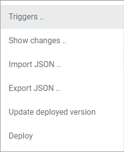

[!!User interface Queue types](../UserInterface/05a_QueueTypes.md)
[!!Workflow and process elements](../Overview/04_WorkflowProcessElements.md)
[!!Manage the workflows](../Operation/01_ManageWorkflows.md)

# Configure the queue types

Configure an arbitrary number of individual queue types to be able to execute certain actions faster, or to throttle them. You can configure an unlimited number of queue types with a defined number of workers and a defined sequence of how actions are to be executed. The total number of workers that can be assigned to the queue types is limited by the number of booked vCores.   

A worker is a job executing the actions within a process. One worker can only execute one action at the same time. By assigning multiple workers to a queue type, this queue type may execute several actions at the same time. Consequently, actions with a queue type with more workers are executed faster than actions with queue types with fewer workers. The total number of workers of all queue types depends on the number of booked vCores.   
For one worker, 4 vCores are needed. Additionally, 10 % of the booked vCores, but at least 4 vCores are blocked for the daily business and cannot be used for workers. The number of vCores needed always refers to the total number of workers in all queue types. For example, for a queue type with 2 workers and a queue type of 4 workers, 28 vCores are needed:   
*4 vCores per worker (4 \* 6 = 24) plus 4 vCores blocked for the daily business (24 + 4 = 28)*   
For detailed information on vCores, see [Check vCores](../../Core1Platform/AdministratingCore1/05_EngineRoom.md#check-vcores) in the *Core1 Platform* documentation.  

The *Default* queue type is predefined and is assigned to all transitions by default. It can be manually overridden by individual queue types. A different queue type may be assigned for each transition.

## Create a queue type

Create an individual queue type, assign a certain number of workers to it, and define the sequence in which the process actions are to be executed.   
If required, create a queue type to throttle specific process actions. For example, you may want to do this if you expect enormous traffic at a certain time or for a certain product (Black Friday, product launch), or if a connected external system is not able to process more than a certain number of actions.

#### Prerequisites

No prerequisites to fulfill.

#### Procedure

*Process Orchestration > Queue types > Tab OVERVIEW*

1. Click the  (Add) button in the bottom right corner.   
    The *Create queue type* view is displayed.

    

2. Enter a name for the queue type in the *Name* field.

3. Enter the desired number of workers for the queue type in the *Number of workers* field.

4. Click the *Execution priority* drop-down list and select the appropriate execution priority. The following options are available:
    - **Oldest executable action**   
        The oldest executable actions within all existing processes is executed first by the workers.
    - **Executable actions of oldest process**   
        The executable actions within the oldest process are executed first by the workers.

5. If you want to create a queue type to throttle a process, enable the *Throttling* toggle.   
   The fields below are ready for input.
     - Specify the maximum number of actions to be executed in the *Throttle action limit* field.   
     - Specify the period in minutes in which the maximum number of actions are to be executed in the *Throttle period (minutes)* field. For example, if the maximum number of actions is 1000 and the throttle period is 60, (it means that) 1000 actions are executed per hour. 
    Note that these numbers refer to a queue type. If a queue type is associated with multiple transitions, the number is divided among all the actions concerned. In addition, if more than one worker is configured for a queue type, there may be minimal deviations (one/two in a thousand) from the specified numbers due to parallel processing. 

6. Click the [SAVE] button in the upper right corner.   
    The *Create queue type* view is closed. A confirmation message is displayed. The new queue type has been created and is displayed in the list of queue types. 

    > [Info] An error notice is displayed if the number of booked vCores is not sufficient to create the queue type with the selected number of workers.

    

## Disable the workflows

Disable the workflows so that no new workflow processes are started, which may be necessary to edit the queue types or workers.

#### Prerequisites

The user has the required rights to edit the developer settings in the engine room.

#### Procedure

*Actindo dashboard*

> [Info] This procedure can be started in any module of the Core1 Platform.

1. Click the flag in the upper center.   
    The engine room panel is unfolded.

    

2. Click the arrow right to the *Developer mode*.   
    The developer mode settings are displayed.

3. Enable the *Disable workflow* toggle in the *Actindo Work Flow Engine* section.   
    The workflows have been disabled. No new workflow processes will start as long as the *Disable workflow* toggle is enabled.

    

4. Click the flag at the bottom of the engine room.    
    The engine room panel is folded.

> [Info] To re-enable the automatic start of workflow processes, unfold the engine room panel and disable the *Disable workflow* toggle in the *Actindo Work Flow Engine* section.

## Edit a queue type

Edit a queue type to modify its name, the number of workers assigned to it or the execution priority.

### Edit the name or the execution priority

Change the name of a queue type or the execution priority, for instance to ensure that certain actions will be executed first. Note that the *Default* queue type is predefined and cannot be edited.

#### Prerequisites

At least one queue type has been created, see [Create a queue type](#create-a-queue-type).

#### Procedure

*Process Orchestration > Queue types > Tab OVERVIEW*

1. Click the queue type you want to edit in the list of queue types.   
    The *Edit queue type* view is displayed.

    

2. Click the *Name* field and edit the name of the queue type.

3. Click the *Execution priority* drop-down list and select the appropriate execution priority in the list. The following options are available:

    - **Oldest executable action**   
            The oldest executable actions within all existing processes is executed first by the workers.
    - **Executable actions of oldest process**   
            The executable actions within the oldest process are executed first by the workers.

4. Click the [SAVE] button in the upper right corner.   
    The changes have been saved. The *Edit queue type* view is closed. A confirmation message is displayed. 

    

### Edit the number of workers and the throttling settings

Change the number of workers of a queue type to increase or decrease the execution speed accordingly. You can only adjust the number of workers and the throttling settings when no more workers are active. 
To achieve this, you must either wait until all running workers are finished or kill all workers to stop them immediately, see [Kill workers](#kill-workers).

#### Prerequisites

- The workflows have been disabled, see [Disable the workflows](#disable-the-workflows).
- No more workers are running.

#### Procedure

*Process Orchestration > Queue types > Tab OVERVIEW*

1. Click the queue type you want to edit in the list of queue types. Note that the *Default* queue type is predefined and cannot be edited.   
    The *Edit queue type* view is displayed.

    

2. Click the *Number of workers* field and edit the number of workers.

3. If you want to use the queue type to throttle a process, enable the  (Throttling) toggle.   
   The fields below are ready for input.

    + Specify the maximum number of actions to be executed in the *Throttle action limit* field.   
    + Specify the period in minutes in which the maximum number of actions are to be executed in the *Throttle period (minutes)* field. For example: Maximum number of actions = 1000, Throttle period = 60 means that a maximum of 1000 actions can be processed in one hour. 
    Note that these numbers refer to a worker. If a worker is associated with multiple transitions, the number is divided among all the actions concerned. In addition, if more than one worker is configured for a queue type, there may be minimal deviations (one/two in a thousand) from the specified numbers due to parallel processing. 

4. Click the [SAVE] button in the upper right corner.      
    The changes have been saved. The *Edit queue type* view is closed. A confirmation message is displayed.

     > [Info] An error notice is displayed if the number of booked vCores is not sufficient to create the queue type with the selected number of workers.

      

5. To restart the workers again, unfold the engine room panel, disable the *Disable workflow* toggle in the *Actindo Work Flow Engine* section and fold the engine room panel again.   
    The workflow processes will start automatically after one minute. If you do not want to wait this time, see [Start workers](#start-workers).

    

## Assign a queue type

Assign a certain queue type to a transition, for instance to prioritize a certain action to be executed faster, or to throttle an action, so that the system load is better distributed.

#### Prerequisites

At least one queue type has been created, see [Create a queue type](#create-a-queue-type).

#### Procedure

*Process Orchestration > Workflows > Tab OVERVIEW > Select workflow > Select workflow version*

1. Select the transition to which you want to assign a certain queue type. If you want to throttle an action, in most cases it is recommended to assign the throttle queue type at one of the first transitions of the workflow.     
    The transition is highlighted and its settings are displayed in the settings sidebar on the right.

    

2. Click the *Queue type* drop-down list and select the desired queue type for the selected transition. 
    The selected queue type is displayed in the settings sidebar.

    > [Info] Repeat the steps **1** and **2** for all transitions to which you want to assign a queue type.

3. Click the  (Points) button in the upper left corner next to the workflow name.   
    The workflow context menu is displayed.

    

4. Click the *Deploy* menu entry in the context menu.   
    A new workflow version with the new assigned queue types has been deployed and published.

## Delete a queue type

You can delete a queue type that is obsolete to release workers for other queue types. The queue type is only deleted, if it is no longer assigned to any transition. Be aware that the *Default* queue type cannot be deleted.

#### Prerequisites

- At least one queue type has been created, see [Create a queue type](#create-a-queue-type).
- The workflows have been disabled, see [Disable the workflows](#disable-the-workflows).
- No more workers are running.
- You have checked your workflow transitions to see if the queue type you want to delete is assigned to any of them. Tip: Use the *Execution log* to identify transitions using a specific queue type, see [Execution log](../UserInterface/06b_ExecutionLog.md).

#### Procedure

*Process Orchestration > Queue types > Tab OVERVIEW*

1. Select the checkbox of the queue type you want to delete in the list of queue types.      
  The editing toolbar is displayed above the queue types list.

  

2. Click the [DELETE] button in the toolbar.   
  The queue type has been deleted. A confirmation message is displayed.

## Kill workers

Sometimes it may be necessary to stop certain processes. Therefore, you have to kill the workers to avoid that these actions are executed. You can either kill the workers of a single queue type or kill all workers regardless of their queue type.
The killed workers will be restarted automatically if the *Disable workflow* toggle in the *Actindo Work Flow Engine* section of the engine room panel is disabled.

> [Caution] Problems may occur when killing workers. Only kill the workers when you are qualified to restart the stopped process actions.  

### Kill the workers of a single queue type

Kill the workers of a single queue type to stop all running actions of a certain queue type.

#### Prerequisites

 The workflows have been disabled, see [Disable the workflows](#disable-the-workflows).

#### Procedure

*Process Orchestration > Queue types > Tab OVERVIEW*

1. Select the checkbox of the queue type whose workers you want to kill.    
  The editing toolbar is displayed above the queue types list.

  

2. Click the [KILL WORKER OF THIS QUEUE TYPE] button in the toolbar.   
  The workers of the selected queue type have been killed. The process actions of the selected queue type will not continue until you restart the workflow processes. A confirmation message is displayed.

3. To restart the worker again, unfold the engine room panel, disable the *Disable workflow* toggle in the *Actindo Work Flow Engine* section and fold the engine room panel again.
    The workflow processes will start automatically after one minute.

### Kill all workers

Kill all workers to stop all currently running actions.

#### Prerequisites

The workflows have been disabled, see [Disable the workflows](#disable-the-workflows).

#### Procedure

*Process Orchestration > Queue types > Tab OVERVIEW*

1. Click the [KILL WORKER] button above the queue types list.    
    All workers have been killed. The process actions will not continue until you restart the workflow processes. A confirmation message is displayed.

2. To restart the workers again, unfold the engine room panel, disable the *Disable workflow* toggle in the *Actindo Work Flow Engine* section and fold the engine room panel again.
    The workflow processes will start automatically after one minute.

## Start workers

Sometimes it may be necessary to restart the workers manually. For example, if you have previously disabled the *Disable workflow* toggle in the *Actindo Work Flow Engine* section of the engine room panel, and you want the workers to start immediately.

#### Prerequisites

The workers have been killed before, or the workflow has been disabled. 

#### Procedure

*Process Orchestration > Queue types > Tab OVERVIEW*

Click the [START WORKER] button above the queue types list.    
All workers are started.

