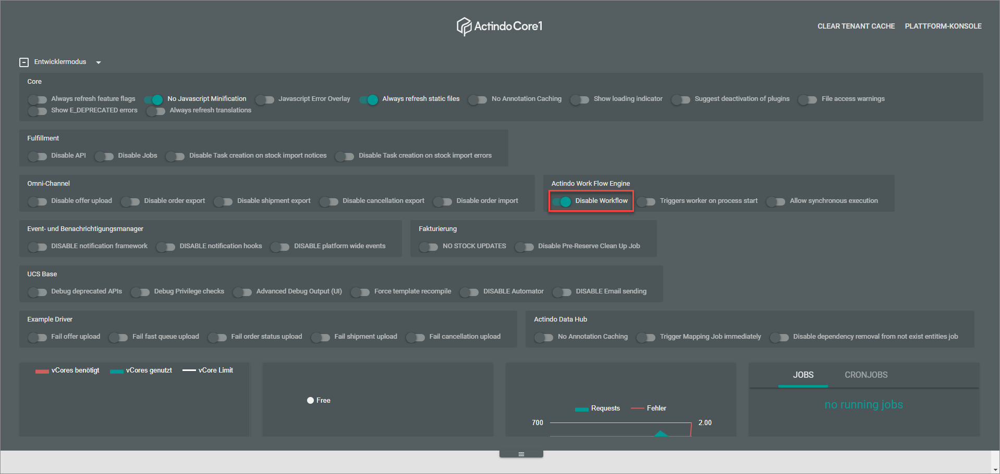
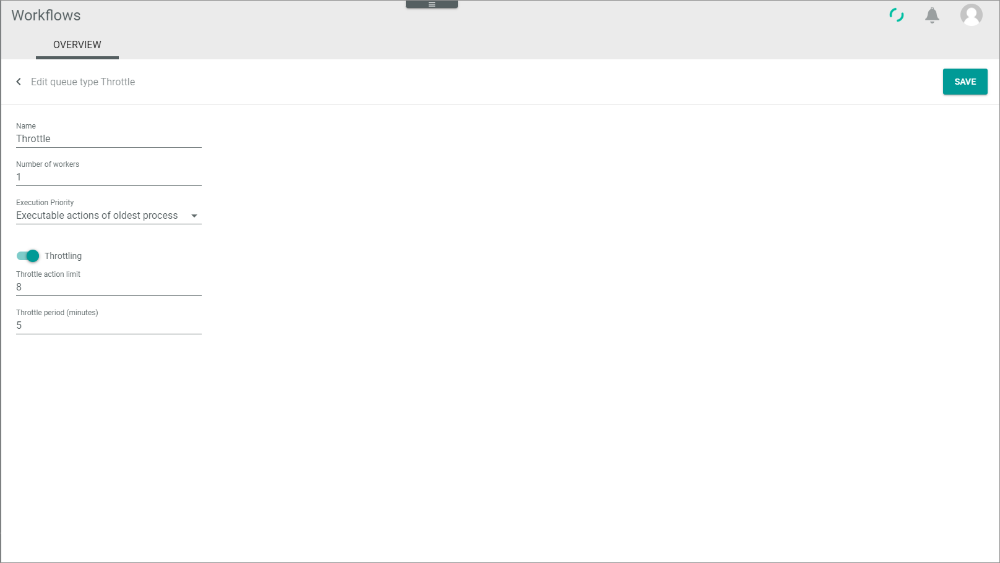
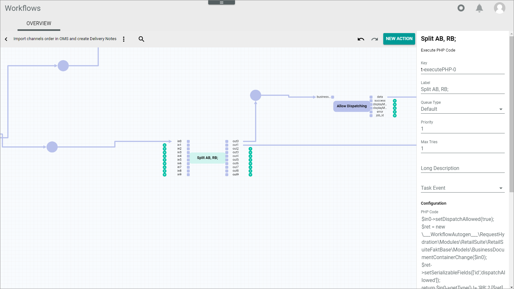

[!!User interface Queue types](../UserInterface/05a_QueueTypes.md)
[!!Workflow and process elements](../Overview/04_WorkflowProcessElements.md)
[!!Manage the workflows](../Operation/01_ManageWorkflows.md)

# Configure the queue types

Configure an arbitrary number of individual queue types to be able to execute certain actions faster. You can configure an unlimited number of queue types with a defined number of workers and a defined sequence of how actions are to be executed. The total number of workers that can be assigned to the queue types is limited by the number of booked vCores.
The *Default* queue type is predefined and is assigned to all transitions by default. It can manually be overridden by individual queue types. A different queue type may be assigned for each transition.

## Create a queue type

Create an individual queue type, assign a certain number of workers to it and define the sequence in which the process actions are to be executed.

#### Prerequisites

No prerequisites to fulfill.

#### Procedure

*Workflows > Queue types > Tab OVERVIEW*

1. Click the  (Add) button in the bottom right corner.   
    The *Create queue type* view is displayed.

    

2. Enter a name for the queue type in the *Name* field.

3. Enter the desired number of workers for the queue type in the *Number of workers* field.

    > [Info] A worker is a job executing the actions within a process. One worker can only execute one action at the same time. By assigning multiple workers to a queue type, this queue type may execute several actions at the same time. Consequently, actions with a queue type with more workers are executed faster than actions with queue types with fewer workers. The total number of workers of all queue types depends on the number of booked vCores.   
    For one worker, 4 vCores are needed. Additionally, 10 % of the booked vCores, but at least 4 vCores are blocked for the daily business and cannot be used for workers. The number of vCores needed always refers to the total number of workers in all queue types. For example, for a queue type with 2 workers and a queue type of 4 workers, 28 vCores are needed:   
    *4 vCores per worker (4 \* 6 = 24) plus 4 vCores blocked for the daily business (24 + 4 = 28)*

4. Click the *Execution priority* drop-down list and select the appropriate execution priority. The following options are available:
    - **Oldest executable action**   
        The oldest executable actions within all existing processes is executed first by the workers.
    - **Executable actions of oldest process**   
        The executable actions within the oldest process are executed first by the workers.

5. Click the [SAVE] button in the upper right corner.   
    The *Create queue type* view is closed. The new queue type has been created and is displayed in the list of queue types. The *Queue type has been created* pop-up window is displayed.

    

    > [Info] An error notice is displayed if the number of booked vCores is not sufficient to create the queue type with the selected number of workers.

    

## Disable the workflows

Disable the workflows so that no new workflow processes are started, which may be necessary to edit the queue types or workers.

#### Prerequisites

The user has the required rights to edit the developer settings in the engine room.

#### Procedure

*Actindo dashboard*

> [Info] This procedure can be started in any module of the Core1 Platform.

1. Click the flag in the upper center.   
    The engine room panel is unfolded.

    

2. Click the arrow right to the *Developer mode*.   
    The developer mode settings are displayed.

3. Enable the *Disable workflow* toggle in the *Actindo Work Flow Engine* box.   
    The workflows have been disabled. No new workflow processes will start as long as the *Disable workflow* toggle is enabled.

    

4. Click the flag at the bottom of the engine room.    
    The engine room panel is folded.

> [Info] To re-enable the automatic start of workflow processes, unfold the engine room panel and disable the *Disable workflow* toggle in the *Actindo Work Flow Engine*.

## Edit a queue type

Edit a queue type to modify its name, the number of workers assigned to it or the execution priority.

### Edit the name or the execution priority

Change the name of a queue type or the execution priority, for instance to ensure that certain actions will be executed first.

#### Prerequisites

At least one queue type has been created, see [Create a queue type](#create-a-queue-type).

> [Info] The *Default* queue type is predefined.

#### Procedure

*Workflows > Queue types > Tab OVERVIEW*

1. Click the queue type you want to edit in the list of queue types.   
    The *Edit queue type* view is displayed.

    

2. Edit the desired data of the queue type in the corresponding fields. You can change the name and the execution priority of the queue type as described below:

    + Click the *Name* field and edit the name of the queue type.

    + Click the *Execution priority* drop-down list and select the appropriate execution priority in the list. The following options are available:
        - **Oldest executable action**   
            The oldest executable actions within all existing processes is executed first by the workers.
        - **Executable actions of oldest process**   
            The executable actions within the oldest process are executed first by the workers.

3. Click the [SAVE] button in the upper right corner.   
    The changes have been saved. The *Edit queue type* view is closed. The *Queue type has been saved* pop-up window is displayed.  

    

### Edit the workers number

Change the number of workers of a queue type to increase or decrease the execution speed accordingly. The number of workers can only be adjusted when no more workers are active. To achieve this, the user must either wait until all running workers are finished or kill all workers to stop them immediately, see [Kill workers](#kill-workers).

#### Prerequisites

- The workflows have been disabled, see [Disable the workflows](#disable-the-workflows).
- No more workers are running.

> [Info] The *Default* queue type is predefined.

#### Procedure

*Workflows > Queue types > Tab OVERVIEW*

1. Click the queue type you want to edit in the list of queue types.   
    The *Edit queue type* view is displayed.

    

2. Click the *Number of workers* field and edit the number of workers.

3. Click the [SAVE] button in the upper right corner.    
    The changes have been saved. The *Edit queue type* view is closed. The *Queue type has been saved* pop-up window is displayed.  

    

4. Unfold the engine room panel, disable the *Disable workflow* toggle in the *Actindo Work Flow Engine* box and fold the engine room panel again.
    The workflow processes will start automatically.

    

## Assign a queue type

Assign a certain queue type to a transition, for instance to prioritize a certain action to be executed faster.

#### Prerequisites

At least one queue type has been created, see [Create a queue type](#create-a-queue-type).

#### Procedure

*Workflows > Workflows > Tab OVERVIEW > Select workflow > Select workflow version*

1. Select the transition to which you want to assign a certain queue type.      
    The transition is highlighted and its settings are displayed in the settings side bar on the right.

    

2. Click the *Queue type* drop-down list and select the desired queue type for the selected transition. All available queue types are displayed in the list.     
    The selected queue type is displayed in the list.

    > [Info] Repeat the steps **1** and **2** for all transitions to which you want to assign a queue type.

3. Click the  (Points) button in the upper left corner next to the workflow name.   
    The workflow context menu is displayed.

    

4. Click the *Deploy* menu entry in the context menu.   
    A new workflow version with the new assigned queue types has been deployed and published.

## Delete a queue type

You can delete a queue type that is obsolete to release workers for other queue types. Be aware that the *Default* queue type cannot be deleted.

#### Prerequisites

- An additional queue type has been created, see [Create a queue type](#create-a-queue-type).
- The workflows have been disabled, see [Disable the workflows](#disable-the-workflows).
- No more workers are running.

#### Procedure

*Workflows > Queue types > Tab OVERVIEW*

1. Select the checkbox of the queue type you want to delete in the list of queue types.      
  The editing toolbar is displayed above the queue types list.

  

2. Click the [DELETE] button in the toolbar.   
  The queue type has been deleted. The *Queue type has been deleted* pop-up window is displayed.

  

  > [Info] The queue type is only deleted, if it is not assigned to any action anymore.

## Kill workers

Sometimes it may be necessary to stop certain process actions. Therefore, you have to kill the workers to avoid that these actions are executed. You can either kill the workers of a single queue type or kill all workers regardless of their queue type.
The killed workers will be restarted automatically if the *Disable workflow* toggle in the *Actindo Work Flow Engine* box of the engine room panel is disabled.

> [Caution] Problems may occur when killing workers. Only kill the workers when you are qualified to restart the stopped process actions.  

### Kill the workers of a single queue type

Kill the workers of a single queue type to stop all running actions of a certain queue type.

#### Prerequisites

At least one queue type has been created, see [Create a queue type](#create-a-queue-type).

> [Info] The *Default* queue type is predefined.

#### Procedure

*Workflows > Queue types > Tab OVERVIEW*

> [Info] Disable the workflows before you kill the workers to prevent an automatic restart of the workflow processes, see [Disable the workflows](#disable-the-workflows).

1. Select the checkbox of the queue type whose workers you want to kill.    
  The editing toolbar is displayed above the queue types list.

  

2. Click the [KILL WORKER OF THIS QUEUE TYPE] button in the toolbar.   
  The workers of the selected queue type have been killed. The process actions of the selected queue type will not continue until you restart the workflow processes. The *Worker will shutdown* pop-up window is displayed.

  

### Kill all workers

Kill all workers to stop all currently running actions.

#### Prerequisites

At least one queue type has been created, see [Create a queue type](#create-a-queue-type).

> [Info] The *Default* queue type is predefined.

#### Procedure

*Workflows > Queue types > Tab OVERVIEW*

> [Info] Disable the workflows before you kill the workers to prevent an automatic restart of the workflow processes, see [Disable the workflows](#disable-the-workflows).

Click the [KILL WORKER] button above the queue types list.    
All workers have been killed. The process actions will not continue until you restart the workflow processes. The *Worker will shutdown* pop-up window is displayed.

  

## Start workers

Sometimes it may be necessary to start the process actions manually. This feature is very helpful if you do not want to wait until the processes starts again automatically. For example, if you have disabled the *Disable workflow* toggle in the *Actindo Work Flow Engine* box of the engine room panel again, and you want the workers to start immediately.

#### Prerequisites

At least one queue type has been created, see [Create a queue type](#create-a-queue-type).

> [Info] The *Default* queue type is predefined.

#### Procedure

*Workflows > Queue types > Tab OVERVIEW*

Click the [START WORKER] button above the queue types list.    
All workers have been started.

  