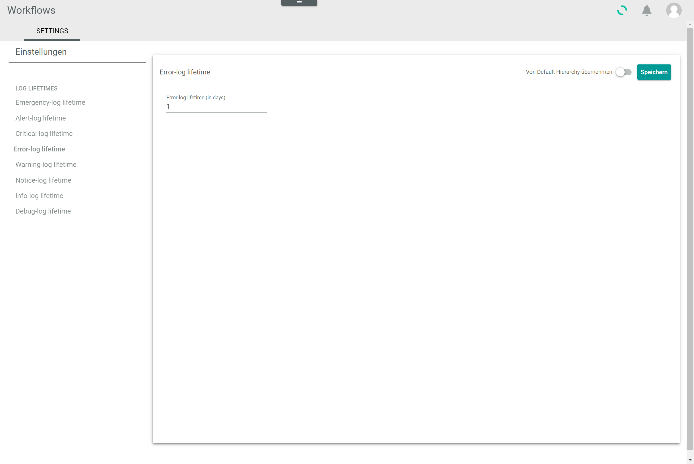
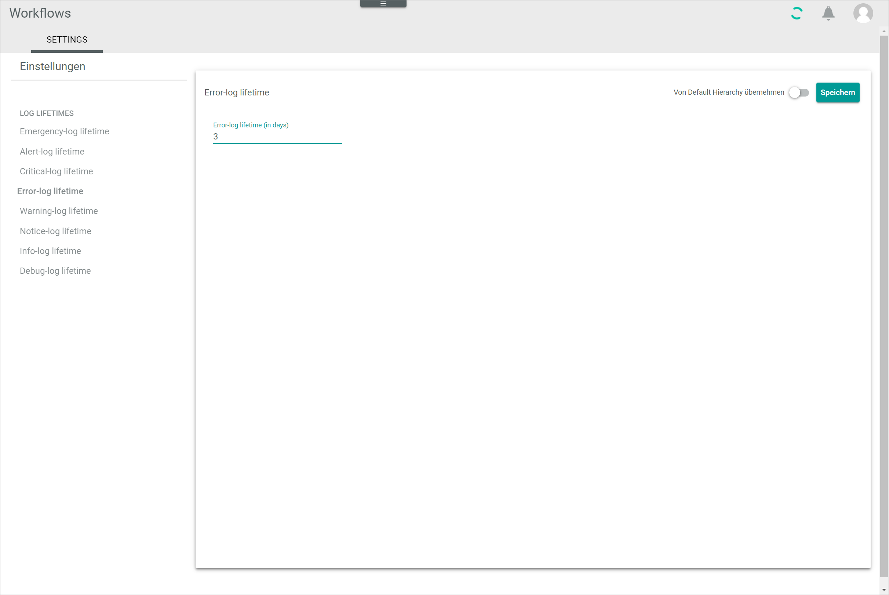

[!!User interface Logging settings](../UserInterface/07a_Settings.md)

# Configure the logging settings

Define in the logging settings how long the different log types are stored. By default, all logs are automatically deleted after one day. You can edit the log lifetime and define a custom lifetime.

#### Prerequisites

No prerequisites to fulfill.

#### Procedure

*Workflows > Settings > Tab SETTINGS*

1. Select the log lifetime type you want to edit in the *LOG LIFETIMES* section of the left *Settings* side menu. The following log types are available:
    - **Emergency-log lifetime**
    - **Alert-log lifetime**
    - **Critical-log lifetime**
    - **Error-log lifetime**
    - **Warning-log lifetime**
    - **Notice-log lifetime**
    - **Info-log lifetime**
    - **Debug-log lifetime**

    The lifetime view of the selected log type is displayed on the right side.

    

    > [Info] The procedure to change the log lifetime is identical for all log lifetime types.

2. Disable the *Apply from default* toggle in the upper right corner.   
    The field to define the log lifetime is unlocked.

3. Enter the desired log lifetime in the *log lifetime (in days)* field.

    

4. Click the [SAVE] button in the upper right corner.   
    The changes have been saved. The *Saving successful* pop-up window is displayed.

    
