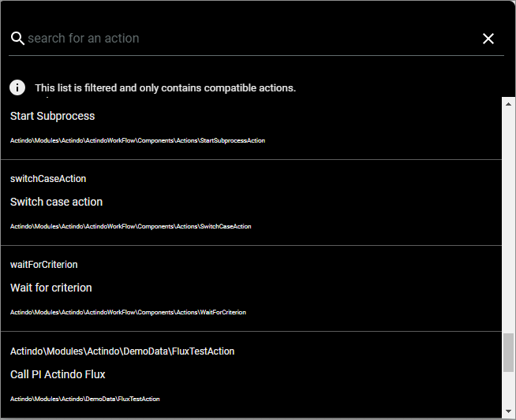
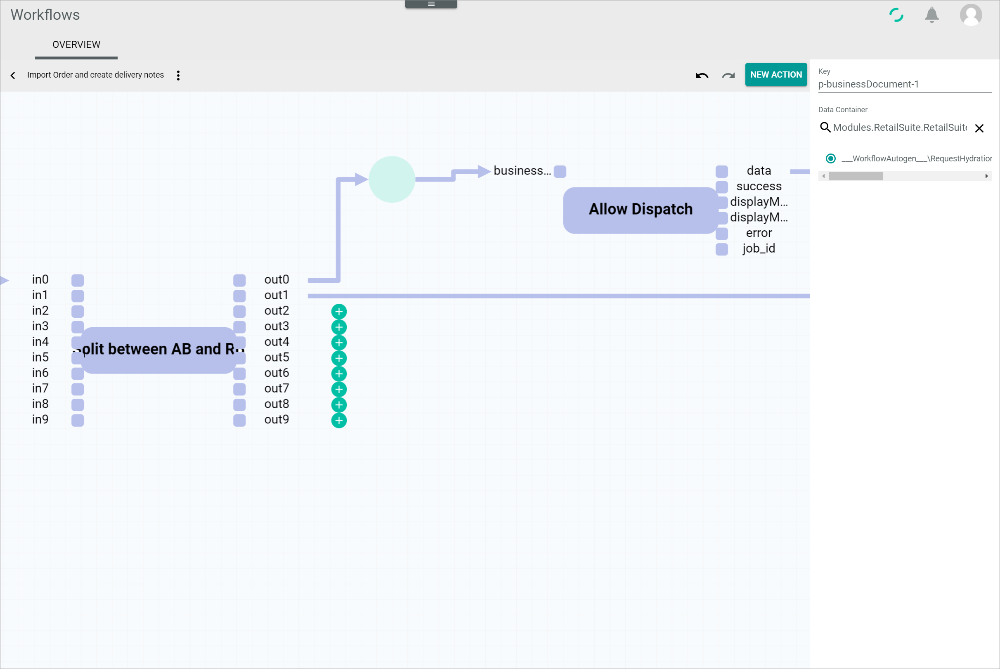
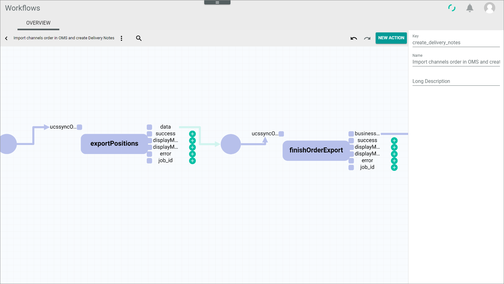
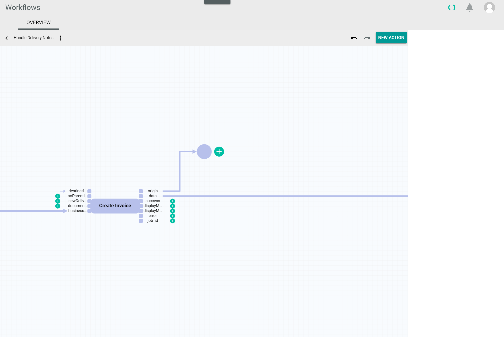
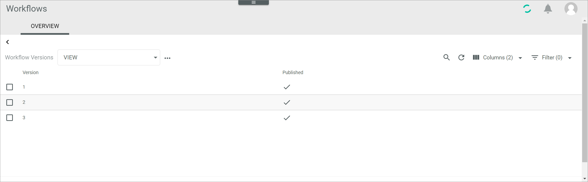

[!!Tasks](../../Tasks/Overview/01_General.md)
[!!User interface Workflows](../UserInterface/02a_Workflows.md)
[!!Workflow and process elements](../Overview/04_WorkflowProcessElements.md)
[!!Track a workflow process](./02_TrackWorkflowProcess.md)

# Manage the workflows

The *Workflows* module allows the customers to define their own business processes, such as orders, shipments, returns, etc.
The workflows can be created individually in the workflow editor, they can be edited subsequently and by publishing and unpublishing a workflow, the usage can be controlled.

## Create a workflow

Create a workflow to define a new process.

### Define the workflow basic settings

In a first step to create a workflow, you have to define the basic settings of the workflow.

#### Prerequisites

No prerequisites to fulfill.

#### Procedure

*Workflows > Workflows > Tab OVERVIEW*

1. Click the  (Add) button in the bottom right corner.   
    The *New workflow* window is displayed.

    

2. Enter a name for the new workflow in the *Select a name for your new workflow* field.

3. Enter a key for the workflow in the *Select a unique key for your new workflow* field. The key is required for API access and must be unique within the workflow version.

4. Click the *Choose the data type of your start place* field and enter the name of the place or a keyword you are searching for.

    > [Info] The list of places is filtered for your keyword as you type.

5. Click the start place you want to add in the list of places.    

6. Click the *Choose the data type of your end place* field and enter the name of the place or a keyword you are searching for.

    > [Info] The list of places is filtered for your keyword as you type.

7. Click the end place you want to add in the list of places.  

8. Click the [CREATE] button in the bottom right corner.   
    The new workflow has been created. The *New workflow* window is closed. The workflow editor with the defined start and end places is displayed.  

    

### Create a transition

Create a transition to define the desired business process.

#### Prerequisites

The basic settings of the workflow have been defined and the workflow editor is displayed, see [Define the workflow basic settings](#define-the-workflow-basic-settings).

#### Procedure

*Workflows > Workflows > Tab OVERVIEW > Button Add > Button CREATE*

1. Click the  (Add) button next to the place or click the [NEW ACTION] button on the right hand above the workflow editor.     
    A window to search for a transition is displayed.

    

2. Click the *Search for an action* field and enter the name of the transition or a keyword you are searching for. If you have clicked the  (Add) button next to a place, only those transitions that are compatible with the data type of the place are displayed in the list.

    > [Info] The list of transitions is filtered for your keyword as you type.

3. Click the transition you want to add in the list of transitions.
    The transition has been added to the workflow. If the transition has been added from a place which requires a certain input data type, the arc from the place will be automatically connected to the corresponding input port of the transition.

    

    > [Info] If any input port or output port of the new transition is mandatory, an arc and a place will be automatically displayed with the corresponding transition.

### Connect the transition

Connect the transition to the a place to create a valid workflow.

#### Prerequisites

- The basic settings of the workflow have been defined and the workflow editor is displayed, see [Define the workflow basic settings](#define-the-workflow-basic-settings).
- At least one transition has been created, see [Create a transition](#create-a-transition)

#### Procedure

*Workflows > Workflows > Tab OVERVIEW > Button Add > Button CREATE*

1. Click the  (Add) button next to an output port of the transition.    
    A new place connected with an arc to the selected output port is displayed.

    

2. Add further transitions by following the procedure [Create an action](#create-an-action) or connect the place with the end place as described in the following step.

    > [Info] A workflow must contain at least one transition and can contain an unlimited number of transitions.

3. Click the place, drag it over the place to which you want to connect it and drop it.     
    The places are merged and the new connection has been created.

## Edit a workflow

Edit a workflow to modify elements within the workflow, to extend the workflow by adding further transitions or to reduce the workflow by removing transitions.

### Select a workflow

Select an existing workflow to edit it.

#### Prerequisites

- At least one workflow has been created, see [Create a workflow](#create-a-workflow).
- You have the required rights to edit a workflow.

#### Procedure

*Workflows > Workflows > Tab OVERVIEW*

1. Click the workflow you want to edit in the list of workflows.   
    The *Workflow versions* view with all versions of the selected workflow is displayed.

    

2. Click the workflow version you want to edit in the list of workflow versions.  
    The workflow editor is displayed in the workspace.

    

[comment]: <> (Step 2 as well as the screenshot workflow versions is possibly not needed in the next workflows version as the version view will disappear and clicking the workflow will take you to the editor directly, check next time)

3. Make the desired changes in the workflow. The following procedures are described in detail below:
    - [Edit the place data type](#edit-the-place-data-type)
    - [Change the place ports](#change-the-place-ports)
    - [Add a transition](#add-a-transition)
    - [Edit a transition](#edit-a-transition)

### Edit the place data type

Edit the place settings to change or define the place data type.

#### Prerequisites

- At least one workflow has been created, see [Create a workflow](#create-a-workflow).
- You have the required rights to edit a workflow.

#### Procedure

*Workflows > Workflows > Tab OVERVIEW > Select workflow*

[comment]: <> (New screenshot with transition in it)

1. Click the place you want to edit.    
    The place is highlighted and its settings are displayed in the settings side bar on the right.

    

2. Click the *Data container* field in the settings side bar and select the appropriate data type in the list of data types.

    > [Info] Only values of those data types that match with the connected output and input port of the selected place are displayed in the list.     

### Change the place ports

You can change the ports of the place by deleting an existing arc and creating a new one.

#### Prerequisites

- At least one workflow has been created, see [Create a workflow](#create-a-workflow).
- You have the required rights to edit a workflow.
- A workflow has been selected, see [Select a workflow](#create-a-workflow).

#### Procedure

*Workflows > Workflows > Tab OVERVIEW > Select workflow*

1. Navigate to the place whose input or output port you want to edit.  

2. Click the arc right or left to the place to change the input or output port. To change the input port, click the arc right to the place, to change the output port, click the arc left to the place.   
    The selected arc is highlighted.

    

3. Press the **BackSpace** or the **Delete** key to remove the selected arc.    
    The selected arc between the place and the port has been deleted.

    > [Info] If the port whose connection is deleted is mandatory, a new place connected to this port is automatically displayed.

4. Click the  (Add) button next to the port you want to connect the place with.    
    A new place with a connection to the selected port is displayed.

5. Click the new place, drag it over the place whose connection you have deleted and drop it.     
    The places are merged and the new connection has been created.

### Delete a place

Delete a place that is no longer needed, for instance if a transition is removed from the workflow.

#### Prerequisites

- At least one workflow has been created, see [Create a workflow](#create-a-workflow).
- You have the required rights to edit a workflow.
- A workflow has been selected, see [Select a workflow](#create-a-workflow).

#### Procedure

*Workflows > Workflows > Tab OVERVIEW > Select workflow*

1. Navigate to the place you want to delete.  

2. Click the place to be deleted.   
    The selected place is highlighted.

    

3. Press the **Delete** key to remove the selected place.    
    The selected place and its arcs have been deleted.

    > [Info] If a one of the arcs has been connected to a mandatory input or output port, a new place connected to this port will be automatically displayed.

### Add a transition

Add one or several transition to the workflow to define or expand the desired business process.

#### Prerequisites

- At least one workflow has been created, see [Create a workflow](#create-a-workflow).
- You have the required rights to edit a workflow.
- A workflow has been selected, see [Select a workflow](#create-a-workflow).

#### Procedure

*Workflows > Workflows > Tab OVERVIEW > Select workflow*

1. Navigate to the part in the workflow where you want to add a transition.  

2. Click the  (Add) button next to the output port to which you want to connect a new transition.     
    A new place connected to the selected output port is displayed.

    > [Info] If a place to the output port already exists, for instance because it is mandatory, you can skip the step **2**.

    

3. Click the  (Add) button right to the new place.    
    A window to search for a transition is displayed.

    

4. Click the *Search for an action* field and enter the name of the transition or a keyword you are searching for.

    > [Info] The list of transitions is filtered for your keyword as you type.

5. Click the transition you want to add in the list of transitions.    
    The transition has been added to the workflow and connected to the selected place.

    

### Edit a transition

Edit a transition to define its settings.

#### Prerequisites

- At least one workflow has been created, see [Create a workflow](#create-a-workflow).
- You have the required rights to edit a workflow.
- A workflow has been selected, see [Select a workflow](#create-a-workflow).

#### Procedure

*Workflows > Workflows > Tab OVERVIEW > Select workflow*

1. Click the transition you want to edit.  
    The transition is highlighted and its settings are displayed in the settings side bar on the right.

    

    > [Info] The settings displayed in the settings side bar may differ depending on the respective transition. The sections *Configuration* and *Static Inputs* are only available for certain transitions.     

2. Edit the settings field in the settings side bar. You can change the label, the queue type, the task event, the configuration and the static inputs as described below:

    + Click the *Label* field and edit the name of the transition displayed in the workflow editor.

    + Click the *Queue type* drop-down list and select the appropriate queue type for the transition. All available queue types are displayed in the drop-down list. By default the *Default* queue type is selected. You can define a different queue type for each transition within the workflow.   
    For detailed information about the queue types, see [Configure the queue types](../Integration/01_ConfigureQueueTypes.md).

    + Click the *Task event* drop-down list and select an event connected to the transition. The event is triggered and the corresponding task is assigned when the process action has failed. All available task events are displayed in the drop-down list. By default, the *ActindoWorkflow process execution failed* event is preselected. The drop-down list is only displayed when the *Task* module is installed and the current user has the required rights to configure it.

    + Edit the field(s) in the *Configuration* section to define further configuration settings to the selected transition. This section is only displayed for certain transitions. The fields displayed in the *Configuration* section depend on the selected transition.

    + Click the  (Add) button right to an input name in the *Static inputs* section to add a static data value to the corresponding input. All input ports that are not yet connected to a place are displayed in this section. Enter the appropriate value in the text field below the input name. The value entered must be a valid JSON value. Click the  (Delete) button right to a value to delete it. This section is only displayed for certain transitions.

        > [Info] Input ports with a static input value cannot be connected to a place. Therefore, a small arrow without a place is displayed in front of an input port with a static input value. Delete the static input value from the port to be able to connect it with a place.     

[comment]: <> (Check the design of static input before next version is released; design possibly changes)
[comment]: <> (Add a link to the Tasks module/task events when documented)

## Copy a workflow  

Copy a workflow by exporting and importing the JSON code to create a new workflow based on an existing workflow.

### Export the workflow JSON code

Export the JSON code of an existing workflow that you want to copy.

#### Prerequisites

- At least one workflow has been created, see [Create a workflow](#create-a-workflow).
- You have the required rights to edit a workflow.

#### Procedure

*Workflows > Workflows > Tab OVERVIEW*

1. Click the workflow you want to copy in the list of workflows.   
    The *Workflow versions* view with all versions of the selected workflow is displayed.

    

2. Click the workflow version you want to copy in the list of workflow versions.  
    The workflow editor is displayed in the workspace.

    

[comment]: <> (Step 2 as well as the screenshot workflow versions is possibly not needed in the next workflows version as the version view will disappear and clicking the workflow will take you to the editor directly, check next time)

3. Click the  (Points) button in the upper left corner next to the workflow name.   
    The workflow context menu is displayed.

    

4. Click the *Export JSON ..* menu entry in the context menu.   
    The *Export JSON* window with the JSON code for the current workflow is displayed.

    

5. Select the complete JSON code in the window, copy it to the clipboard and click the [CLOSE] button in the bottom right corner.   
    The *Export JSON* window is closed.

6. Click the  (Back) button in the workflow editor.  
    The workflow editor is closed and the list of workflows is displayed again.

### Import the workflow JSON code

Import the exported JSON code to an existing or new workflow to copy it.

#### Prerequisites

- At least one workflow has been created, see [Create a workflow](#create-a-workflow).
- You have the required rights to edit a workflow.
- The JSON code of the workflow to copy has been exported to the clipboard, see [Export the workflow JSON code](#export-the-workflow-JSON-code).

#### Procedure

*Workflows > Workflows > Tab OVERVIEW*

1. [Create a new workflow](#create-a-workflow) or click the workflow in the list of workflows to which you want to import the copied JSON code.   
  The *Workflow versions* view with all versions of the selected workflow is displayed.

  

2. Click the workflow version you want to edit in the list of workflow versions.  
  The workflow editor is displayed in the workspace.

  

[comment]: <> (Step 2 as well as the screenshot workflow versions is possibly not needed in the next workflows version as the version view will disappear and clicking the workflow will take you to the editor directly, check next time)

3. Click the  (Points) button in the upper left corner next to the workflow name.   
  The workflow context menu is displayed.

  

4. Click the *Import JSON ..* menu entry in the context menu.   
  The *Import JSON* window with the JSON code for the current workflow is displayed.

  

5. Select the complete JSON code in the window, replace it by the JSON code in your clipboard and click the [IMPORT JSON] button in the bottom right corner.
  The *Import JSON* window is closed. The copied workflow is displayed in the workflow editor.

  

  > [Info] You can edit the workflow as desired before deploying it.

6. Click the  (Points) button in the upper left corner next to the workflow name.   
  The workflow context menu is displayed.

  

7. Click the *Deploy* menu entry in the context menu.   
  The copied workflow has been deployed and published.

## Publish a workflow version

A workflow can only be used for processes if it is published. If multiple versions of a workflow exist, the highest published version is taken for upcoming workflow processes. Therefore you have to publish a workflow to use it for workflow processes. By default, a workflow is automatically published when it is created or when a new workflow version is deployed. You can manually publish or [unpublish](#unpublish-a-workflow-version) workflow versions.

#### Prerequisites

- At least one workflow has been created, see [Create a workflow](#create-a-workflow).
- At least one workflow version is unpublished, see [Unpublish a workflow version](#unpublish-a-workflow-version).

#### Procedure

*Workflows > Workflows > Tab OVERVIEW > Select workflow*

1. Select the checkbox of the workflow version you want to publish.      
  The editing toolbar is displayed.

2. Click the [PUBLISH] button in the editing toolbar.   
  The selected workflow version has been published. The icon in the *Published* column changes from  (Cross) to  (Checkmark).

  

## Unpublish a workflow version

A workflow can only be used for processes if it is published. By default, a created workflow or a deployed workflow version is automatically published. You can manually [publish](#publish-a-workflow-version) or unpublish workflow versions. Unpublish a workflow version if the workflow is still in work or used for testing purposes and the workflow should not yet be used for processes.

#### Prerequisites

- At least one workflow has been created, see [Create a workflow](#create-a-workflow).
- At least one workflow version has been published, see [Publish a workflow version](#publish-a-workflow-version).

#### Procedure

*Workflows > Workflows > Tab OVERVIEW > Select workflow*

  

1. Select the checkbox of the workflow version you want to unpublish.      
  The editing toolbar is displayed.

2. Click the [UNPUBLISH] button in the editing toolbar.   
  The selected workflow version has been unpublished. The icon in the *Published* column changes from  (Checkmark) to  (Cross).

  
