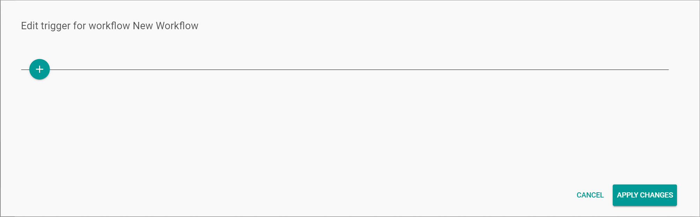
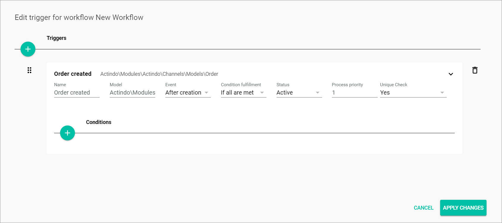
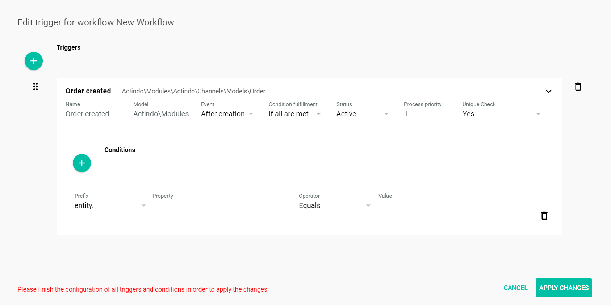
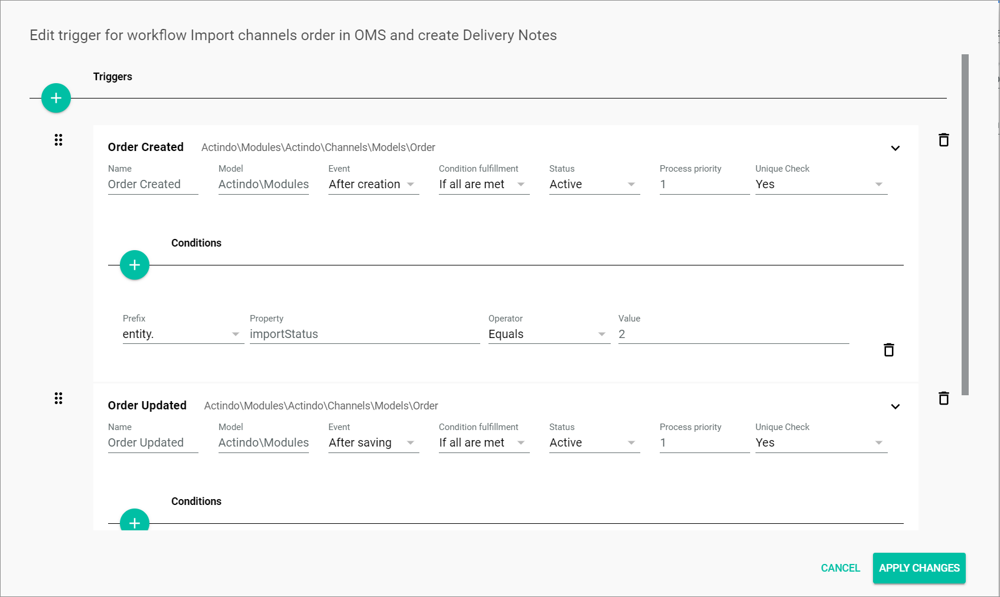

[!!User interface Workflows](../UserInterface/02a_Workflows.md)

# Manage the triggers

When designing a workflow to map a business process, the *Triggers* function allows you to determine a specific model, such as a product or a dispatch note, to initiate a process. Any model, together with the occurrence of a related event, can trigger a process, for instance a product being created or a product attribute being changed. Besides, multiple conditions can be configured for a trigger to recreate all possible variants of a workflow.   
You can create one or several triggers for a workflow, define conditions, edit the triggers or delete them.

## Create a trigger

Create a trigger to determine a business object to initiate a process and the related event to make it executable.

#### Prerequisites

No prerequisites to fulfill.

#### Procedure

*Process Orchestration > Workflows > Tab OVERVIEW > Button Add > Button CREATE*   
*Process Orchestration > Workflows > Tab OVERVIEW > Select a workflow > Select a workflow version*

1. Click the  (Points) button in the upper left corner next to the workflow name.   
    The workflow context menu is displayed.

    

2. Click the *Triggers* menu entry.  
    The *Edit trigger for workflow "Workflow name"* window is displayed.

    

3. Click the  (Add) button to create a trigger.  
    A *New trigger* input line is displayed.

    

4. Enter a descriptive name for the trigger in the *Name* field.   
    The entered name is displayed above the trigger input line.

5. Enter the applicable namespace of the desired model in the *Model* field, for example a PIM product corresponds to the model Actindo.Modules.Actindo.PIM.Models.PIMProduct. By entering the model, replace the dots with back slashes (**Actindo\Modules\Actindo\PIM\Models\PIMProduct**).   
    The entered namespace is displayed to the right of the trigger name above the trigger input line.

    > [Info] You can take the data models from the related data model under *Dev Tools > API > Tab DATA MODELS*.

6. Click the *Event* drop-down list and select the appropriate option. The following options are available:  
    - **After creation**   
        Select this option for the trigger to be executed after the model has been created. This option is preselected by default.
    - **After saving**   
        Select this option for the trigger to be executed after the model has been saved.

7. Click the *Condition fulfillment* drop-down list and select the appropriate option. The following options are available:
    - **If all are met**  
        Select this option if you want all conditions to be met for the trigger to be executed. This option is preselected by default.
    - **If any is met**  
        Select this option if you want the trigger to be executed if any single one of the configured conditions is met.

8. Click the *Status* drop-down list and select the appropriate option. The following options are available:
    - **Active**  
        Select this option to activate the trigger.
    - **Inactive**  
        Select this option to deactivate the trigger temporarily.  

9. Enter the priority for the process execution in the *Process priority* field. The priority is specified with a positive integer. The greater the number, the higher the priority.  

    > [Info] As soon as all fields are completed, the  (Add) button to add a condition is displayed.  

    
    

10. If desired, add one or several conditions to the trigger, see [Add a condition](#add-a-condition). You can also create a trigger without adding a single condition.

    > [Info] Repeat the steps **3** to **10** to add a further trigger. You can add an unlimited number of triggers to a workflow.

11. Make sure that the model defined in the trigger is used as the data container for the start place of the workflow.

12. Click the [APPLY CHANGES] button.  
    The trigger has been saved. The *Edit trigger for workflow "Workflow name"* window is closed.

## Add a condition

Add one or several conditions to a trigger to define more precisely when a process is executed.

#### Prerequisites

All trigger fields have been completed, see [Create a trigger](#create-a-trigger).

#### Procedure

*Process Orchestration > Workflows > Tab OVERVIEW > Button Add > Button CREATE > Button Points > Menu entry Triggers*    
*Process Orchestration > Workflows > Tab OVERVIEW > Select a workflow > Select a workflow version > Button Points > Menu entry Triggers*

1. Click the  (Add) button.  
    A new input line is displayed.

    

2. Click the *Prefix* drop-down list and select the appropriate prefix. The following options are available:  
    - **entity.**   
        Select this option if you want to refer to any property independently of its change status. The option is usually selected if the **After creation** event is selected in the *Event* drop-down list of the trigger fields. This option is preselected by default.
    - **changeset.**   
        Select this option if you want to refer to a property that has been changed. Only properties that have been changed are included to the change set.

3. Enter the applicable property in the *Property* field.  

    > [Info] The properties of an entity you can refer to are described in the relevant API documentation. To include a deeper level of the data field, enter a point *.* at a time, for instance *{$entity._pim_tax_zone.id}*. The first point is already included in the *Prefix* field, so you can start with the property name without adding a point at the beginning.

4. Click the *Operator* drop-down list and select the appropriate option. The following options are available:  
    - **Equals**   
        Select this option if the property value must equal the value specified in the *Value* field for the trigger to be executed.
    - **Does not equal**   
        Select this option if the property value must not equal the value specified in the *Value* field for the trigger to be executed.
    - **Is set**  
        Select this option if any property value must be set for the trigger to be executed. No value must be entered in the *Value* field. A toggle is available instead of a value:   
        - Enable the toggle to define that a property value must be set for the condition to be met.
        - Disable the toggle to define that a property value must not be set for the condition to be met.

[comment]: <> (Option is set anpassen, nachdem ICBPM-204 fertig ist > DONE)

5. If necessary, enter the corresponding value in the *Value* field.

    > [Info] Repeat the steps **1** to **5** to add a further condition to the trigger. You can add an unlimited number of conditions.

6. Click the [APPLY CHANGES] button.  
    The condition has been saved. The *Edit trigger for workflow "Workflow name"* window is closed.

## Edit a trigger

Edit a trigger to modify any of the previously configured settings. It is also possible to edit or delete a condition for a trigger to be executed.

#### Prerequisites

At least one trigger has been created, see [Create a trigger](#create-a-trigger).

#### Procedure

*Process Orchestration > Workflows > Tab OVERVIEW > Button Add > Button CREATE > Button Points > Menu entry Triggers*   
*Process Orchestration > Workflows > Tab OVERVIEW > Select a workflow > Select a workflow version > Button Points > Menu entry Triggers*

1. Edit the trigger settings as necessary.

2. If desired, edit the conditions:
    + Edit the condition settings as necessary.
    + Add one or several conditions, see [Add a condition](#add-a-condition).
    + Click the  (Delete) button to the right of a condition to delete the corresponding condition.

3. Click the [APPLY CHANGES] button.    
    All changes have been saved. The *Edit trigger for workflow "Workflow name"* window is closed.

## Change the order of triggers

Modify the position of one or more triggers to set the correct order for the triggers to be executed. The correct order of the triggers is crucial, as the system goes through the triggers in the order they are listed, starting from the top, and stops checking them as soon as a matching trigger is found. This means, that the triggers must be organized from specific to general to cover all possible relevant cases.

#### Prerequisites

At least two triggers have been created in the workflow version, see [Create a trigger](#create-a-trigger).

#### Procedure

*Process Orchestration > Workflows > Tab OVERVIEW > Button Add > Button CREATE > Button Points > Menu entry Triggers*    
*Process Orchestration > Workflows > Tab OVERVIEW > Select a workflow > Select a workflow version > Button Points > Menu entry Triggers*

1. Click and hold the  (Drag) button to the left of the trigger you want to move to another position in the list.   

2. By using drag and drop, move the selected trigger to the desired position in the list.

    

3. If necessary, repeat the steps **1** and **2** for all triggers that need to be repositioned.

4. Click the [APPLY CHANGES] button.  
    All changes have been saved. The *Edit trigger for workflow "Workflow name"* window is closed.

## Delete a trigger

You can delete a trigger that is no longer relevant.

> [Caution] Be aware that any deletion is permanent and cannot be undone. You can deactivate the trigger temporarily by changing status to *Inactive* in the *Status* drop-down list.

#### Prerequisites

At least one trigger has been created, see [Create a trigger](#create-a-trigger).

#### Procedure

*Process Orchestration > Workflows > Tab OVERVIEW > Button Add > Button CREATE > Button Points > Menu entry Triggers*     
*Process Orchestration > Workflows > Tab OVERVIEW > Select a workflow > Select a workflow version > Button Points > Menu entry Triggers*

1. Click the  (Delete) button to the right of the trigger to be deleted.  
    The trigger and all corresponding conditions are removed from the list.

    

2. Click the [APPLY CHANGES] button.  
    The trigger has been deleted. The *Edit trigger for workflow "Workflow name"* window is closed.
