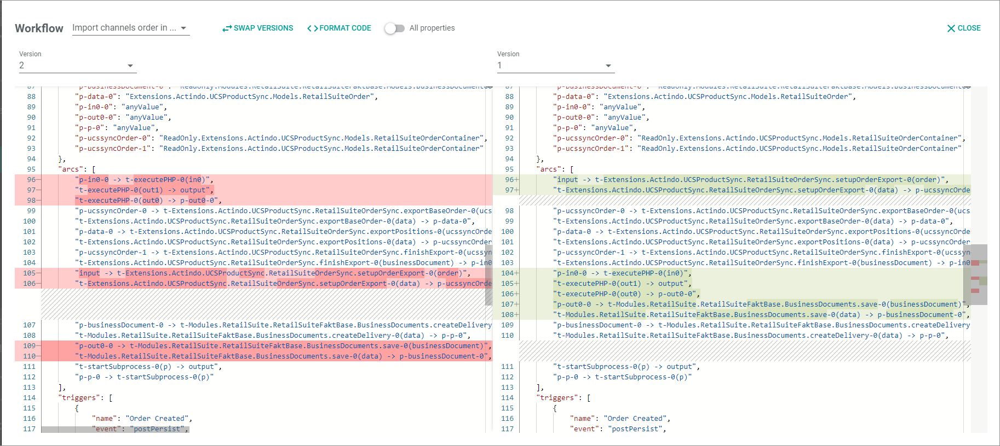
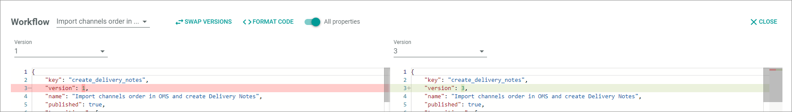
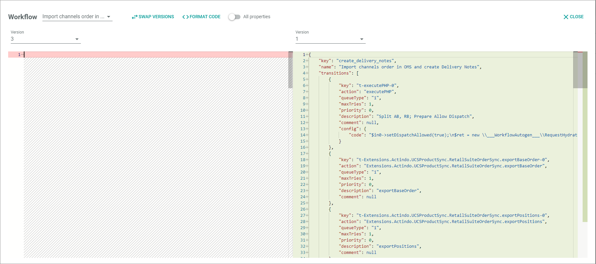

# Compare the workflow versions

The comparison function of the workflow enables to compare two versions of a workflow. You can use it to compare a workflow to any other version available on the current instance. It is possible to edit the JSON code directly in the compare view, so that you can also compare to a workflow with a version available on another instance. You can use this function for creating change logs as well as to be able to do software-audits.

## Compare the workflow version with other version

Compare a workflow with any other version available on the current instance.

#### Prerequisites

- At least one workflow has been created, see [Create a workflow](#create-a-workflow).
- You have the required rights to edit a workflow.
- You have opened the workflow editor in each desired instance.

#### Procedure

*Workflows > Workflows > Tab OVERVIEW*

1. Select the workflow for which you want to do a comparison.   
    The *Workflow versions* view is displayed.
    
    

2. Click the checkbox at the desired version you want to compare.   
    The editing toolbar is displayed.

    > [Info] If you are currently working in the workflow editor, and want to display changes from the previous version, you can also display the *Workflow "workflow name"* pop-up window as follows:  
        - Click the  (Points) button in the upper left corner next to the workflow name.  
        - Click the *Show changes* menu entry.

3. Click the [COMPARE] button.  
    The *Workflow "workflow name"* pop-up window is displayed. On the left side, the JSON code of the oldest version is displayed. 

    

4. Compare the versions.   
    Inserts are displayed in green, deletions are displayed in red.
    
5. If desired, use one of the following assistants:   

   - Select version   
        Click the version drop-down list on top of a column and select the desired version number.

    - Swap versions   
        Click the  [SWAP VERSIONS] button to swap the versions displayed. Note that on the left side always the deletions are displayed, on the right side the inserts.
       
    - Smoothen comparison   
        Click the  [FORMAT CODE] button to increase the comparability of the coding lines. The function compares the lines of code and puts them in the same order, so that order differences are no longer highlighted.

    - Display all changes   
       Click the  (All properties) toggle to compare all properties. This includes properties which have no functional impact such as the version number, or positioning of the nodes.

        

## Compare the workflow versions from different instances 

Compare a workflow with any other version available on another instance.

#### Prerequisites

- At least one workflow has been created in each required instance, see [Create a workflow](#create-a-workflow).
- You have the required rights to edit a workflow.
- A workflow has been selected, see [Select a workflow](#create-a-workflow).

#### Procedure

*Workflows > Workflows > Tab OVERVIEW > Select workflow > Select version > Select points > Select Show changes in both systems*

1. Copy the JSON code from the workflow version you want to use as source for the comparison.

2. Delete the code in the target version.
    

3. Paste the source JSON code to the target version. 

4. Compare the versions. If desired, copy missing code from the source to the target version or delete unnecessary code in the target.

