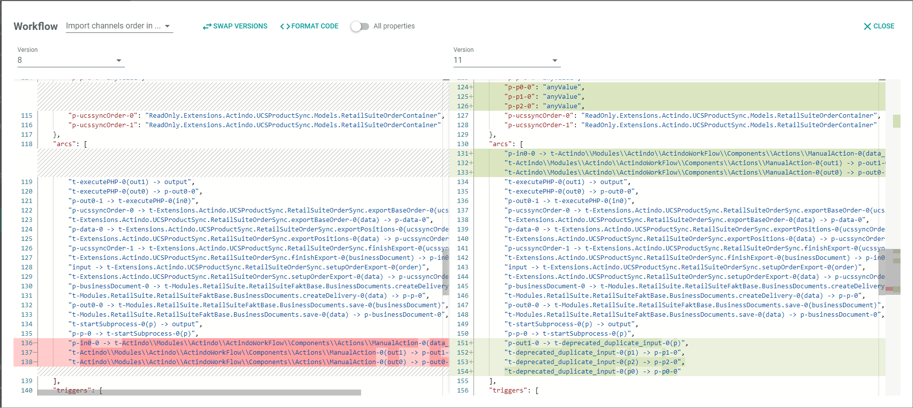

# Compare the workflow versions
<!---NEU Neues Kapitel-->
The comparison function of the workflow enables to compare different workflow versions. By doing this, you can compare the JSON code lines of two different workflow versions, whereby all differences between the relevant code lines are highlighted.  

You can use this function to do the following: 
- Compare a specific workflow version to any other version of that workflow available on the current instance.
- Compare a specific workflow version to any workflow version available on another instance. 
- Change, insert, or delete code lines. This is possible because you can edit the JSON code directly.  
- Display change logs, for example, to do software audits.

## Open the comparison window

Open the comparison window to compare different workflow versions. There are two different ways to open it.

#### Prerequisites

You have the required rights to edit a workflow.

#### Procedure

*Process Orchestration > Workflows > Tab OVERVIEW*

Select the workflow for which you want to do a comparison.   
The *Workflow versions* view is displayed.
    

**Open the comparison window via the Workflow versions view**

1. Click the checkbox at the desired version you want to use for comparison.   
    The editing toolbar is displayed.
    
2. Click the [COMPARE] button.  
    The comparison window is displayed. 

      

**Open the comparison window in the workflow editor**   

1. Select a workflow version.   
    The workflow editor is displayed.

2. Click the  (Points) button in the upper left corner next to the workflow name.  
    The workflow context menu is displayed.

    

3. Select the *Show changes* menu entry.  
    The comparison window is displayed. 

    
    

## Compare the versions

Compare a workflow version with any other version available on the current instance.

#### Prerequisites

- At least two versions of a workflow has been created, see [Create a workflow](./01_ManageWorkflows.md#create-a-workflow).
- You have the required rights to edit a workflow.
- You have opened the comparison window, see [Open the comparison window](#open-the-comparison-window).

#### Procedure

*Process Orchestration > Workflows > Tab OVERVIEW > Select workflow > Tick workflow version > Select COMPARE*  
*Process Orchestration > Workflows > Tab OVERVIEW > Select workflow > Select workflow version > Select points > Select Show changes*

   
1. Compare the versions.   
    The left column highlights the differences in red, the right column in green. Inserts that are not available in the other version are highlighted as a gray shaded area. The scrollbar on the right highlights all differences in red or green, so you can quickly scroll to a line with differences.
    
2. If desired, use one of the following assistant functions:   

   - Version   
        To change a displayed version, click the *Version* drop-down list on top of a column and select the desired version number.

    - Swap versions   
        Click the  [SWAP VERSIONS] button to swap the versions displayed. 
       
    - Format code  
        Click the  [FORMAT CODE] button to smooth the comparison.   
        The function compares the lines of code and puts them in the same order, so that order differences are no longer highlighted.

    - All properties   
       Click the  (All properties) toggle to compare all changes. This includes properties which have no functional impact such as the version number or the positioning of the nodes.

        

3. Click the [X CLOSE] button to close the comparison window.

## Compare versions of different instances

Compare a workflow version with any other version available on another instance.

#### Prerequisites

- At least one workflow has been created in each instance, see [Create a workflow](./01_ManageWorkflows.md#create-a-workflow).
- You have the required rights to edit a workflow in each of the instances.
- You are logged in to the instance, from which you want to retrieve the desired workflow version.
- You have opened the comparison window, see [Open the comparison window](#open-the-comparison-window).

#### Procedure

*Process Orchestration > Workflows > Tab OVERVIEW > Select workflow > Tick workflow version > Select COMPARE in both systems*  
*Process Orchestration > Workflows > Tab OVERVIEW > Select workflow > Select workflow version > Select points > Select Show changes in both systems*

1. Copy the JSON code from the workflow version you want to use as source for the comparison. To do this, you can copy the code with **Ctrl C** or use the export function, see [Export the workflow JSON code](./04_CopyWorkflow.md#export-the-workflow-json-code).

2. Log out from this system and log in to the instance on which you want to perform the comparison. 

3. Open the workflow version that you want to compare with the version you have just copied, see [Open the comparison window](#open-the-comparison-window).

2. Delete the JSON code in the column that is not the desired target version.   
    The column contains no longer any code.

    

4. Paste the copied source JSON code to the empty column.   
    The comparison is displayed again.
    
    
    
5. Compare the versions. If desired, use the assistant functions, see [Compare the versions](#compare-the-versions). 

6. If desired, copy missing code from the source to the target version or delete unnecessary code in the target. 

7. Click the [X CLOSE] button to close the comparison window.

## Change the workflow to be compared 

Change the workflow to be compared without leaving the comparison window.

#### Prerequisites

- You have the required rights to edit a workflow.
- You have opened the comparison window, see [Open the comparison window](#open-the-comparison-window).

#### Procedure

*Process Orchestration > Workflows > Tab OVERVIEW > Select workflow > Tick workflow version > Select COMPARE*  
*Process Orchestration > Workflows > Tab OVERVIEW > Select workflow > Select workflow version > Select points > Select Show changes*

1. Click the drop-down list next to the window title.  
    A list of all workflows available in the current instance is displayed.

2. Select the appropriate workflow.  
   The current workflow code has been removed. The columns are empty.

   

3. Select the desired workflow version by clicking on the *Version* drop-down list of the left column.  
    A list of all available workflow versions available for the selected workflow is displayed.

4. Select the desired version.   
   The column is filled with JSON code.

5. Repeat step **3** and **4** for the right column.

6. Compare the workflow versions. If desired, use the assistant functions, see [Compare the versions](#compare-the-versions). 

7. Click the [X CLOSE] button to close the comparison window.

