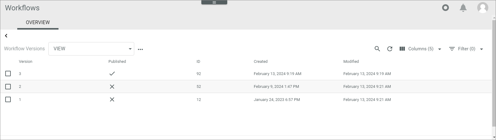
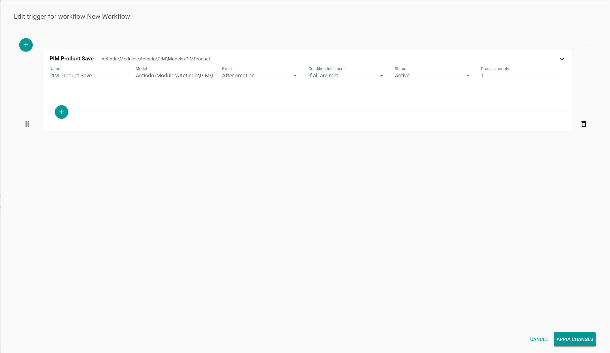
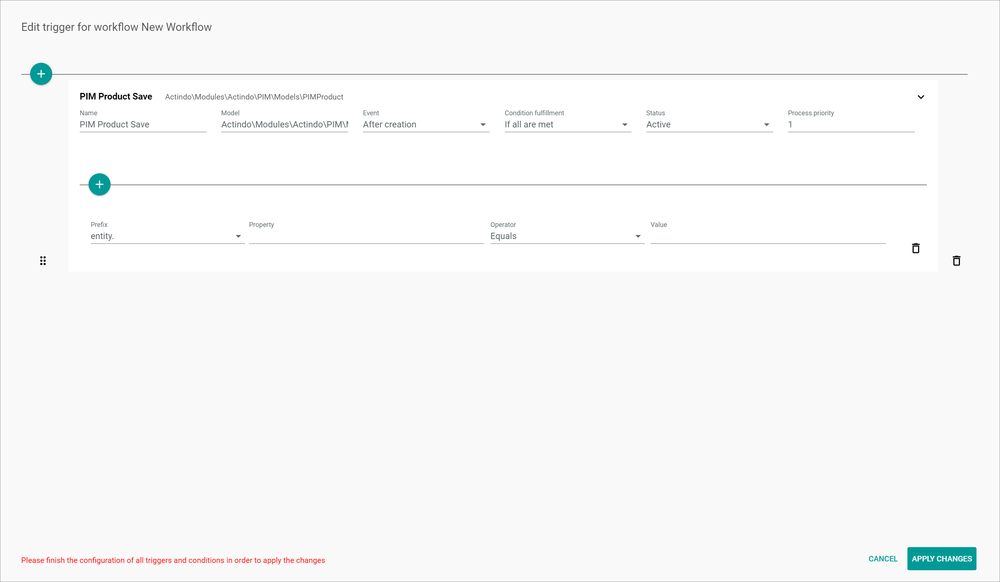
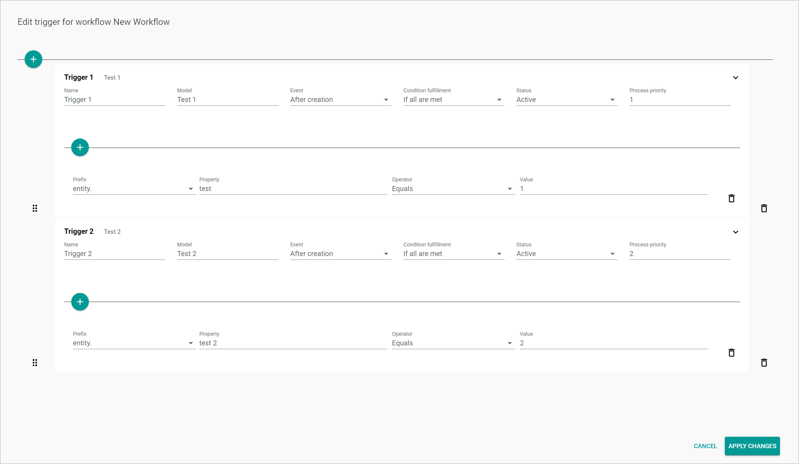

[!!User Interface Workflows](../UserInterface/02a_Workflows.md)   
[!!Workflow and process elements](../Overview/04_WorkflowProcessElements.md)   
[!!Track a workflow process](./02_TrackWorkflowProcess.md)   

# Manage the triggers

When designing a workflow to map a business process, the *Triggers* function allows the user to determine a specific model, such as a product or a dispatch note, to initiate a process. Any model, together with the occurrence of a related event, can trigger a process, for instance a product being created or a product attribute being changed. Besides, multiple conditions can be configured in a trigger to recreate all possible variants of a workflow.

Triggers can be created, edited or deleted in the workflow editor.

## Create a trigger

Create a trigger to determine a business object to initiate a process and the related event to make it executable.

#### Prerequisites

No prerequisites to fulfill.

[comment]: <> (MV: Add triggers info to UI)

#### Procedure

*Workflows > Workflows > Tab OVERVIEW*

1. Select a workflow from the *Workflows* list.  
  The *Workflow versions* view with all versions of the selected workflow is displayed.

  

2. Select the workflow version where the trigger is to be   added.  
  The workflow editor is displayed.

3. Click the  (Points) button in the upper left corner next to the workflow name.   
  The workflow context menu is displayed.

  

4. Click the *Triggers* menu option.  
  The *Edit trigger for workflow "Workflow name"* window is displayed.

  

5. Click the  (Add) button to create a trigger.  
  A *New trigger* input line is displayed.

  

6. Enter a description in the *Name* field.  

7. Enter the applicable namespace of the model in the *Model* field, for example a PIM product.
  > [Info] The data models can be taken from the relevant API documentation.

8. Click the *Event* drop-down list and select the appropriate option. The following options are available:  
  - **After creation**   
    Select this option to initiate the process after the model has being created. This option is preselected by default.
  - **After saving**   
    Select this option to initiate the process after the model has being saved.

9. Click the *Condition fulfillment* drop-down list and select the appropriate option. The following options are available:
  - **If all are met**  
    Select this option if you want all conditions to be met for the trigger to be executed. This option is preselected by default.
  - **If any is met**  
    Select this option if you want any condition to be met for the trigger to be executed.

10. Click the *Status* drop-down list and select the appropriate option. The following options are available:
  - **Active**  
      Select this option to activate the trigger.
  - **Inactive**  
      Select this option to deactivate the trigger temporarily.  

11. Enter the priority for the process execution in the *Process priority* field. The priority is specified with a positive integer. The greater the number, the higher the priority.  

  > [Info] As soon as all fields are completed, the  (Add) button is displayed.  

12. If desired, follow the steps below to add a condition, see [Add a condition](#add-a-condition).

  

13. Click the [APPLY CHANGES] button.  
  The changes made are saved. The *Edit trigger for workflow "Workflow name"* window is closed.

## Add a condition

If desired, you can add one or more conditions for a trigger to be executed.

#### Prerequisites

All trigger fields have been completed, see [Create a trigger](#create-a-trigger).

#### Procedure

*Workflows > Workflows > Tab OVERVIEW > Select a workflow > Select a workflow version > Button Points > Menu entry Triggers*

1. Click the  (Add) button.  
  A new input line is displayed.

  

2. Click the *Prefix* drop-down list and select the appropriate option. The following options are available:  
  - **entity**
  - **changeset**

3. Enter the applicable property in the *Property* field.  

4. Click the *Operator* drop-down list and select the appropriate option. The following options are available:  
  - **Equals**  
    Select this option if the property value must equal the value specified in the *Value* field for the trigger to be executed.
  - **Does not equal**  
    Select this option if the property value must not equal the value specified in the *Value* field for the trigger to be executed.
  - **Is set**  
    Select this option if the property value must be a fixed value set in the *Value* field for the trigger to be executed.

[comment]: <> (Bedeutung? Was/wofür wird es genutzt? Unterschied zu Equals? Booleans? Wert vorhanden?)

5. Enter the applicable value in the *Value* field. Both numbers and letters can be used in this field.

6. Click the [APPLY CHANGES] button.  
  The changes made are saved. The *Edit trigger for workflow "Workflow name"* window is closed.

## Edit a trigger

Edit a trigger to modify any of the previously configured settings. It is also possible to edit or delete a condition for a trigger to be executed.

#### Prerequisites

A trigger has been created, see [Create a trigger](#create-a-trigger).

#### Procedure

*Workflows > Workflows > Tab OVERVIEW > Select a workflow > Select a workflow version > Button Points > Menu entry Triggers*

1. Edit the trigger settings as necessary.

2. If desired, edit the condition values.

3. If desired, add one or more conditions, see [Add a condition](#add-a-condition).

4. If desired, click the  (Delete) button to the right of a condition.  
  The condition is removed from the list.

5. Click the [APPLY CHANGES] button.    
  The changes have been saved. The *Edit trigger for workflow "Workflow name"* window is closed.

### Change the order of triggers

Modify the position of one or more triggers to set the correct order for the triggers to be executed. The correct order of the triggers is crucial, as the system goes through the triggers in the order they are listed, starting from the top, and stops checking them as soon as a matching trigger is found. This means, that the triggers must be organized from specific to general to cover all possible relevant cases.

[comment]: <> (Zu bearbeiten)

#### Prerequisites

At least two triggers have been created in the workflow version, see [Create a trigger](#create-a-trigger).

#### Procedure

*Workflows > Workflows > Tab OVERVIEW > Select a workflow > Select a workflow version > Button Points > Menu entry Triggers*

1. Click and hold the  (Drag) button to the left of the trigger you want to move to another position in the list.   

2. By using drag and drop, move the selected trigger to the desired position in the list.

3. If necessary, repeat the steps **1** and **2** for all triggers that need to be repositioned.

4. Click the [APPLY CHANGES] button.  
  The trigger position has been saved.

  [comment]: <> (Kein Pop-up-Fenster/Bestätigung angezeigt. Die Änderung der Reihenfolge scheint noch nicht einwandfrei zu funktionieren. Anscheinend muss man die Triggers zusammenklappen, damit man sie überhaupt bewegen kann. Danach reagiert das Fenster aber nicht mehr.)

## Delete a trigger

You can delete a trigger that is no longer relevant.

  > [Note] Be aware that any deletion is permanent and cannot be undone. You can deactivate the trigger temporarily by changing status to *Inactive* in the *Status* drop-down list.

#### Prerequisites

A trigger has been created, see [Create a trigger](#create-a-trigger).

#### Procedure

*Workflows > Workflows > Tab OVERVIEW > Select a workflow > Select a workflow version > Button Points > Menu entry Triggers*

1. Click the  (Delete) button to the right of the trigger to be deleted.  
  The trigger and all corresponding conditions are removed from the list.

2. Click the [APPLY CHANGES] button.  
  The trigger has been deleted.

[comment]: <> (Kein Pop-up-Fenster/Keine Bestätigung angezeigt. Trigger kann man nicht löschen. Stand 20.09.22)
