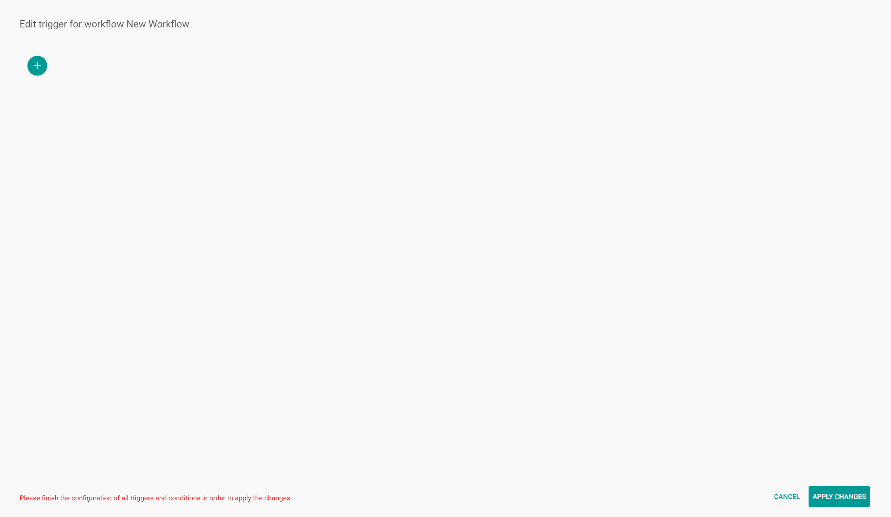
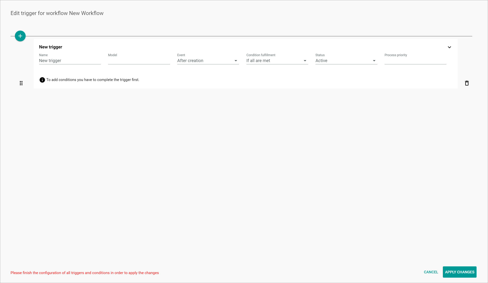

[!!User Interface Workflows](../UserInterface/02a_Workflows.md)   
[!!Workflow and process elements](../Overview/04_WorkflowProcessElements.md)   
[!!Track a workflow process](./02_TrackWorkflowProcess.md)   

# Manage the triggers

When designing a workflow to map a business process, the *Triggers* function allows the user to determine a specific business object, such as a product or a dispatch note, to initiate an action within the workflow. Any object, along with an event, can trigger a workflow action, for instance a product being created or a product attribute being changed. Besides, multiple conditions can be configured in a trigger to recreate all possible variables of a workflow.

Triggers can be created, edited or deleted in the workflow editor.

## Create a trigger

Create a trigger to determine a business object to initiate a workflow action and an event to make it relevant.

#### Prerequisites

- A workflow has been created or is being created, see [Create a workflow](./01_ManageWorkflows.md#create-a-workflow).
- You have the required rights to create or edit a workflow.

[comment]: <> (The workflow has to be created before you can add the trigger? Or can your add triggers while you create the workflow? Triggers come first in the workflow versions... You can actually add triggers, even if a workflow is not "finished" yet... Unsicher! -> OLI, wie ist es gedacht?)

[comment]: <> (MV: Add triggers info to Workflow process elements and UI)

#### Procedure

*Workflows > Workflows > Tab OVERVIEW*

1. Select a workflow from the *Workflows* list.  
The *Workflow versions* view with all versions of the selected workflow is displayed.

  

2. Select the workflow version where the trigger is to be added.  
The workflow editor is displayed.

3. Click the  (Points) button in the upper left corner next to the workflow name.   
  The workflow context menu is displayed.

  

4. Click the *Triggers* menu option.  
The *Edit trigger for workflow* window is displayed.

  

5. Click the  (Add) button to create a trigger.  
A *New trigger* input line is displayed.

  

6. Enter a description in the *Name* field.  

7. Enter the applicable data model to initiate a workflow action in the *Model* field, for example a PIM product.
  > [Info] The data models can be taken from the relevant API documentation.

8. Click the *Event* drop-down list and select the appropriate option. The following options are available:  
  - **After creation**   
  Select this option if you want the model to initiate the action after being created. This option is preselected by default.
  - **After saving**   
  Select this option if you want the model to initiate the action after being saved.

9. Click the *Condition fulfillment* drop-down list and select the appropriate option. The following options are available:
  - **If any is met**  
    Select this option if you want any condition to be met for the trigger to apply. This option is preselected by default.
  - **If all are met**  
    Select this option if you want all conditions to be met for the trigger to apply.

10. Click the *Status* drop-down list and select the appropriate option. The following options are available:
    - **Active**  
      Select this option to activate the trigger.
    - **Inactive**  
      Select this option to deactivate the trigger.  

11. Enter the priority in the *Process priority* field. The priority is specified with a positive integer. The greater the number, the higher the priority.  
As soon as the priority number has been entered, the  (Add) button is displayed.  If necessary, follow the steps below to add a condition, see [Add a condition](#add-a-condition).

  

## Add a condition

You can add one or more conditions for the trigger to be relevant.

  > [Info] To add conditions you have to complete the trigger first.

#### Prerequisites

A trigger has been created, see [Create a trigger](#create-a-trigger).

#### Procedure

*Workflows > Workflows > Tab OVERVIEW > Select a workflow > Select a workflow version > Button Points > Menu entry Triggers > Button Add > New trigger added > Button Add*

1. Click the  (Add) button.  
A new input line is displayed.

2. Click the *Prefix* drop-down list and select the appropriate option. The following options are available:  
  - **entity**
  - **changeset**

3. Enter the applicable attribute in the *Property* field.  

4. Click the *Operator* drop-down list and select the appropriate option. The following options are available:  
  - **Equals**
  - **Does not equal**
  - **Is set**

5. Enter the applicable value in the *Value* field.

6. Click the [APPLY CHANGES] button.  
The changes made are saved. The *Edit trigger for workflow* is closed.

## Edit a trigger

Edit a trigger to modify any of the previously configured values. It is also possible to edit or delete a condition for a trigger to be relevant.

#### Prerequisites

A trigger has been created, see [Create a trigger](#create-a-trigger).

#### Procedure

*Workflows > Workflows > Tab OVERVIEW > Select a workflow > Select a workflow version > Button Points > Menu entry Triggers*

1. Edit the trigger values previously configured as necessary.

2. If one or more conditions have been previously added, edit the condition values previously configured as necessary.

3. If desired, one or more conditions can be added, see [Add a condition](#add-a-condition).

4. If desired, click the  (Delete) button to the right of a condition to delete it if it is not longer applicable.  
The condition is removed from the list.

5. Click the [APPLY CHANGES] button.    
The changes have been saved. The *Edit trigger for workflow* is closed.

## Change the order of triggers

Modify the position of one or more triggers to...

[comment]: <> (Oli: Es soll eine Prio-Liste sein, also ähnlich wie Decision Matrix. Wozu ändert man die Reihenfolge hier? Wie stellt man die Prio ein, über Process Priority Feld oder durch Reihenfolge? Oder hat miteinander nichts zu tun?)

#### Prerequisites

At least two triggers have been created in the workflow version, see [Create a trigger](#create-a-trigger).

#### Procedure

*Workflows > Workflows > Tab OVERVIEW > Select a workflow > Select a workflow version > Button Points > Menu entry Triggers*

1. Click the  (Drag) button to the left of the trigger, move the trigger to a different position with the left mouse button pressed and drop it in the desired position by releasing the mouse button.   

2. Click the [APPLY CHANGES] button.  
The trigger position has been saved.

[comment]: <> (Kein Pop-up-Fenster/Bestätigung angezeigt.)

3. If necessary, repeat the steps **1** and **2** for all triggers that need to be repositioned.

## Delete a trigger

#### Prerequisites

A trigger has been created, see [Create a trigger](#create-a-trigger).

#### Procedure

*Workflows > Workflows > Tab OVERVIEW > Select a workflow > Select a workflow version > Button Points > Menu entry Triggers*

1. Click the  (Delete) button to the right of the trigger to be deleted.  
  The trigger is removed from the list.

2. Click the [APPLY CHANGES] button.  
  The trigger has been deleted.

[comment]: <> (Kein Pop-up-Fenster/Bestätigung angezeigt. Trigger kann man nicht löschen. Stand 20.09.22)
