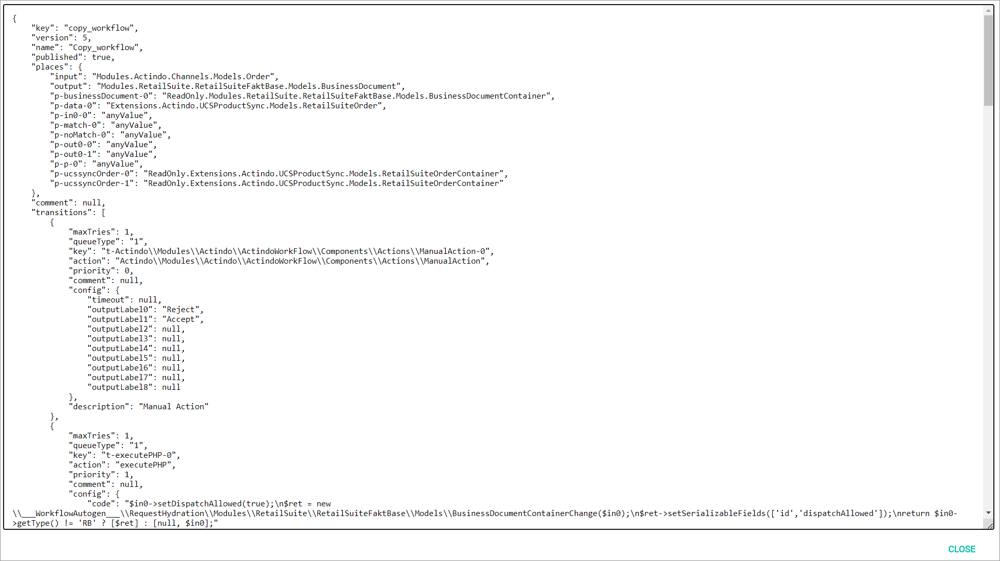

# Copy a workflow

Copy a workflow by exporting and importing the JSON code to create a new workflow based on an existing workflow.

## Export the workflow JSON code

Export the JSON code of an existing workflow that you want to copy.

#### Prerequisites

- At least one workflow has been created, see [Create a workflow](#create-a-workflow).
- You have the required rights to edit a workflow.

#### Procedure

*Workflows > Workflows > Tab OVERVIEW*

1. Click the workflow you want to copy in the list of workflows.   
    The *Workflow versions* view with all versions of the selected workflow is displayed.

    

2. Click the workflow version you want to copy in the list of workflow versions.  
    The workflow editor is displayed in the workspace.

    

[comment]: <> (Step 2 as well as the screenshot workflow versions is possibly not needed in the next workflows version as the version view will disappear and clicking the workflow will take you to the editor directly, check next time)

3. Click the  (Points) button in the upper left corner next to the workflow name.   
    The workflow context menu is displayed.

    

4. Click the *Export JSON ..* menu entry in the context menu.   
    The *Export JSON* window with the JSON code for the current workflow is displayed.

    

5. Select the complete JSON code in the window, copy it to the clipboard and click the [CLOSE] button in the bottom right corner.   
    The *Export JSON* window is closed.

6. Click the  (Back) button in the workflow editor.  
    The workflow editor is closed and the list of workflows is displayed again.

## Import the workflow JSON code

Import the exported JSON code to an existing or new workflow to copy it.

#### Prerequisites

- At least one workflow has been created, see [Create a workflow](#create-a-workflow).
- You have the required rights to edit a workflow.
- The JSON code of the workflow to copy has been exported to the clipboard, see [Export the workflow JSON code](#export-the-workflow-JSON-code).

#### Procedure

*Workflows > Workflows > Tab OVERVIEW*

1. [Create a new workflow](#create-a-workflow) or click the workflow in the list of workflows to which you want to import the copied JSON code.   
  The *Workflow versions* view with all versions of the selected workflow is displayed.

  

2. Click the workflow version you want to edit in the list of workflow versions.  
  The workflow editor is displayed in the workspace.

  

[comment]: <> (Step 2 as well as the screenshot workflow versions is possibly not needed in the next workflows version as the version view will disappear and clicking the workflow will take you to the editor directly, check next time)

3. Click the  (Points) button in the upper left corner next to the workflow name.   
  The workflow context menu is displayed.

  

4. Click the *Import JSON ..* menu entry in the context menu.   
  The *Import JSON* window with the JSON code for the current workflow is displayed.

  

5. Select the complete JSON code in the window, replace it by the JSON code in your clipboard and click the [IMPORT JSON] button in the bottom right corner.
  The *Import JSON* window is closed. The copied workflow is displayed in the workflow editor.

  

  > [Info] You can edit the workflow as desired before deploying it.

6. Click the  (Points) button in the upper left corner next to the workflow name.   
  The workflow context menu is displayed.

  

7. Click the *Deploy* menu entry in the context menu.   
  The copied workflow has been deployed and published.

