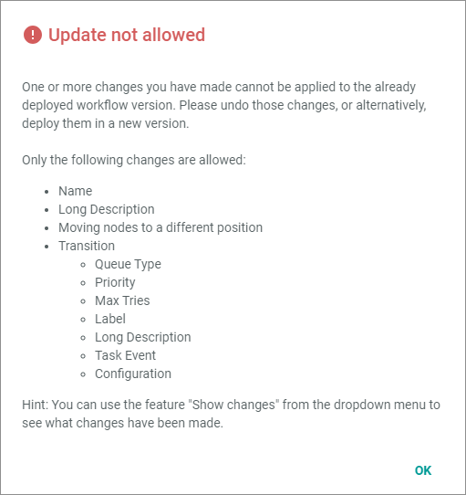

# Update deployed version

The *Update deployed version* function is designed to support in the test phase. It is recommended that you do not use it in a production system. For example, this function is suitable, if one of the included transitions is running on an error because of faulty configuration, and you do not want to set up the whole workflow again.   

When updating a deployed version, no new version is created, but the actual version is overwritten. This means that changes to the workflow are not recorded.

#### Prerequisites

- You are in the testing phase. 
- At least one workflow has been created, see [Create a workflow](#create-a-workflow).
- You have the required rights to edit a workflow.
- A workflow has been selected, see [Select a workflow](#create-a-workflow).
- In the current version, you have not added any additional transitions, nor you have made any other changes to the structure.

#### Procedure

*Workflows > Workflows > Tab OVERVIEW > Select workflow > Select version*

1. Make minor changes to the workflow, for example, change the configuration or the attributes of a transition. Changes on the following settings are allowed:
    - Name
    - Long description
    - Moving nodes to a different position
    - Transition changes:
        - Queue type
        - Priority
        - Max tries <!--- hier kriege ich eine Fehlermeldung: Bug ticket https://internal-jira.actindo.com/browse/BUG-523?filter=-2-->
        - Label
        - Long description
        - Task event
        - Configuration

2. If desired, check your changes. To do this, click the  (Points) button in the upper left corner next to the workflow name.   
    The workflow context menu is displayed.

    

3. Select the **Show changes** option. For detailed information, see [Compare the workflow versions](03_CompareWorkflows.md).

4. Click the  (Points) button in the upper left corner next to the workflow name.   
    The workflow context menu is displayed.

5. Select **Update deployed version**.   
    The current deployed version is overwritten.    
    If you have changed anything that is not allowed, the following error message is displayed. 

    

    

