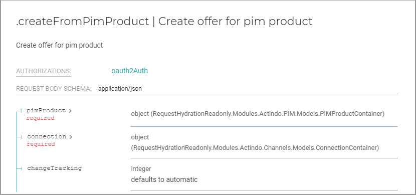

# Insert a static input

With the static input function, you can use an input port to pass customer-specific data to a transition, with which you want to process it.     
For example, you want to send offer data to a specific sales channel. Since it is not possible to input a sales channel to a start place and to pass it through the entire workflow, you can input this information to a transition that then passes the sales channel information to an API endpoint.   

The following procedure shows an example of how to edit the static inputs by adding a sales channel information that requires complex JSON code. 

#### Prerequisites

- You have the required rights to edit a workflow. 
- The transition you want to add has additional input ports.

#### Procedure

*Process Orchestration > Workflows > Tab OVERVIEW > Select workflow > Select version*

1. Add the desired transition. For detailed information, see [Add a transition](./01_ManageWorkflows.md#add-a-transition).   
    The transition is added. It has several input ports which are listed in the *Static inputs* section of the transition settings sidebar. 

    

2. Check the API used in the API documentation. To do this, select *Dev Tools > API > Select API tab* and select the desired API.    
    The API documentation is displayed. On the left side, the API list is displayed. The middle column contains the parameters. The right side shows the JSON code of the API parameters. 
      
    

    
3. Check the parameters of the API.    
    All required parameters are indicated. You must fill the required parameters to ensure a smooth data transfer.
     

   
   
4. Expand all parameters which have a complex structure. To do this, click the  (Collapsed) button at the parameter value.   
    The  (Collapsed) button has changed to an  (Expanded) button. The fields contained in the structure are displayed in the right column.

     .

5. In the right column, copy the entire JSON code of the desired complex parameter you want to use, including the curly brackets.

    .

6. Change back to your workflow configuration. In the *Static inputs* section of the transition's settings sidebar, click the  (Plus) button at the desired input parameter.    
    The  (Delete) button is displayed at the input parameter. 

    .
    
7. Enter the copied JSON code. By doing it, delete the quotes.   
    The complex code has been added to the input parameter. 

    > [Info] If you add a simple string, do not delete the quotes. Instead, use the following syntax, for example: **"U_ACTIO"**.
    
8. Enter the required value after the colon.    
    A small arrow without a place is displayed in front of the input port with the defined static input value. 

    
    

9. If desired, click the  (Delete) button to delete the JSON code. 

10. If desired, add further static inputs. Note that you cannot configure all input ports as static inputs. At least one input port must be linked to a place.  