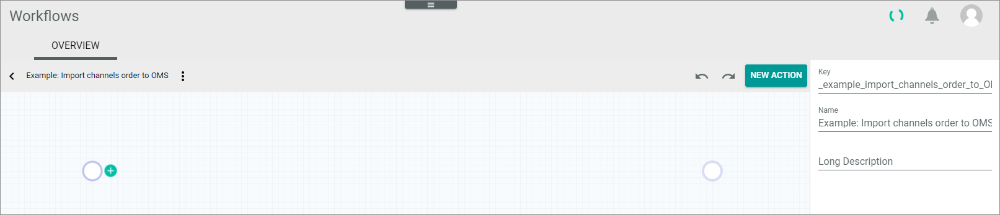

# Workflow tutorial

The following tutorial shows by using a simple example how to create a workflow.

## Use case

An order has been imported from a sales channel via a driver into the *Omni-Channel* module. There an *Omni-Channel* order is created. The workflow is used to transfer the order from the *Omni-Channel* module to the *Order Management* module, where a business document of type order confirmation (AB) is to be created. This is then available for further business transactions. 

## Prerequisites

- The *Actindo workflow engine* module is installed on your current instance.
- You have the required rights to edit a workflow.   
- For detailed information on the single steps and the fields to edit, read the following to prepare:
    - [Workflow and process elements](./04_WorkflowProcessElements.md)
    - [Manage the workflows](./01_ManageWorkflows.md)
    - [OVERVIEW (Workflows)](./02a_Workflows.md)
    - [Manage the triggers](./02_ManageTriggers.md)
    

## Create a workflow

1. Before you can start with creating a workflow, you need to think about the data container that is to be input/output. To do this, check the data modules that are available for your desired business transaction.  
    In our example, the creation of an Omni-Channel order is the trigger that initiates the workflow execution and a business document of type AB (order confirmation) is to be output.

2. Select *DevTools > API > Tab DATA MODEL* to search for data models that meet the requirements for the input / output. In our example, the following data models meets these requirements:
    - Input: Actindo.Modules.Actindo.Channels.Models.Order
    - Output: Actindo.Modules.RetailSuite.RetailSuiteFaktBase.Models.BusinessDocument

3. Select *Process Orchestration > Workflows*.
    The OVERVIEW tab is displayed.
        

4. Click the  (Add) button in the bottom right corner.   
    The *New workflow* window is displayed.

    

5. Enter a name and a unique key for the workflow.

6. Search for **Models\Order** in the *Choose the data type of your start place* field and select the **&#95;&#95;&#95;WorkflowAutogen___\Actindo\Modules\Actindo\Channels\Models\Order** radio button. As you can see, you need to change the dots from the data model to backslashes to enter the data model in the workflow configuration.

7. Search for **Models\BusinessDocument** in the the *Choose the data type of your end place* field and select the **&#95;&#95;&#95;WorkflowAutogen___\Actindo\Modules\RetailSuite\RetailSuiteFaktBase\Models\BusinessDocument** radio button.

    

8. Click the [CREATE] button.  
    The new workflow has been created. The *Workflows* view is displayed.

## Check start and end place

*Process Orchestration > Workflows > Select newly created workflow > Select version*

1. Click the start place.   
    The key *input* and the selected *Data container* is displayed in the settings sidebar. As you can see, the backslashes of the data model are displayed as dots again in the *Data Container* field.

2. Click the end place.     
    The key *output* and the selected *Data container* is displayed. As you can see, the backslashes of the data model are displayed as dots again in the *Data Container* field.

## Edit a trigger

Think about the circumstances under which the workflow is to be started. Per default the workflow is started for each newly created Omni-Channel order that has the **Actindo.Modules.Actindo.Channels.Models.Order** as start place.   
To ensure that the workflow is also started when an Omni-Channel order is updated, you can create a trigger. <!--- Stimmt das?--> A trigger becomes effective in the start place of a workflow and defines the conditions under which the workflow is to be initiated. For example, a workflow should only be initiated, if a   
Note that when you create a trigger, all the conditions required to initiate the workflow must be listed. In our example, not only the update of an Omni-Channel order need to be defined, but also the creation of it.

## Add a transition

