[!!User interface Workflows](../UserInterface/02a_Workflows.md)
[!!User interface Processes](../UserInterface/03a_Processes.md)
[!!User interface Process actions](../UserInterface/04a_ProcessActions.md)
[!!User interface EXECUTION LOG](../UserInterface/06b_ExecutionLog.md)
[!!Retry a process action](../Troubleshooting/01_RetryProcessAction.md)
[!!Workflow and process elements](../Overview/04_WorkflowProcessElements.md)

# Track the workflow process

A process is an instance of a workflow. When an operation is performed, a data entity is generated, for example an invoice, which in turn initiates a further workflow process. Therefore, for every single operation performed, an individual instance of the corresponding workflow, that is, a process, is initiated.
<!---Lieber Technischer Reviewer, diesen Abschnitt bitte prüfen, mir ist nicht ganz klar, was er sagen möchte (for every single operation, ??)-->

<!--- > Alternativ-Vorschlag: Process menu entry als zentrales Tool im Workflow darstellen, um die Konfiguration zu testen, und wenn ein Workflow auf einen Fehler läuft, die Fehlerursache zu finden.... Man kann den Process real-time beobachten und manual actions ausführen-->

A process has a start and an end place, as well as different stages (places and actions) which the initial data goes through in order to be processed. For a detailed description of the workflow elements, see [Workflow and process elements](../Overview/04_WorkflowProcessElements.md).

Track the workflow process to check the status of a whole process or of individual actions, the status and the content of a token, to perform manual actions, or to analyze the execution of the actions.

## Check the process status

The process status can be checked to monitor how far a process has progressed, detect potential problems, and solve any problems that may occur as a result of a misconfiguration or any other external issues, so that the process can continue running.

The *OVERVIEW* tab in the *Processes* menu entry displays a list of all processes that are currently being executed or have been executed in the system. By default, all existing processes are displayed but can also be filtered according to different criteria.

#### Prerequisites

- A workflow has been created, see [Create a workflow](./01_ManageWorkflows.md#create-a-workflow).
- A workflow process has been initiated.

#### Procedure

*Process Orchestration > Processes > Tab OVERVIEW*

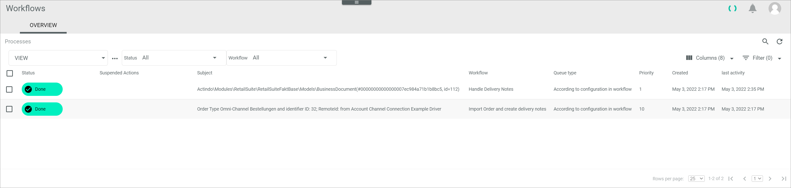

1. Click the *Status* drop-down list and select the **All** option.  
    All processes, regardless of their status, are displayed.

2. Click the *Workflow* drop-down list and select the workflow you want to check.  
    All processes of the selected workflow are displayed.

3. Check the status of the desired process in the *Status* column of the processes list.

4. If desired, click a process to display the *Process ID* view, which includes a diagram of the process and detailed information about the individual process actions, tokens, and logs.    
 

## Check the process action status

The process action status can be checked to monitor what actions have already been executed, whether problems have occurred and at what place, or whether manual actions are awaiting a user decision. If the process is currently active, you can observe the process execution in real time.  

The *Process ID* view displays a diagram of the selected process including all places and actions. More details about the process actions, tokens, and logs included in the diagram are displayed in separate tabs at the bottom of the *Process ID* view.

#### Prerequisites

- A workflow has been created, see [Create a workflow](./01_ManageWorkflows.md#create-a-workflow).
- A workflow process has been initiated.

#### Procedure

*Process Orchestration > Processes > Tab OVERVIEW > Select process*

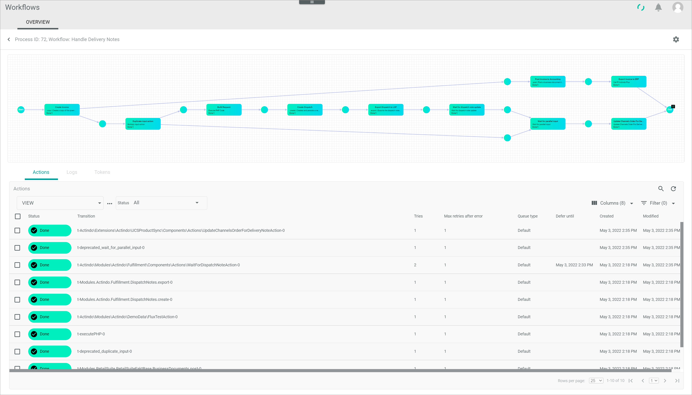

1. Click the *Actions* tab at the bottom of the *Process ID* view.   
    The *Actions* tab is displayed.

    > [Info] By default, the *Actions* tab is preselected.

2. Click the *Status* drop-down list and select the **All** option.    
    All actions, regardless of their status, are displayed.

3. Check the actions displayed in the diagram. The workflow process diagram displays the actions in different colors depending on their current status:  

    - **In progress** (blue)   
    - **Done** (green)   
    - **Error** (red)  
    - **Pending** (white)
    - **Manual action** (yellow), see [Make a user decision](#make-a-user-decision)

4. If desired, display the transition documentation that might have been added when creating the workflow. You can identify the documentation by a small [Info] button.

    >[Info] Scroll the mouse wheel to zoom in or out. By doing it, make sure that the mouse pointer is placed on a workflow element. If necessary, change your scroll wheel settings to adjust the zoom levels.

    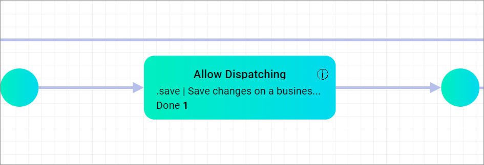

    + Click the [Info] button to read the documentation.  
      The *Long description* pop-up window is displayed.

    + Click the [Close] button in the bottom right corner to close the window.

5. Click the action to be checked in the diagram.   
    The selected action is displayed in the *Actions* tab.

6. Check the action status in the *Status* column. The following statuses are available:

    - **Active**    
       The action waits for a worker to become available or waits until a defer date is reached.
    - **Done**   
       Action has been already executed. You can rerun this action. Note that this is only useful in very rare cases where something has gone wrong.
    - **Error**   
       Action has given an error. You can retry or abort this action.
    - **Error, automatic retry**    
       Action has given an error but will be retried automatically. 
    - **Suspended**     
       Action has been manually paused. You can unsuspend the pause.
    - **Process aborted**  
       The process has been manually aborted. All currently running process actions have been stopped and will no longer be executed.
    - **Aborted**   
        The action has been manually aborted. You can rerun this action.
    -  **Manual**  
       The action is waiting for a user decision. Make your user decision, see [Make a user decision](#make-a-user-decision).
      
7. Check the number of tries for the action in the *Tries* column.

8. Check the number of times an action must be retried after error in the *Maximal retries after error* column.

9. Check the assigned queue type in the *Queue type* column.

    > [Info] The queue type is assigned to an action when editing a workflow, see [Edit an action](./01_ManageWorkflows.md#edit-an-action).

10. Check when the action will be executed next time in the *Defer until* column. This function depends on the action configuration and is not available in all actions. It is also filled when a user executes a manual action and sets a follow-up date.

11. If necessary, select the checkbox of an action for which you want to perform further operations.   
   The editing toolbar is displayed. The functions available for this specific action status are displayed, for example, the functions retry, abort, or rerun.

12. Continue with checking the [logs](#check-the-logs), the [token status and content](#check-the-token-status-and-content), and the [execution log](#check-the-execution-log).

> [Info] You can also display a list of all actions in the *Process actions* tab, regardless of the process they are part of. For detailed information, see [Process actions](ActindoWorkFlow/UserInterface/04a_ProcessActions.md).

## Check the logs

The log can be checked to identify issues that may be caused by a faulty workflow configuration or other issues with the process.

#### Prerequisites

- A workflow has been created, see [Create a workflow](./01_ManageWorkflows.md#create-a-workflow).
- A workflow process has been initiated.

#### Procedure

*Process Orchestration > Processes > Tab OVERVIEW > Select process*

1. Click the *logs* tab.  
    The *Logs* tab with a list of all logs created for the selected process is displayed.

2. Click the *Log level* drop-down list and select the log level you want to check.  
    All logs of the selected log level are displayed.

3. Check the logs. For detailed information, see [Logs](../UserInterface/06a_Logs.md).

## Check the token status and content

The token status and content can be checked to monitor how data progress within a process and, if necessary, detect and solve any data type related issues.   

The *Tokens* tab displays the tokens being processed. A token is a container carrying any data needed to complete an action, which could be a number or a business document for example. For detailed information, see [Tokens](../Overview/04_WorkflowProcessElements.md#tokens).

#### Prerequisites

- A workflow has been created, see [Create a workflow](./01_ManageWorkflows.md#create-a-workflow).
- A workflow process has been initiated.

#### Procedure

*Process Orchestration > Processes > Tab OVERVIEW > Select process*

1. Click the *Tokens* tab.  
    The *Tokens* tab with a list of all tokens within the selected process is displayed.

    > [Info] If the *Hide processed* toggle is active, only the tokens currently waiting to be further processed are displayed.

2. Disable the *Hide processed* toggle.  
    All tokens, including the ones that have already been processed, are displayed.

3. Check the places displayed in the diagram.  
    The places are green if at least one token has passed through them, otherwise they are white.

    > [Info] A place can contain a black square displaying a number. This number specifies the number of tokens waiting to be processed at that place.

4. Select a place in the diagram.  
    The token input in the selected place, if any, is displayed in the *Tokens* tab. Otherwise, an information message is displayed.

5. Check the token status in the *Status* column. The following statuses are available:
    - **Processed** (green)
    - **Being processed** (blue)
    - **Error** (red)
    - **Unprocessed** (white)

6. Check the place where the token is located in the *Place* column.

7. Check the data contained in the token in the *Data* column.

8. Check the next compatible action(s) where the token can be input in the *Next possible action(s)* column.

9. If necessary, click an action in the diagram to display further information in the *Actions* tab.   
For detailed information about checking the action status, see [Check the process action status](#check-the-process-action-status).

    > [Info] A number is displayed next to the status of each action. This number refers to the number of tokens processed in this action, and it depends on the action status and the number of tokens received.

## Add process comments

The *Comments* tab can be used to comment on a process so that you can leave notes about the execution of the process. You can use these notes for yourself, but also for other users to see that you have already reviewed the process and to explain your decisions.  

You can write the comments in Markdown syntax.

#### Prerequisites

- A workflow has been created, see [Create a workflow](./01_ManageWorkflows.md#create-a-workflow).
- A workflow process has been initiated.

#### Procedure

*Process Orchestration > Processes > Tab OVERVIEW > Select process*

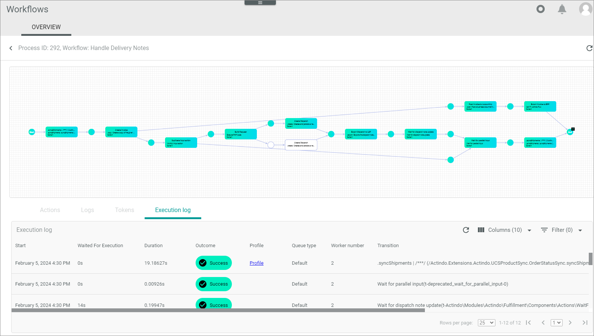

1. Click the *Comment* tab.  
    The *Comment* tab is displayed.

    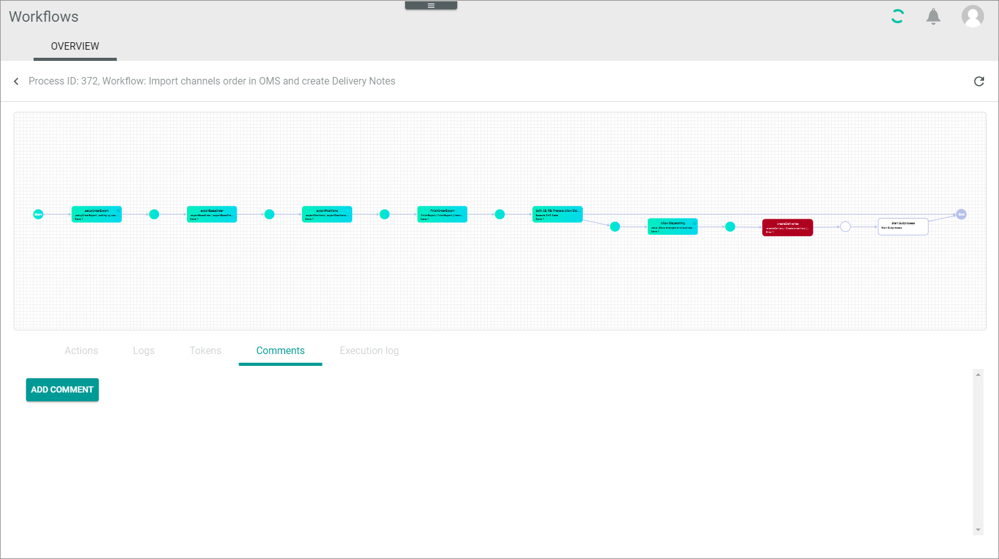

2. Click the [ADD COMMENT] button.   
    The *Add comment* window is opened.   

    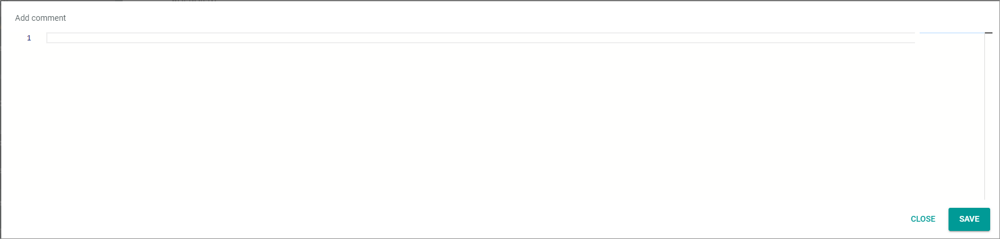

3. Enter your text in Markdown language

    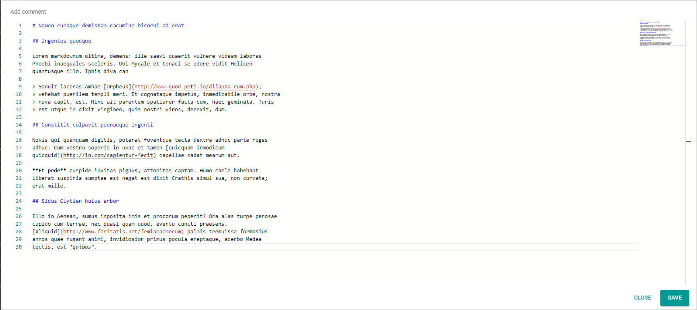

4. Click the [SAVE] button.   
    The comment is displayed. Your name and username is displayed as well as the date and time of creation. You can use the [EDIT] and [DELETE] buttons to edit or delete the comment.

    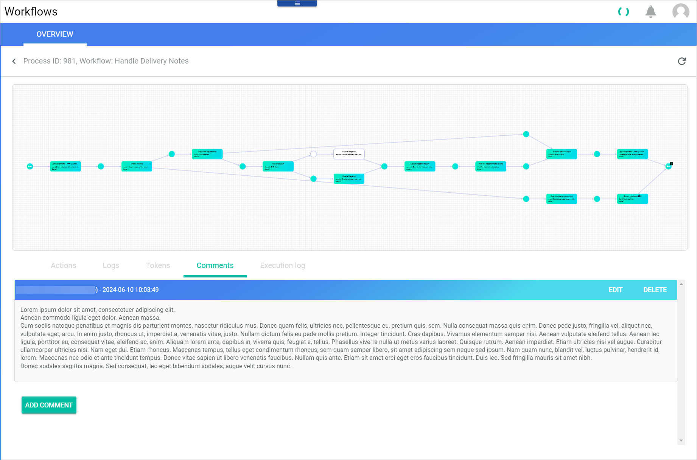

## Check the execution log

The execution log can be used to monitor the execution of individual process actions and, if necessary, to detect and to resolve transition-related issues, that is issues in the workflow configuration or in subsequent processing operations.

The *Execution log* allows you to analyze what each worker did and how long it took to execute a process action.   
For example, a process may have taken a long time to be executed. Here you can see if a certain process action caused the delay, such as sending an email, or if the process had to wait a long time for execution.

 > [Info] Note that the execution log only displays data, if the execution date of the process does not exceed the time period defined for the *Lifetime execution log in days* setting. For detailed information, see [Configure logging settings](../Integration/02_ConfigureLoggingSettings.md).

#### Prerequisites

- A workflow has been created, see [Create a workflow](./01_ManageWorkflows.md#create-a-workflow).
- A workflow process has been initiated.

#### Procedure

*Process Orchestration > Processes > Tab OVERVIEW > Select process*

1. Click the *Execution log* tab.  
    The *Execution log* tab with a list of all executed transitions (process actions) within the selected process is displayed.

2. Check the *Waited for execution* time to see if the process action had to wait until the worker was available.

3. Check the *Duration* time to see how long it took the worker to complete the process action. Very helpful in this context is the *Execution statistics* view, which displays the average processing time in seconds for each process action over a specified time period. For detailed information, see [Execution statistics](../UserInterface/06c_ExecutionStatistics.md).

4. Check the *Outcome* column to see if the process action was performed successfully, or if the worker stopped the process at a certain process action. The following statuses are available:

    - **Success**   
    The process action was performed successfully.   

    - **Deferred**   
    The process action has run through, but it needs to wait for something. It will start automatically again when the expected event or data is available.  

    - **Retry**    
    The process action failed, but will be retried after a period of time has elapsed. 

    - **Error**   
    The process action failed finally.

5. Check the *Profile* column to see if a profile has been created for a process action. This might have been the reason for a longer processing time. If desired, open the profile. For detailed information, see [Profile](../UserInterface/06d_Profile.md).

6. Check the *Queue type* to see the queue type with which the process action was performed. Maybe the process action was throttled and this was the reason for a long processing time. For detailed information, see [Create a queue type](../Integration/01_ConfigureQueueTypes.md#create-a-queue-type).

7. Check the *Worker number* to see the number of workers who performed the process action. 

8. Check the *Transition* column to see the name of the transition.

## Make a user decision

A process will be paused if a manual action is waiting for a user decision, for example, if a business transaction needs an approval. Make a user decision, so that the workflow process can continue.  For detailed information on the *Manual action* core action, see [Manual action](../UserInterface/08_CoreActions.md#manual-action).

#### Prerequisites

- A workflow has been created, see [Create a workflow](./01_ManageWorkflows.md#create-a-workflow).
- A workflow process has been initiated.
- The workflow process requires a user decision because it contains a *Manual action* core action.

#### Procedure

*Process Orchestration > Processes > Tab Overview*

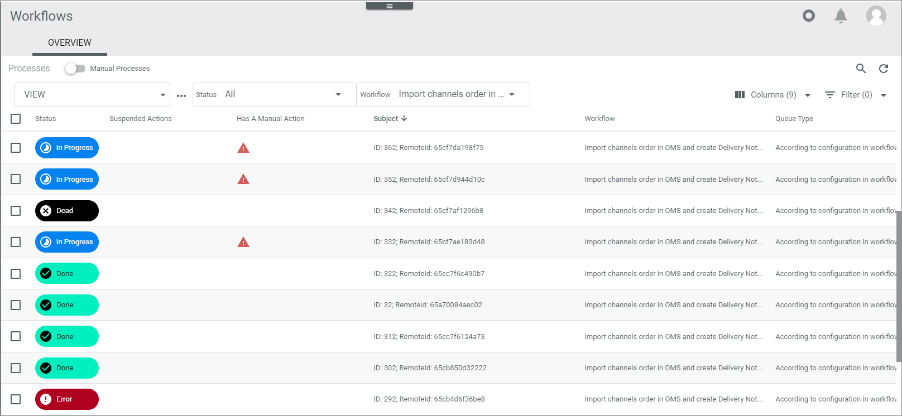

1. Enable the  *Manual processes* toggle.    
    Only those processes that require manual actions are displayed. They have the **In progress** status and a warning sign  in the *Has a manual action* column.

2. Click a desired process.      
    The *Process ID* view is displayed. In the workflow diagram, the manual action is displayed in yellow.

   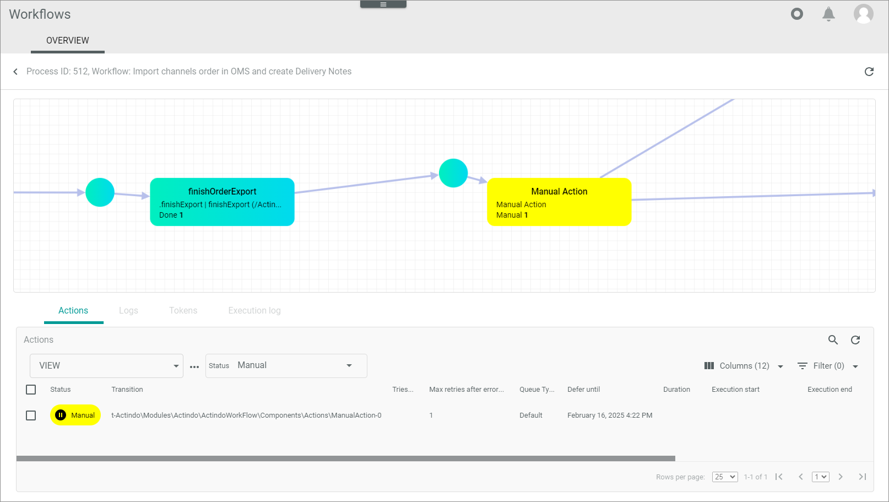

3. Click the checkbox of the manual action in the *Actions* tab.    
    The editing toolbar is displayed.

4. Click the [TAKE DECISION] button.   
   The *Take decision* pop-up window is displayed.
   
   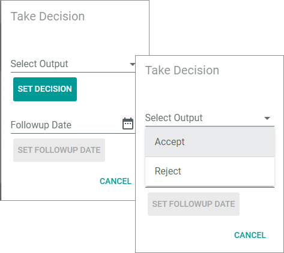

5. If you want the process to continue directly, click the *Select output* drop-down list, select the desired decision, and click the [SET DECISION] button.   
    The workflow process changes to the *In progress* status and proceeds. 

6. If you want to postpone the decision to a later date, click the  (Calendar) button, select the desired date and click the [SET FOLLOWUP DATE] button.   
    The workflow process remains in the *Manual* status. In the *Actions* tab, the follow-up date is included in the *Defer until* column.