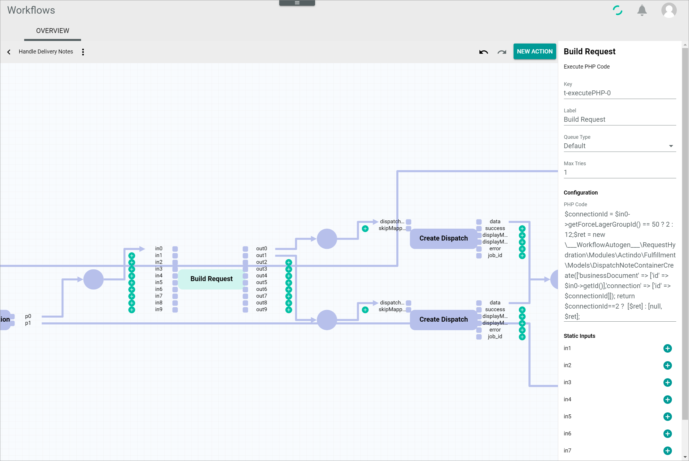
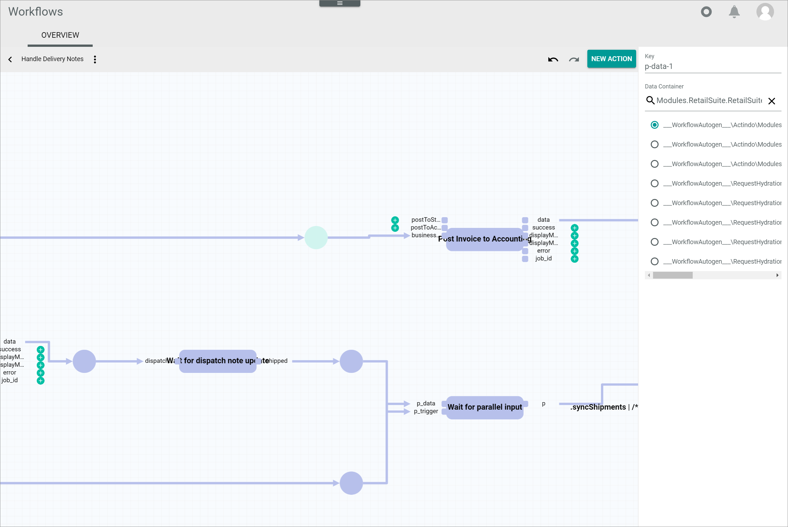

# Workflow and process elements

The *Workflows* module allows customers to model their own processes to match their companies structure. A workflow consists of a number of fixed elements that are chained together, each of them having specific characteristics. These elements are used to design the workflow, which can be edited as necessary according to customer needs.    
For detailed information, see [Manage the workflows](../Operation/01_ManageWorkflows.md).

A workflow runs from a fixed start place to a fixed end place, which can be in turn linked to another workflow. A workflow must contain at least one transition between the start and the end place. The transitions are linked through places with each other, connecting the corresponding transition input and output ports. All these elements are described more in detail below:

- [Transitions](#transitions)
- [Places](#places)
- [Start and end place](#start-and-end-place)
- [Arcs](#arcs)
- [Input and output ports](#input-and-output-ports)

The *Workflows* module is linked to different system modules and plugins, such as *Order management*, *Email*, *Omni-Channel* and *Tasks*. The transitions available to create workflows depend on the modules installed in the system.

Since business processes, and the workflows that map them, evolve over time, workflows can be versioned. While every workflow can be uniquely identified through its key, there may be any number of versions of it. Several versions of the same workflow can be published at the same time. However, when a process for a given workflow is to be started, the latest published version of the workflow, that is, the one with the highest version number, is used.   

A process is an instance of a workflow. If you have created a workflow for a specific business case, in which all the required steps are described, a single process of this workflow will be created for each of these business cases that is initiated.

Workflow processes are initiated by a certain event. This event can either be defined via code or via the doctrine triggers configured in the *Workflows* module. In the doctrine trigger, you can define the triggers as well as conditions that have to be fulfilled to initiate a certain workflow process, see [Manage the triggers](../Operation/03_ManageTriggers.md).

Workflow processes, as well as the workflows itself, consists of certain elements that are described in detail below. As a process is an instance of the workflow, some elements in the workflows and the processes are very similar or even nearly identical. Nevertheless, the function of these elements differs depending on its use in the workflow or the process:

- [Places](#places)
- [Start and end place](#start-and-end-place)
- [Actions](#actions)
- [Tokens](#tokens)

## Transitions

The transitions act as building blocks that are chained together through places to configure a workflow. They are represented by a rectangle. Transitions are also called workflow actions.

The transitions available to create workflows depend on the modules installed in the system. A certain number of transitions is always preconfigured in the *Workflows* module, the so-called *Core actions*, see [Workflow core actions](../UserInterface/08_CoreActions.md). Every API endpoint of the modules automatically becomes available as a transition and can be used in any workflow. However, you can also build your own transitions independent from the API. Some transition may have configuration options, but most of them do not.

All transitions contain a certain, predefined number of input and output ports, at least one of each, which can be mandatory or optional.    
For detailed information about the types of input/output ports, see [Input and output ports](#input-and-output-ports).

When adding a new transition, places for mandatory input ports are automatically inserted, whereas optional input ports are displayed with a  (Add) button.

When clicking a transition in the workflow editor, it becomes highlighted and the corresponding element settings are displayed in the settings side bar.

The transition settings side bar is located to the right of the workspace and allows to define the transition settings. The following fields are displayed:

- *Key*  
    Transition key. This field is read-only. The key is required for API access and must be unique within the workflow version.

- *Label*  
    Transition label defined by the user. It can be used to specify or simplify the transition name. When editing the transition label, it is changed both at the top of the settings side bar and in the action rectangle in the diagram.

- *Queue type*  
    Click the drop-down list to select the applicable queue type. All available queue types are displayed in the list. You can select a different queue type for each action.    
    For detailed information about queue types, see [Configure the queue types](../Integration/01_ConfigureQueueTypes.md).

- *Task event*  
    Click the drop-down list and select the applicable task event. All available task events are displayed. This option is linked to the *Tasks* module. The drop-down list is only displayed if the *Tasks* module is installed and the user has the necessary rights.

   > [Info] The *ActindoWorkflow Process Execution Failed* task is preconfigured by default. A list of all existing task events is displayed in the *Events* menu entry of the *Tasks* module.

- *Configuration*  
    Depending on the transition, there might be configuration options, for instance, defining an email where a receipt or document must be sent. Editing the transition configuration may require basic programming knowledge. Most transitions are preconfigured and do not include configuration options. In this case, the *Configuration* section is not displayed.

- *Static inputs*  
    All unlinked input ports are listed in this section. Static inputs can be used to configure static values for certain inputs. They can be defined by the user clicking the  (Add) button. Only valid JSON values are accepted. When used, static inputs are displayed by a small arrow in front of the input ports in the workflow diagram. This section is only displayed, if the selected transition has at least one unlinked input port.

    > [Info] Not all input ports can be configured as static inputs. At least one input port must be linked to a place.

When a transition is executed in a workflow process, it is called action or process action. This means that an action is the actual execution of a configured transition. As a result, one transition may be associated with multiple process actions.   
For detailed information, see [Actions](#actions).

## Places

A place is an intermediate stage in the workflow and is represented by a circle, usually provided with incoming and/or outcoming arcs.
Places are used to build workflows and they are also displayed in the workflow processes. Places serve as link between two transitions, joining an output port from the previous transition to the corresponding input port of the following transition.

> [Info] In the workflow processes,input and output ports of actions are not displayed, nevertheless, the places also serve as link between two actions.

Places linking mandatory input/output ports are displayed by default and cannot be deleted. Additional places can be added by clicking the  (Add) button next to the optional input/output port. All places included in a workflow must be linked to input/output ports.    
For detailed information about the types of input/output ports, see [Input and output ports](#input-and-output-ports).

Special types of places are the start and end place. Every workflow starts with a single place and ends with a single place.    
For detailed information, see [Start and end place](#start-and-end-place).

When clicking a place in the workflow editor, it becomes highlighted and the corresponding element settings are displayed in the settings side bar.

The place settings side bar is located to the right of the workspace and allows to define the place settings. The following fields are displayed:

- *Key*  
    Place key. This field is read-only. The key is required for API access and must be unique within the workflow version.

- *Data container*  
    Use this field to define the data type to be used in the place. If necessary, click the  (Delete) button to display the whole list of available data types. Enter a search text for the desired data type. The list of actions is filtered for your search text as you type. Select the radio button of the appropriate option.

In the workflow processes, a place can hold any number of tokens, including none. A token is a container carrying data, which is needed to execute a subsequent action. The place data type is always defined, more or less specifically, so it is possible to recognize the kind of data that flows through it.    
For detailed information, see [Tokens](#tokens).

When clicking a place in the workflow process diagram, the *Tokens* tab is displayed.   
For detailed information, see [Check the token status and content](../Operation/02_TrackWorkflowProcess.md#check-the-token-status-and-content).

## Start and end place

Every workflow starts with a single start place and ends with a single end place, which are special types of places.

The start place can only hold one token. The end place is the final result of all actions executed in the process and can contain any number of tokens, but at least one. A process is marked as *Done* when all tokens have reached the end place.

### Start place

The start place is the initial stage of the workflow. It is represented by a circle with an incoming arc pointing towards an input port of the first action. Similarly to places, when clicking it in the workflow editor, the start place becomes highlighted and the corresponding element settings are displayed in the settings side bar.

The start place settings side bar is located to the right of the workspace and allows to define the start place settings. The fields are identical to those of the [place](#place).

When clicking a start place in the workflow process diagram, the *Tokens* tab is displayed.   
For detailed information, see [Check the token status and content](../Operation/02_TrackWorkflowProcess.md#check-the-token-status-and-content).

### End place

The end place is the final stage of the workflow. It is represented by a circle with an outcoming arrow coming from one or more actions being executed in the last stage(s) of the workflow. Similarly to a place, when clicking it in the workflow editor, the end place becomes highlighted and the corresponding element settings are displayed in the settings side bar.

The end place settings side bar is located to the right of the workspace and allows to define the end place settings. The fields are identical to those of the [place](#place).

When clicking an end place in the workflow process diagram, the *Tokens* tab is displayed.   
For detailed information, see [Check the token status and content](../Operation/02_TrackWorkflowProcess.md#check-the-token-status-and-content).

## Arcs

The arcs are the links connecting a place with the input and output port(s) of a transition to model the flow of information. The arcs are represented by arrows. Arcs connecting a place to an input port are called *incoming arcs*, arc connecting an output port to a place are called *outcoming arcs*.

## Input and output ports

All transitions contain a certain, predefined number of input and output ports, at least one of each. They are defined with a descriptive name, such as *origin*, *data* or *destination*.

Input ports are positioned to the left of the transition and output ports are positioned to the right of the transition. Both are represented by a square.

Both, input and output ports, can be of two types:

- **Mandatory**  
    Mandatory ports must be linked to a place, which in turn must be linked to a transition. Places linked to a mandatory port cannot be deleted or removed. When adding a new transition, all places linked to a mandatory input/output port are already displayed.

- **Optional**  
    Optional ports are displayed with an  (Add) button next to each of them. By clicking the  (Add) button a new place is added, which can in turn be linked to a new transition. For detailed information about adding new transitions, see [Add a transition](../Operation/01_ManageWorkflows.md#add-a-transition).

## Actions

An action, or a process action, is the actual execution of a transition configured in a workflow. As such, a process action can be successful or faulty depending on its execution. If an error occurs, a process action can be retried if the underlying cause has been fixed, which results in a re-execution of the process action.

For an action to be executable in a workflow process, all connected inputs and outputs ports, mandatory or optional, must be fed with data. The data are carried by tokens, see [Tokens](#tokens). Alternatively, static inputs can be configured in the corresponding transition input ports, see [Transitions](#transitions).

## Tokens

A token is a container carrying data needed to execute an action, for example a number or a document.

A process is started with a single token at the start place, which will be input in an action to be executed. In turn, an action may output several tokens, which will become inputs for subsequent actions. It is therefore possible that a place contains several tokens, for example, several delivery notes issued for different parts of a same order. Each token will then be processed separately, that means, that the subsequent actions will be executed once for each token available.

Next to the status of every started action, that is, with status *In progress*, *Done* or *Error*, a number is displayed. This number refers to the number of tokens processed in this action, and it depends on the action status and the number of tokens received. For example, if an action displays the message *Done 1*, this means that the action has already been executed and that one token has been processed.    
For detailed information about the process actions, see [Process actions](../UserInterface/04a_ProcessActions.md).

A place can also contain a black square displaying a number. This number specifies the number of tokens waiting to be processed at that place. This could happen, for example, because a token running in parallel has not been received at a particular stage of the process, but also because all tokens have been processed and are waiting for further action at the end place.
