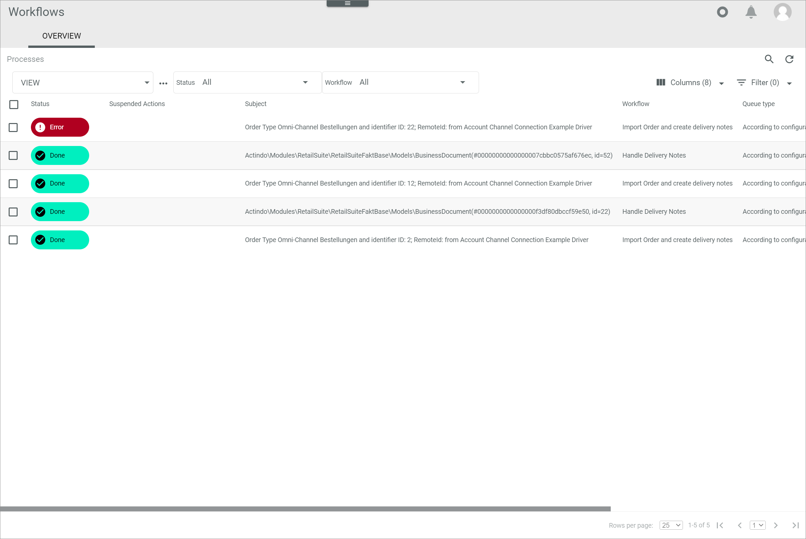

[!!User interface Processes](../UserInterface/03a_Processes.md)
[!!User interface Process actions](../UserInterface/04a_ProcessActions.md)
[!!Track a workflow process](../Operation/09_TrackWorkflowProcess)
[!!Workflow and process elements](../Overview/04_WorkflowProcessElements.md)

# Retry process action

You can retry one or several faulty process actions after you have fixed the cause of the error to continue the affected process(es).

## Retry a single process action

If a single action failed, you can restart this action on its own. If multiple actions failed because of the same error, it is recommended to [restart all these actions together](#retry-multiple-process-actions) after the error has been fixed.

#### Error Description

A process action fails and the process action status *Error* is displayed.

Follow the instructions below to restart the process action after you have fixed the cause of the error.

#### Prerequisites

The cause of the faulty process action has been fixed.

#### Procedure

*Workflows > Processes > Tab OVERVIEW*

1. Click the process with the **Error** status in the *Status* column.   
    The *Process ID* view of the selected process is displayed.

    

2. Click the faulty process action in the process diagram.   
    The selected action is displayed in the *Actions* tab in the bottom part of the *Process ID* view.

    > [Info] If required, you can switch to the *Logs* tab and click the log with the **Error** type in the column *Type* to display the *Log ID* view with the complete log message to the error.

3. Select the checkbox of the faulty action.   
    The editing toolbar is displayed.

    

4. Click the  (Retry) button in the editing toolbar.     
    The process action has been restarted. The status of the restarted process action changes to **In Progress**. A confirmation message is displayed.

## Retry multiple process actions

If multiple actions failed, you can restart these actions all together. If a single action failed or if you want to test whether an action runs without errors taking a specific action as reference, it is recommended to [restart a single action](#retry-a-single-process-action) after the error has been fixed.

#### Error Description

Multiple process actions fail and the process action status *Error* is displayed for these actions.

Follow the instructions below to restart the process actions after you have fixed the cause of the error(s).

#### Prerequisites

The cause of the faulty process actions has been fixed.

#### Procedure

*Workflows > Process actions > Tab OVERVIEW*

[comment]: <> (Vor nächster Version prüfen; bald neuer Pfad: *Workflows > Process actions > Tab OVERVIEW* > pfad is ok 21.02.2024)

1. Click the *Status* drop-down list and select the **Error** option.  
    All failed process actions are displayed in the list of actions.

    

2. Select the checkboxes of all faulty actions you want to retry. If you want to retry all faulty actions in the list, you can also select the checkbox in the header.   
    The editing toolbar is displayed.

    

4. Click the  (Retry) button in the editing toolbar.     
    All selected process actions have been restarted. The status of the restarted process actions changes to **In Progress**. The actions are removed from the *Error* status list. A confirmation message is displayed.

#### Was this chapter helpful?

If you need further assistance, please contact the Customer Support.
