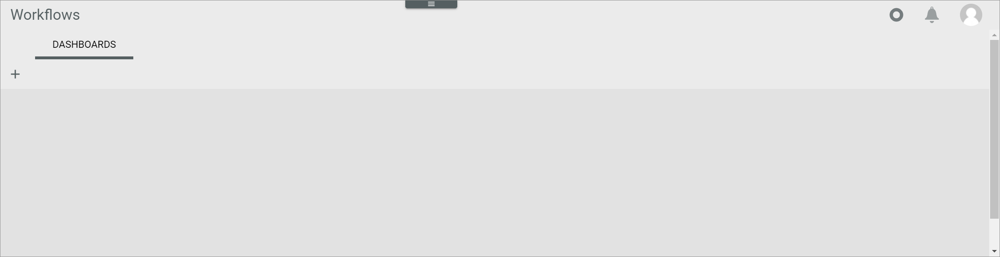
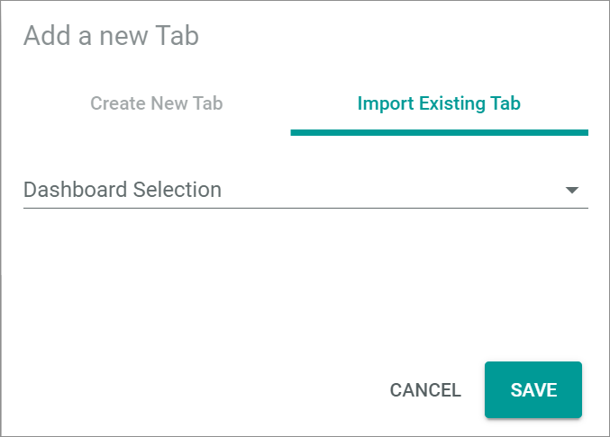

[!!Workflows](ActindoWorkFlow)

# Dashboard
*Workflows > Overview > Tab DASHBOARDS*

In the *DASHBOARDS* tab, the custom tabs with composable dashlets are displayed. By default no tab is created.

-  (Add)   
  Click this button to add a new tab to display different dashlets. The *Add a new Tab* window is displayed.

-  (Delete)   
  Click this button to delete the selected tab. The *Confirm Tab Deletion* window is displayed. This button is only displayed next to a created tab.

## Add a new tab - Create new tab

- *Tab Name*   
  Enter a name for the new tab.

- [CANCEL]   
  Click this button to cancel creating a tab and close the *Add a new Tab* window.

- [SAVE]   
  Click this button to save the tab with the entered name and close the *Add a new Tab* window. The new tab is created.

## Add a new tab - Import existing tab

- *Dashboard Selection*   
  Click the drop-down list to select the dashboard tab to be imported to the dashboard. All available dashboard tabs that are not yet included in the dashboard are displayed in the list.

- [CANCEL]   
  Click this button to cancel importing a tab and close the *Add a new Tab* window.

- [SAVE]   
  Click this button to save the selected tab for import and close the *Add a new Tab* window. The selected tab is imported.

[comment]: <> (When is this tab unlocked? Only available in the Actindo Dashboard?)

## Confirm tab deletion

- [CANCEL]   
  Click this button to cancel deleting the selected tab and close the *Confirm Tab Deletion* window.

- [ACCEPT]   
  Click this button to delete the selected tab and close the *Confirm Tab Deletion* window. The tab and its dashlets are deleted.

## Tab

-  (Settings)   
  Click this button to edit the tab. The *Edit tab* view is displayed.  

### Edit tab

- *Select Viewport*   
  Click the drop-down list to select the view to be applied to the tab. A different view can be selected for each tab. The drop-down list is only displayed in the *Edit tab* view. The following options are available:    
  - **Automatic**: The system automatically detects the appropriate view and applies it to the tab.
  - **Mobile**: The mobile view is applied to the tab.  
  - **Tablet**: The tablet view is applied to the tab.  
  - **Laptop**: The laptop view is applied to the tab.  
  - **Desktop**: The desktop view is applied to the tab.  

- [ADD ELEMENT]   
  Click the button to add a dashlet to the selected tab. The *Dashlet Picker* window is displayed. The button is only displayed in the *Edit tab* view.

- [SAVE]   
  Click this button to save any changes. The changes are applied. The *Edit tab* view is closed.

-  (Cancel)   
  Click this button to cancel editing the tab. Any changes are rejected. The *Edit tab* view is closed.

- Dashlet   
  Hover over a dashlet until the cursor icon changes to the cross arrows cursor. Then move the dashlet on the predefined grid using drag and drop. To remove a dashlet from the tab, click the  (Remove) button in the upper right corner of the dashlet.  

### Dashlet picker

- [x]
  Select a checkbox to add the selected dashlet to the tab. You can select multiple checkboxes. If you click the checkbox in the header, all dashlets in the list are selected. A toolbar indicating the number of selected dashlets is displayed above the list when you have selected at least one checkbox. By default, the following dashlets are available:
  - Current failure count: This dashlet displays the number of processes that have currently an *Error* status.
  - Workflow count: This dashlet displays the number of workflows in the *Workflows* module.
  -	Waiting processes: This dashlet displays the number of waiting processes in the *Workflows* module.

- [CANCEL]   
  Click this button to cancel adding dashlets and close the *Dashlet Picker* window.

- [ACCEPT]   
  Click this button to add the selected dashlets to the tab and close the *Dashlet Picker* window. The dashlets are displayed in the tab.
