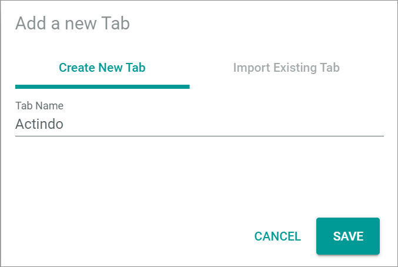
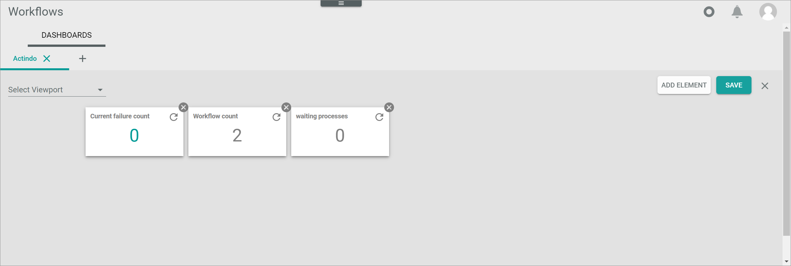

# DASHBOARDS

*Process Orchestration > Overview > Tab DASHBOARDS*

In the *DASHBOARDS* tab, the custom tabs with composable dashlets are displayed. By default no tab is created.

-  (Add)   
    Click this button to add a new tab to display different dashlets. The *Add a new tab* window is displayed, see [Add a new tab](#add-a-new-tab).

-  (Delete)   
    Click this button to delete the selected tab. The *Confirm tab deletion* window is displayed, see [Confirm tab deletion](#confirm-tab-deletion). This button is only displayed next to a created tab.

## Add a new tab

*Process Orchestration > Overview > Tab DASHBOARDS > Button Add*

**Create new tab**

- *Tab Name*   
    Enter a name for the new tab.

- [CANCEL]   
    Click this button to cancel creating a tab. The *Add a new tab* window is closed.

- [SAVE]   
    Click this button to save the tab with the entered name. The *Add a new tab* window is closed. The new tab is created.

**Import existing tab**

The *Import existing tab* tab is locked. It is only available in the *Actindo Dashboard*. For detailed information, see [Import dashboard](../../Core1/UsingCore1/06_ManageDashboard.md#Import-dashboard)

## Confirm tab deletion

*Process Orchestration > Overview > Tab DASHBOARDS > Button Delete*

- [CANCEL]   
    Click this button to cancel deleting the selected tab. The *Confirm tab deletion* window is closed.

- [ACCEPT]   
    Click this button to delete the selected tab. The *Confirm tab deletion* window is closed. The tab and its dashlets are deleted.

## Tab

*Process Orchestration > Overview > Tab DASHBOARDS > Select tab*   
*Process Orchestration > Overview > Tab DASHBOARDS > Button Add > Button Save*   

-  (Settings)   
    Click this button to edit the tab. The *Edit tab* view is displayed, see [Edit tab](#edit-tab).  

### Edit tab

*Process Orchestration > Overview > Tab DASHBOARDS > Select tab > Button Settings*   
*Process Orchestration > Overview > Tab DASHBOARDS > Button Add > Button Save > Button Settings*  

- *Select Viewport*   
  Click the drop-down list to select the view to be applied to the tab. A different view can be selected for each tab. The drop-down list is only displayed in the *Edit tab* view. The following options are available:    
    - **Automatic**   
        The system automatically detects the appropriate view and applies it to the tab.
    - **Mobile**   
        The mobile view is applied to the tab.  
    - **Tablet**   
        The tablet view is applied to the tab.  
    - **Laptop**   
        The laptop view is applied to the tab.  
    - **Desktop**   
        The desktop view is applied to the tab.  

- [ADD ELEMENT]   
    Click the button to add a dashlet to the selected tab. The *Dashlet picker* window is displayed, see [Dashlet picker](#dashlet-picker). The button is only displayed in the *Edit tab* view.

- [SAVE]   
    Click this button to save any changes. The changes are applied. The *Edit tab* view is closed.

-  (Cancel)   
    Click this button to cancel editing the tab. Any changes are rejected. The *Edit tab* view is closed.

- Dashlet   
    Hover over a dashlet until the cursor icon changes to the cross arrows cursor. Then move the dashlet on the predefined grid using drag and drop. To remove a dashlet from the tab, click the  (Remove) button in the upper right corner of the dashlet.  

### Dashlet picker

*Process Orchestration > Overview > Tab DASHBOARDS > Select tab > Button Settings > Button ADD ELEMENT*   
*Process Orchestration > Overview > Tab DASHBOARDS > Button Add > Button Save > Button Settings > Button ADD ELEMENT*  

- [x]   
  Select a checkbox to add the selected dashlet to the tab. You can select multiple checkboxes. If you click the checkbox in the header, all dashlets in the list are selected. A toolbar indicating the number of selected dashlets is displayed above the list when you have selected at least one checkbox.   
  By default, the following dashlets are available:
    - *Current failure count*   
        This dashlet displays the number of processes that have currently an *Error* status.
    - *Workflow count*   
        This dashlet displays the number of workflows in the *Process Orchestration* module.
    - *Waiting processes*   
        This dashlet displays the number of waiting processes in the *Process Orchestration* module.

- [CANCEL]   
    Click this button to cancel adding dashlets. The *Dashlet picker* window is closed.

- [ACCEPT]   
    Click this button to add the selected dashlets to the tab. The *Dashlet picker* window is closed. The dashlets are displayed in the tab.
