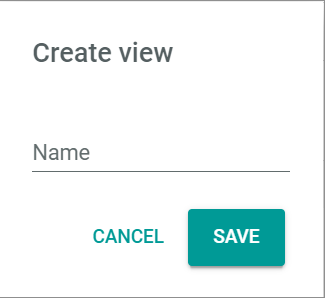
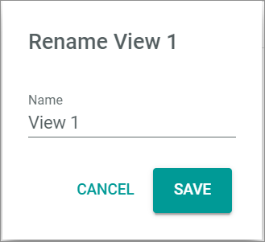

[!!Workflows](ActindoWorkFlow)
[!!Tasks](Tasks)

# Overview

*Workflows > Workflows > Tab OVERVIEW*

**Workflows**
- *VIEW*  
Click the drop-down list to select the view. All created views are displayed in the drop-down list. Click the  (Points) button to the right of the *VIEW* drop-down list to display the context menu and create a view. For detailed information, see [Create view](#create-view).

  - View context menu  
  Click the  (Points) button to the right of the *View* drop-down list to display the context menu. The following menu entries are available:

    -  create  
    Click this entry to create a view. The *Create view* window is displayed.

    -  rename  
    Click this entry to rename the selected view. The *Rename view* window is displayed. This menu entry is only displayed when a view is selected.

    -  reset  
    Click this entry to reset the view to the selected views settings. This menu entry is only displayed when a view is selected and any changes are made to the views settings.

    -  publish  
    Click this entry to publish the view. This menu entry is only displayed when a view is selected and unpublished.

    -  unpublish  
    Click this entry to unpublish the view. This menu entry is only displayed when a view is selected and published.

    -  save  
    Click this entry to save the current view settings in the selected view. This menu entry is only displayed when a view is selected.

      > [Info] When the settings of a view have been changed, an asterisk is displayed behind the view name. The asterisk is hidden as soon as the changes have been saved.

    -  delete  
    Click this entry to delete the selected view. A confirmation window to confirm the deletion is displayed. This menu entry is only displayed when a view is selected.

-  (Search)  
    Click this button to display the search bar and search for a workflow.

    > [Info] The search function can be used to search for a workflow name and key. At least 3 characters must be entered.

-  (Refresh)  
    Click this button to update the list of workflows.

-  Columns (x)  
    Click this button to display the columns bar and customize the displayed columns and the order of columns in the list. The *x* indicates the number of columns that are currently displayed in the list.

-  Filter (x)  
    Click this button to display the filter bar and customize the active filters. The *x* indicates the number of filters that are currently active.

The list displays all workflows. Depending on the settings, the displayed columns may vary. All fields are read-only.

- *Name*  
  Name of the workflow.

- *Key*  
  Workflow key. The key is required for API access and must be unique within the workflow version.

- *Highest version*  
  Highest existing version of the workflow.

- *Highest published version*  
  Highest published version of the workflow.

- *ID*  
  Workflow identification number. The ID number is automatically assigned by the system when the workflow is created.

-  (Add)  
Click this button to create a workflow. The *New workflow* window is displayed, see [New workflow](#new-workflow). For detailed information, see [Create a workflow](../Operation/01_ManageWorkflows.md#create-a-workflow).

## New workflow

*Workflows > Workflows > Tab OVERVIEW > Button Add*

- *Select a name for your new workflow*  
Enter a name for the new workflow.

- *Select a unique key for your new workflow*  
Enter a key for the workflow. The key is required for API access and must be unique within the workflow version.

- *Choose the data type of your start place*  
Enter the name of the start place or a keyword to search for and select the appropriate place in the list of places.

  > [Info] The list of places is filtered for your keyword as you type.

-  (Delete)  
  Click this button to clear the search bar field for the start place.

- *Choose the data type of your end place*  
Enter the name of the end place or a keyword to search for and select the appropriate place in the list of places.

  > [Info] The list of places is filtered for your keyword as you type.

-  (Delete)  
    Click this button to clear the search bar field for the end place.

- [CANCEL]  
Click this button to cancel creating a new workflow. The *New workflow* window is closed.

- [CREATE]  
Click this button to create a new workflow. The workflow editor with the defined start and end places is displayed.

## Workflow versions

*Workflows > Workflows > Tab OVERVIEW > Select workflow*

[comment]: <> (subject/path to change, but correct for now -> check in the future)

-  (Back)  
Click this button to close the *Workflow versions* view and return to the *Workflows* view.

- *VIEW*  
Click the drop-down list to select the view. All created views are displayed in the drop-down list. Click the  (Points) button to the right of the *VIEW* drop-down list to display the context menu and create a view. For detailed information, see [Create view](#create-view).

  - View context menu  
  Click the  (Points) button to the right of the *View* drop-down list to display the context menu. The following menu entries are available:

    -  create  
  Click this entry to create a view. The *Create view* window is displayed.

    -  rename  
  Click this entry to rename the selected view. The *Rename view* window is displayed. This menu entry is only displayed when a view is selected.

    -  reset  
  Click this entry to reset the view to the selected views settings. This menu entry is only displayed when a view is selected and any changes are made to the views settings.

    -  publish  
  Click this entry to publish the view. This menu entry is only displayed when a view is selected and unpublished.

    -  unpublish  
  Click this entry to unpublish the view. This menu entry is only displayed when a view is selected and published.

    -  save  
  Click this entry to save the current view settings in the selected view. This menu entry is only displayed when a view is selected.

      > [Info] When the settings of a view have been changed, an asterisk is displayed behind the view name. The asterisk is hidden as soon as the changes have been saved.

    -  delete  
  Click this entry to delete the selected view. A confirmation window to confirm the deletion is displayed. This menu entry is only displayed when a view is selected.

-  (Search)  
    Click this button to display the search bar and search for a workflow version.

    > [Info] The search function can be used to search for a workflow version ID. At least 3 characters must be entered.

-  (Refresh)  
    Click this button to update the list of workflow versions.

-  Columns (x)  
    Click this button to display the columns bar and customize the displayed columns and the order of columns in the list. The x indicates the number of columns that are currently displayed in the list.

-  Filter (x)  
    Click this button to display the filter bar and customize the active filters. The x indicates the number of filters that are currently active.

The list displays all workflow versions of the selected workflow. Depending on the settings, the displayed columns may vary. All fields are read-only.

- *Version*  
  Version number of the workflow.

- *Published*  
  -  (Checkmark): The workflow version is published.
  -  (Cross): The workflow version is unpublished.

- *ID*  
  Identification number of the workflow version. The ID number is automatically assigned by the system when the workflow version is created.

- [x]  
Select the checkbox to display the editing toolbar.

- [PUBLISH]   
  Click this button to publish a workflow version. This button is only displayed if the selected workflow version is unpublished. For detailed information, see [Publish a workflow](../Operation/01_ManageWorkflows.md#publish-a-workflow).

- [UNPUBLISH]    
  Click this button to unpublish a workflow version. This button is only displayed if the selected workflow version is published. For detailed information, see [Unpublish a workflow](../Operation/01_ManageWorkflows.md#unpublish-a-workflow).

## Workflow editor

*Workflows > Workflows > Tab OVERVIEW > Select workflow > Select version*

-  (Back)  
Click this button to close the workflow editor and return to the list of workflows.

-   (Points)  
Click the  (Points) button to the right of the workflow name to display the context menu. The following menu entries are available:

  - *Import JSON*  
  Click this entry to import data in JSON format. The *Import JSON* window is displayed, see [Import JSON](#import-json).

  - *Export JSON*  
  Click this entry to export data in JSON format. The *Export JSON* window is displayed, see [Export JSON](#export-json).

  - *Deploy*  
  Click this entry to publish a new workflow version with the current state.

-  (Undo)  
  Click this button to undo the last change made.

-  (Redo)  
  Click this button to redo the last undone change.

- [NEW ACTION]  
  Click this button to add a transition. The *Search for an action* window is displayed. For detailed information, see [Search for an action](#search-for-an-action).

 The workflow diagram includes the following elements:  

- Place  
  Intermediate stage in the workflow, represented by a circle, usually provided with incoming and/or outcoming arcs. It serves as link between two transitions.

  When clicking a place in the workflow editor, it becomes highlighted and the corresponding element settings are displayed in the settings side bar.

  

  - *Key*  
  Place key. This field is read-only. The key is required for API access and must be unique within the workflow version.

  - *Data container*  
  Use this field to define the data type to be used in the place. If necessary, click the  (Delete) button to display the whole list of available data types. Enter a search text for the desired data type. The list of transitions is filtered for your search text as you type. Select the radio button of the appropriate option.   
  For detailed information, see [Places](../Overview/04_WorkflowProcessElements.md#places).

  - Start/end place  
  Special types of places at the beginning and at the end of a workflow. Every workflow starts with a single place and ends with a single place.

  When clicking the start/end place, it becomes highlighted and the corresponding element settings are displayed in the settings side bar.

  

    - *Key*  
    Place key. This field is read-only. The key is required for API access and must be unique within the workflow version.

    - *Data container*  
    Use this field to define the data type to be used in the place. If necessary, click the  (Delete) button to display the whole list of available data types. Enter a search text for the desired data type. The list of transitions is filtered for your search text as you type. Select the radio button of the appropriate option.   
    For detailed information, see [Start and end place](../Overview/04_WorkflowProcessElements.md#start-and-end-place).

- Transition  
  Building blocks that are chained together through places to configure a workflow, represented by a rectangle. All transitions contain a certain, predefined number of input and output ports, represented by a small square to the link and the right of the transition.

  When clicking a transition in the workflow editor, it becomes highlighted and the corresponding element settings are displayed in the settings side bar.

  

  The transition settings side bar is located to the right of the workspace and allows to define the transition settings. The following fields are displayed:

  - *Key*  
   Transition key. This field is read-only. The key is required for API access and must be unique within the workflow version.

  - *Label*  
  Transition label defined by the user. It can be used to specify or simplify the transition name. When editing the transition label, it is changed both at the top of the settings side bar and in the transition rectangle in the diagram.

  - *Queue type*  
  Click the drop-down list to select the applicable queue type. For detailed information about queue types, see [Configure the queue types](../Integration/01_ConfigureQueueTypes.md).

  - *Task event*  
  Click the drop-down list and select the applicable task event. All available task events are displayed. This option is linked to the *Tasks* module. The drop-down list is only displayed if the *Tasks* module is installed and the user has the necessary rights.

    > [Info] The *ActindoWorkflow Process Execution Failed* task is preconfigured by default. A list of all existing task events is displayed in the *Events* menu entry of the *Tasks* module.

  - *Configuration*  
  Depending on the transition, there might be configuration options, for instance, defining an email where a receipt or document must be sent. Editing the transition configuration may require basic programming knowledge.

    > [Info] Most transitions are preconfigured and do not include configuration options. In this case, the *Configuration* section is not displayed.

  - *Static inputs*  
  All unlinked inputs are listed in this section. Static inputs can be used to configure static values for certain inputs. They can be defined by the user clicking the  (Add) button. Only valid JSON values are accepted. When used, static inputs are displayed by a small arrow in front of the input ports in the workflow diagram. This section is only displayed, if the selected transition has at least one unlinked input port.

  For detailed information, see [Transitions](../Overview/04_WorkflowProcessElements.md#transitions).

- Input/output port  
Represented by a small square positioned to the left (input) and to the right (output) of the transition, they are defined with a descriptive name, such as origin, data or destination. They can be mandatory or optional. If optional, an  (Add) button is displayed next to them.

  For detailed information, see [Input and output ports](../Overview/04_WorkflowProcessElements.md#input-and-output-ports).

- Arc  
The arcs are the links connecting a place with the input and output port(s) of an transition to model the flow of information. The arcs are represented by arrows. Arcs connecting a place to an input port are called *incoming arcs*, arc connecting an output port to a place are called *outcoming arcs*.

  For detailed information, see [Arcs](../Overview/04_WorkflowProcessElements.md#arcs).

## Import JSON

*Workflows > Workflows > Tab OVERVIEW > Select workflow > Select version > Button Points > Menu entry Import JSON*

The *Import JSON* window displays the workflow source code in JSON format. Configuration changes can be made in this view and applied with the [IMPORT JSON] button.

  > [Info] To modify the source code, in-depth programming knowledge is needed.

- [CLOSE]  
Click this button to close the window and reject all changes.

- [IMPORT JSON]  
Click this button to apply all changes made to the source code.

## Export JSON

*Workflows > Workflows > Tab OVERVIEW > Select workflow > Select version > Button Points > Menu entry Export JSON*

The *Export JSON* window displays all workflow source code in JSON format. This view is read-only.

- [CLOSE]  
Click this button to close the window.

## Search for an action

*Workflows > Workflows > Tab OVERVIEW > Select workflow > Select version > Button NEW ACTION*
*Workflows > Workflows > Tab OVERVIEW > Select workflow > Select version > Button Add next to a place*

The *Search for an action* window displays a list of possible transitions for the selected place.

  > [Info] If clicking the [NEW ACTION] button, all existing transitions are displayed. If clicking the  (Add) button next to a place, only the compatible transitions for that place are displayed, as specified in the information message of the *Search for an action* window below the search bar).

- *Search for an action* (search bar)  
Click this field (search bar) to enter the name of the transition or a keyword to search for. Select an transition in the list of transitions to add the selected transition to the workflow.
For detailed information about adding a transition, see [Create an action](ActindoWorkFlow/Operation/01_ManageWorkflows.md#create-an-action).

  > [Info] The list of transitions is filtered for your keyword as you type.

-  (Delete)  
Click this button to clear the search bar field.

## Create view

*Workflows > Workflows > Tab OVERVIEW > Button Points > Menu entry create*

- *Name*  
Enter a name for the view.

- [CANCEL]  
Click this button to cancel creating a view. The *Create view* window is closed.

- [SAVE]  
Click this button to save the new view. The *Create view* window is closed. The view is saved and displayed in the *View* drop-down list.

## Rename view

*Workflows > Processes > Tab OVERVIEW > Button Points > Menu entry rename*

- *Name*  
Click the field to edit the view name.

- [CANCEL]  
Click this button to cancel renaming a view. The *Rename view* window is closed.

- [SAVE]  
Click this button to save the changes to the view name. The *Rename view* window is closed. The new name for the view is saved and displayed in the *View* drop-down list.
