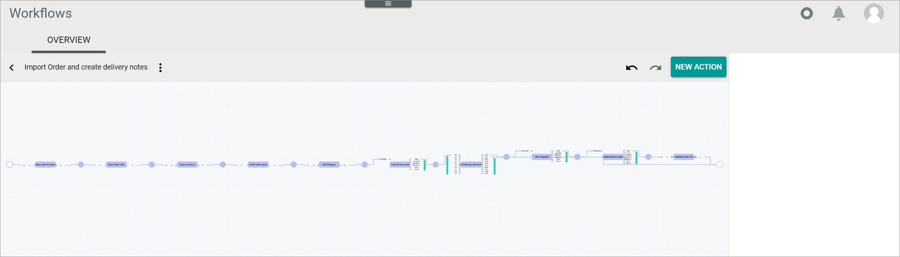
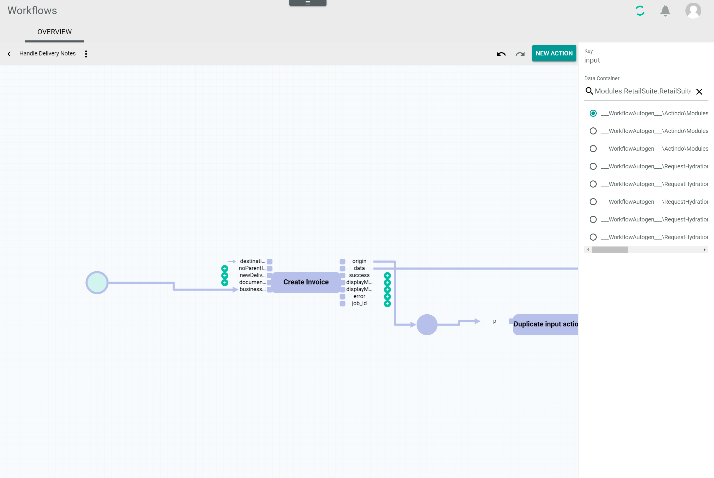

[!!Manage the workflows](../Operation/01_ManageWorkflows.md)
[!!Workflow and process elements](../Overview/04_WorkflowProcessElements.md)
[!!Configure the queue types](../Integration/01_ConfigureQueueTypes.md)

[comment]: < add link to Tasks module if available (Currently not available 21.02.2024)>

# OVERVIEW (Workflow)

*Process Orchestration > Workflows > Tab OVERVIEW*

**Workflows**

The list displays all workflows. Depending on the settings, the displayed columns may vary. All fields are read-only.

- *Name*  
    Name of the workflow.

- *Key*  
    Workflow key. The key is required for API access and must be unique within the workflow version.

- *Highest version*  
    Highest existing version of the workflow.

- *Highest published version*  
    Highest published version of the workflow.

- *ID*  
    Workflow identification number. The ID number is automatically assigned by the system when the workflow is created.

-  (Add)  
    Click this button to create a workflow. The *New workflow* window is displayed, see [New workflow](#new-workflow).    

## New workflow

*Process Orchestration > Workflows > Tab OVERVIEW > Button Add*

- *Select a name for your new workflow*  
    Enter a name for the new workflow.

- *Select a unique key for your new workflow*  
    Enter a key for the workflow. The key is required for API access and must be unique within the workflow version.

- *Choose the data type of your start place*  
    Enter the name of the start place or a keyword to search for and select the appropriate place in the list of places.

    > [Info] The list of places is filtered for your keyword as you type.

-  (Delete)  
    Click this button to clear the search bar field for the start place.

- *Choose the data type of your end place*  
    Enter the name of the end place or a keyword to search for and select the appropriate place in the list of places.

    > [Info] The list of places is filtered for your keyword as you type.

-  (Delete)  
    Click this button to clear the search bar field for the end place.

- [CANCEL]  
    Click this button to cancel creating a new workflow. The *New workflow* window is closed.

- [CREATE]  
    Click this button to create a new workflow. The workflow editor with the defined start and end places is displayed.

## Workflow versions

*Process Orchestration > Workflows > Tab OVERVIEW > Select workflow*

[comment]: <> (subject/path to change, but correct for now -> check in the future > still available 21.02.2024)

The list displays all workflow versions of the selected workflow. Depending on the settings, the displayed columns may vary. All fields are read-only.

- *Version*  
    Version number of the workflow.

- *Published*  
    -  (Checkmark): The workflow version is published.
    -  (Cross): The workflow version is unpublished.

- *ID*  
    Identification number of the workflow version. The ID number is automatically assigned by the system when the workflow version is created.

- *Created*   
    Date and time the version was created.

- *Modified*   
    Date and time the version was modified.

The following functions are available for the editing toolbar:

- [x]   
    Select the checkbox to display the editing toolbar.

- [PUBLISH]   
    Click this button to publish a workflow version. This button is only displayed if the selected workflow version is unpublished.    

- [UNPUBLISH]    
    Click this button to unpublish a workflow version. This button is only displayed if the selected workflow version is published.   

## Workflow editor

*Process Orchestration > Workflows > Tab OVERVIEW > Select workflow > Select version*

>[Info] Scroll the mouse wheel to zoom in or out. Make sure that the mouse pointer is placed on a workflow element. If necessary, change your scroll wheel settings to adjust the zoom levels.

-  (Points)  
    Click this button to the right of the workflow name to display the context menu. The following menu entries are available:

    - *Triggers*  
        Click this entry to add triggers and conditions. The *Edit trigger for workflow "Workflow name"* window is displayed, see [Edit trigger for workflow "Workflow name"](#edit-trigger-for-workflow-workflow-name).

    - *Show changes*   
        Click this entry to compare two versions of a workflow to see the differences (insertions/deletions). For detailed information, see [Compare the workflow versions](../Operation/03_CompareWorkflows.md).

    - *Import JSON*  
        Click this entry to import a workflow in JSON format. The *Import JSON* window is displayed, see [Import JSON](#import-json).
        Import the exported JSON code to an existing or new workflow to copy it.

    - *Export JSON*  
        Click this entry to export a workflow in JSON format. The *Export JSON* window is displayed, see [Export JSON](#export-json).

    - *Update deployed version*   
        In the test phase, click this entry to update the current workflow version without creating a new version. For detailed information, see [Update a deployed version](../Operation/05_UpdateDeployedVersion.md). 

    - *Deploy*  
        Click this entry to publish a new workflow version with the current state.

-  (Undo)  
    Click this button to undo the last change made.

-  (Redo)  
    Click this button to redo the last undone change.

- [NEW ACTION]  
    Click this button to add a transition. The *Search for an action* window is displayed, see [Search for an action](#search-for-an-action).

The workflow diagram includes the following elements:  

- Place    
    Intermediate stage in the workflow, represented by a circle, usually provided with incoming and/or outcoming arcs. It serves as link between two transitions. For detailed information, see [Places](../Overview/04_WorkflowProcessElements.md#places).   
    If you click a place in the workflow editor, it becomes highlighted and the corresponding element settings are displayed in the settings sidebar.

    

    - *Key*  
        Place key. This field is read-only. The key is required for API access and must be unique within the workflow version. <!--- Stimmt das, dass er unique sein muss? Beim Import Channels order..ist der Key nicht unique.. p-out-0, p-id-0p-businessDocument-0...-->

    - *Data container*  
        Use this field to define the data type to be used in the place. If necessary, click the  (Delete) button to display the whole list of available data types. Enter a search text for the desired data type. The list of transitions is filtered for your search text as you type. Select the radio button of the appropriate option.   
        
- Start/end place   
    Special types of places at the beginning and at the end of a workflow. Every workflow starts with a single place and ends with a single place.   
    If you click the start/end place, it becomes highlighted and the corresponding element settings are displayed in the settings sidebar.

    

    - *Key*  
        Place key. This field is read-only. The key is required for API access and must be unique within the workflow version.<!--- Stimmt das, dass er unique sein muss? Beim Import Channels order..ist der Key nicht unique.. p-out-0, p-id-0p-businessDocument-0...-->

    - *Data container*   
        Use this field to define the data type to be used in the place. If necessary, click the  (Delete) button to display the whole list of available data types. Enter a search text for the desired data type. The list of transitions is filtered for your search text as you type. Select the radio button of the appropriate option.   
        For detailed information, see [Start and end place](../Overview/04_WorkflowProcessElements.md#start-and-end-place).

- Transition  
    Building blocks that are chained together through places to configure a workflow, represented by a rectangle. All transitions contain a certain, predefined number of input and output ports, represented by a small square to the left and the right of the transition.   
    When clicking a transition in the workflow editor, it becomes highlighted and the corresponding element settings are displayed in the settings sidebar.

    

    The transition settings sidebar is located to the right of the workspace and allows to define the transition settings. The following fields are displayed:

    - *Key*  
        Transition key. This field is read-only. The key is required for API access and must be unique within the workflow version.<!--- Was ist damit gemeint? und wenn ich eine transition mehrfach einfüge?...-->

    - *Label*  
        Transition label defined by the user. It can be used to specify or simplify the transition name. When editing the transition label, it is changed both at the top of the settings sidebar and in the transition rectangle in the diagram.

    - *Queue type*  
        Click the drop-down list to select the applicable queue type, see [Queue types](05_QueueTypes.md).

    - *Priority*   
        The *Priority* field is used in high performance scenarios. You can use it to speed up a critical path when there are so many actions to be processed that they cannot be processed in parallel, and they pile up in the backlog. You do this by prioritizing the actions that are in the critical path. For example, a critical path might be when an order has been received and needs to be sent to shipping, while other actions such as sending emails are not as time-critical. Note: Priority 10 increases the processing probability by a factor of 10 over priority 1, and priority 8 increases the processing probability by a factor of 4 over priority 2.

    - *Max tries*   
        Number of times the action execution should be retried after an error has occurred. This setting depends on the transition and is usually preconfigured. If you change this setting to a value greater than 1, you can select a retry time strategy from a drop-down list. Depending on this retry time strategy, the value in the *Strategy config value* field is used to perform the number of retries specified in the *Max tries* field. The following retry time strategies are available:

        - **Constant**   
            Define a constant value. For example, a constant value of 3 means to retry the action every 3 minutes.

        - **CustomFunction**  
            Use any suitable php function to define the retry time.

        - **Custom**   
            Enter the number of minutes, separated by commas, to define the time after which the action should be retried. For example, 2,7,9 means to retry after 2, 7, and 9 minutes, if you have entered **3** in the *Max tries* field.

        - **Exponential**   
            Enter an exponential function to define the amount of time the process should wait for the next execution of the retry. For example, 2^Y.

        - **Linear**   
            Enter a linear sequence for the process to wait for the next retry execution. For example, 1,2,3 means to retry after 1, 2, and 3 minutes, if you have entered **3** in the *Max tries* field.

        - **Quadratic**   
            Enter a square value to define the time in minutes after which the action should be retried, for example, Y^2.

        Select the retry strategy and enter the required value in minutes in the *Strategy config value* field.

    - *Task event*  
        Click the drop-down list and select the applicable task event. All available task events are displayed.   
        This option is linked to the *Tasks* module. The drop-down list is only displayed if the *Tasks* module is installed and the user has the necessary rights. 

        > [Info] The *ActindoWorkflow Process Execution Failed* task is preconfigured by default. A list of all existing task events is displayed in the *Events* menu entry of the *Tasks* module. For detailed information, see [Manage the events](Tasks/Operation/01_ManageEvents.md) in the *Tasks* documentation.

    - *Long description*   
        If desired, edit a long text to document the transition.   
        The *Edit long description* window is displayed. You can add a long text using a simple Markdown editor.

    - *Configuration*  
        Depending on the transition, there might be configuration options, for instance, defining an email where a receipt or document must be sent. Editing the transition configuration may require basic programming knowledge.

        > [Info] Most transitions are preconfigured and do not include configuration options. In this case, the *Configuration* section is not displayed.

    - *Static inputs*  
        All unlinked inputs are listed in this section. You can use static inputs to configure static values for certain inputs. You can define it by clicking the  (Add) button.   
        Only valid JSON values are accepted. When used, static inputs are displayed by a small arrow in front of the input ports in the workflow diagram. This section is only displayed, if the selected transition has at least one unlinked input port.  For detailed information, see [Insert a static input](../Operation/06_InsertStaticInput.md). 

    For detailed information, see [Transitions](../Overview/04_WorkflowProcessElements.md#transitions).

- Input/output port  
    Represented by a small square positioned to the left (input) and to the right (output) of the transition, they are defined with a descriptive name, such as origin, data or destination. They can be mandatory or optional. If optional, an  (Add) button is displayed next to them.   
    For detailed information, see [Input and output ports](../Overview/04_WorkflowProcessElements.md#input-and-output-ports).

- Arc  
    The arcs are the links connecting a place with the input and output port(s) of a transition to model the flow of information. The arcs are represented by arrows. Arcs connecting a place to an input port are called *incoming arcs*, arcs connecting an output port to a place are called *outcoming arcs*.   
    For detailed information, see [Arcs](../Overview/04_WorkflowProcessElements.md#arcs).

## Edit trigger for workflow "Workflow name"  

*Process Orchestration > Workflows > Tab OVERVIEW > Button Add > Button CREATE > Button Points > Menu entry Triggers*    
*Process Orchestration > Workflows > Tab OVERVIEW > Select a workflow > Select a workflow version > Button Points > Menu entry Triggers*

The *Edit trigger for workflow "workflow name"* window allows you to determine a specific model, such as a product or a dispatch note, to initiate a process. For detailed information, see [Manage the triggers](../Operation/02_ManageTriggers.md).

-  (Add trigger)  
    Click this button to add a trigger. A trigger input line is displayed.

    > [Info] The following fields are only displayed when a trigger has been added.

-  (Collapse)  
    Click this button to collapse the trigger box.

-  (Expand)  
    Click this button to expand the trigger box.

- *Name*  
    Enter a descriptive name for the new trigger. The entered name is displayed above the trigger input line.

- *Model*  
    Enter the applicable namespace of the model. The entered namespace is displayed to the right of the name above the trigger input line. Ensure that the name space of the model corresponds to the  

- *Event*  
    Click the drop-down list and select the appropriate event. The following options are available:    
    - **After creation**   
        Select this option for the trigger to be executed after the model has been created. This option is preselected by default.
    - **After saving**   
        Select this option for the trigger to be executed after the model has been saved.

- *Condition fulfillment*  
    Click the drop-down list and select the appropriate condition fulfillment. The following options are available:  
    - **If all are met**  
        Select this option if you want all conditions to be met for the trigger to be executed. This option is preselected by default.
    - **If any is met**  
        Select this option if you want the trigger to be executed if any single one of the configured conditions is met.

- *Status*  
    Click the drop-down list and select the appropriate status. The following options are available:   
    - **Active**  
        Select this option to activate the trigger. This option is preselected by default.
    - **Inactive**  
        Select this option to deactivate the trigger temporarily.

- *Process priority*  
    Enter the priority for the process execution. The priority is specified with a positive integer. The greater the number, the higher the priority.  

    > [Info] As soon as all trigger fields are completed, the  (Add) button is displayed below the trigger input line.

-  (Drag)  
    Click and hold this button to move the trigger to a another position in the list. Drop the trigger in the desired position by releasing the mouse button.

-  (Delete)  
    Click the button to the right of the trigger box to delete the trigger.

-  (Add condition)  
    Click this button to add a condition. A condition input line is displayed. The button is only displayed if all trigger fields have been completed.

    > [Info] The following fields are only displayed when a condition has been added.

- *Prefix*  
    Click the drop-down list and select the appropriate prefix. The following options are available:
    - **entity.**  
        Select this option if you want to refer to any property independently of its change status. The option is usually selected if the **After creation** event is selected in the *Event* drop-down list of the trigger fields. This option is preselected by default.
    - **changeset.**  
        Select this option if you want to refer to a property that has been changed. Only properties that have been changed are included to the change set.

- *Property*  
    Enter the applicable property for the selected prefix.

    > [Info] The properties of an entity you can refer to are described in the relevant API documentation. To include a deeper level of the data field, enter a point *.* at a time, for instance *{$entity._pim_tax_zone.id}*. The first point is already included in the *Prefix* field, so you can start with the property name without adding a point at the beginning.

- *Operator*  
    Click the drop-down list and selected the appropriate option. The following options are available:
    - **Equals**  
        Select this option if the property value must equal the value specified in the *Value* field for the trigger to be executed. This option is preselected by default.
    - **Does not equal**  
        Select this option if the property value must not equal the value specified in the *Value* field for the trigger to be executed.
    - **Is set**  
        Select this option if any property value must be set for the trigger to be executed. No value must be entered in the *Value* field. A toggle is available instead of a value:   
        - Enable the toggle to define that a property value must be set for the condition to be met.
        - Disable the toggle to define that a property value must not be set for the condition to be met.

<!--ICBPM-204 eingebaut-->

- *Value*  
    Enter the applicable value.

-  (Delete)  
    Click the button to the right of the condition input line to delete the condition.

- [CANCEL]  
    Click this button to cancel the editing the trigger(s) and reject all changes.

- [APPLY CHANGES]  
    Click this button to save all changes made to the trigger(s).

## Workflow &ndash; Compare workflow versions

*Process Orchestration > Workflows > Tab OVERVIEW > Select workflow > Select version > Button Points > Menu entry Show changes*

*Process Orchestration > Workflows > Tab OVERVIEW > Select workflow > Select version > Click COMPARE button*

    

**Workflows**

The *Workflow* window displays two versions of a workflow configuration.

The following fields and functions are available in this window:

- *Workflow*   
    Click this drop-down list to select the workflow you want to use for comparison.

-  [SWAP VERSIONS]   
    Click this button to swap the versions displayed.

-  [FORMAT CODE]   
    Click this button to compare the lines of code and puts them in the same order, so that order differences are no longer highlighted.

-  (All properties)   
    Enable this toggle to compare all changes. This includes properties which have no functional impact such as the version number or the positioning of the nodes.

- *Version*   
    Click this drop-down list to select the workflow version that is to be displayed. The drop-down list contains all versions available for the workflow selected in the *Workflow* field.

## Import JSON

*Process Orchestration > Workflows > Tab OVERVIEW > Select workflow > Select version > Button Points > Menu entry Import JSON*

The *Import JSON* window displays the workflow source code in JSON format. Configuration changes can be made in this view and applied with the [IMPORT JSON] button.

> [Info] To modify the source code, in-depth programming knowledge is needed.

- [CLOSE]  
    Click this button to close the window and reject all changes.

- [IMPORT JSON]  
    Click this button to apply all changes made to the source code.

## Export JSON

*Process Orchestration > Workflows > Tab OVERVIEW > Select workflow > Select version > Button Points > Menu entry Export JSON*

The *Export JSON* window displays all workflow source code in JSON format. This view is read-only.

- [CLOSE]  
    Click this button to close the window.

## Search for an action

*Process Orchestration > Workflows > Tab OVERVIEW > Select workflow > Select version > Button NEW ACTION*
*Process Orchestration > Workflows > Tab OVERVIEW > Select workflow > Select version > Button Add next to a place*

The *Search for an action* window displays a list of possible transitions for the selected place.   

> [Info] If clicking the [NEW ACTION] button, all existing transitions are displayed. If clicking the  (Add) button next to a place, only the compatible transitions for that place are displayed, as specified in the information message of the *Search for an action* window below the search bar.

- *Search for an action* (search bar)  
    Click this field to enter the name of the transition or a keyword to search for. Select a transition in the list of transitions to add the selected transition to the workflow.   

    > [Info] The list of transitions is filtered for your keyword as you type.

-  (Delete)  
    Click this button to clear the search bar field.
