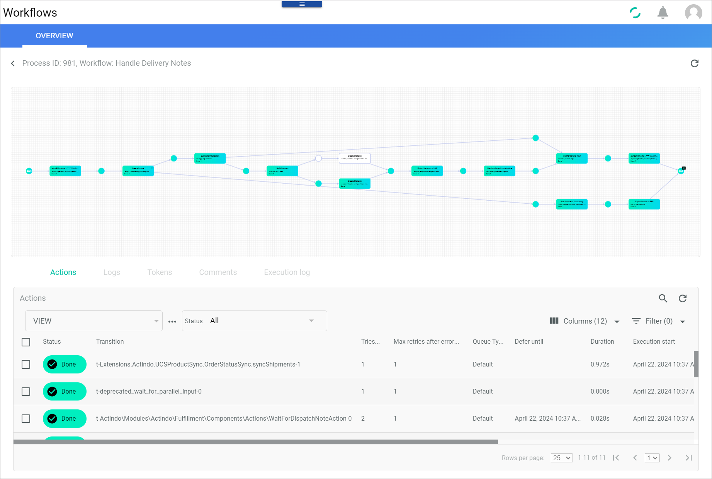
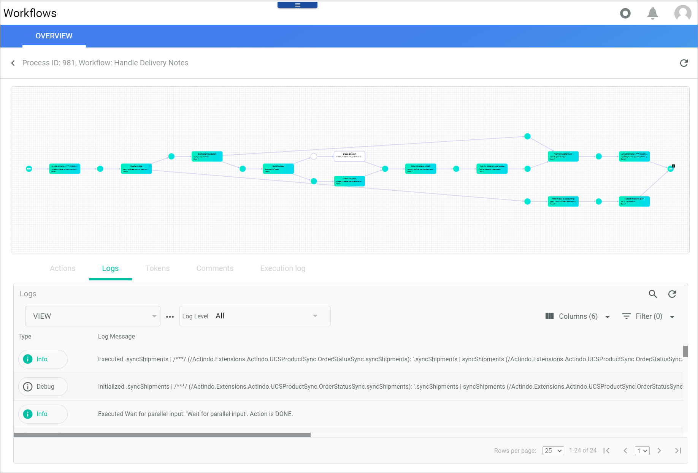
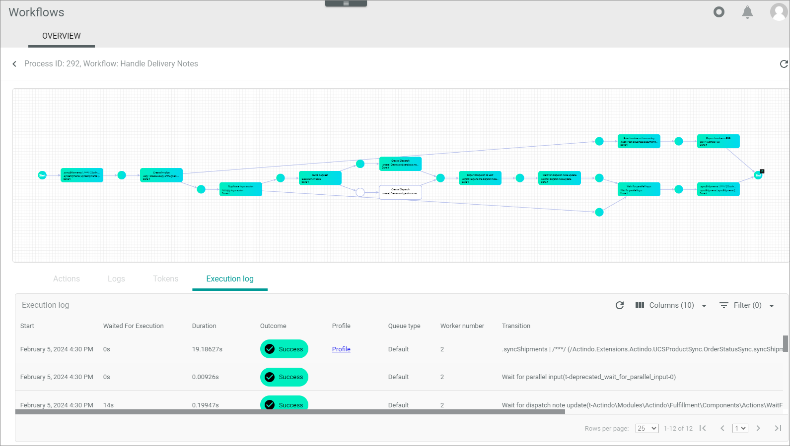

[!!Manage the workflows](../Operation/01_ManageWorkflows.md)
[!!Configure the queue types](../Integration/01_ConfigureQueueTypes.md)
[!!Process actions](./04a_ProcessActions.md)

# OVERVIEW (Processes)

*Process Orchestration > Processes > Tab OVERVIEW*

**Processes**

The list displays all processes that are matching the selected values (status and workflow type). Depending on the settings, the displayed columns may vary. All fields are read-only. Click a process in the list to display the *Process ID* view with a process diagram and detailed information about the selected process.

The following fields and functions are available on top of the list:

-  (Manual processes)   
   Enable this toggle to display only those processes which require a user interaction. Disable this toggle to display all processes.

- *Status*  
    Click the drop-down list to select a process status. The following options are available:  
    - **All**  
        Select this option to display all processes, regardless of their status.
    - **Ready**  
        Select this option to display the processes that have just been initiated.
    - **In progress**  
        Select this option to display the processes that are currently active (first action is already executed) and/or require a user interaction.
    - **Error**  
        Select this option to display the processes that have given an error (a process action has given an error).
    - **Done**  
        Select this option to display the processes that have been successfully executed (end place has been reached).  
    - **Dead**  
        Select this option to display the processes that have automatically stopped due to a missing input. A dead process cannot be retried. It can only be aborted, that is, manually ended, and re-initiated.
    - **Suspended**  
        Select this option to display the processes that have been manually paused. The subsequent process actions were temporarily stopped.
    - **Aborted**  
        Select this option to display the processes that have been manually ended. All process actions currently running are stopped and no longer executed.

- *Workflow*  
    Click the drop-down list to display a specific workflow. All workflows created in the *Workflows* menu entry are available in the list.

The following functions are available for the editing toolbar. Depending on the process status, the editing toolbar displays specific buttons:

- [x]  
    Select the checkbox to display the editing toolbar. If you click the checkbox in the header, all processes in the list are selected.

-  (Abort)  
    Click this button to end the process. This button is displayed if the process status is *Error* or *In progress*. When clicking this button, the process status changes to *Aborted*.

-  (Suspend)  
    Click this button to suspend the process temporarily. This button is displayed if the process status is *In progress*.  When clicking this button, the process status changes to *Suspended*.

-  (Start)  
    Click this button to resume the process. This button is displayed if the process status is *Suspended*. When clicking this button, process status changes again to *In progress*.

The following functions and fields are available in this list:

- *Status*  
    Status of the process. The different process statuses are displayed in different colors. The following statuses are possible:
    - **Ready** (light gray)
    - **In progress** (blue)
    - **Error** (red)
    - **Done** (green)
    - **Dead** (black)
    - **Suspended** (dark gray)
    - **Aborted** (black)

- *Suspended actions*  
    If the process contains suspended actions, a (Warning) sign is displayed. Click the process to display the individual actions. <!---TO BE ENHANCED-->

- *Has a manual action*   
    If the process contains a manual action, a (Warning) sign is displayed. Click the process to execute the manual action, see [Make a user decision](../Operation/09_TrackWorkflowProcess.md#make-a-user-decision).

- *Subject*
    [TO BE ENHANCED]
    

- *Workflow*  
    Name of the corresponding workflow.

- *Queue type*  
    Queue type configured in the process. This column displays the queue type name or **According to configuration in workflow**.

- *Priority*  
    Process priority set up in the system. The higher the number, the higher the priority.

- *Created*  
    Date and time of creation.

- *Last activity*  
    Last date and time an activity was registered in the process.

- *ID*  
    Process identification number. The ID number is automatically assigned by the system.

- *Owning module*  
    Module that has created the workflow.

    > [Info] When a workflow is manually created in the *Process orchestration* module, **ActindoWorkFlow** is displayed. A workflow can also be created automatically by a different module. In this case, the name of the corresponding module is displayed.  

- *Created by*  
    Name and username of the user who initiated the process.

- *Modified by*  
    Name and username of the user who modified the process.

## Process ID

*Process Orchestration > Processes > Tab OVERVIEW > Select a process*

**Process ID**

- *Process ID*  
    Process identification number. The ID number is automatically assigned by the system.

- *Process orchestration*  
    Name of the workflow.

### Process diagram

The diagram displays a visualization of the selected process including all places and actions. If the process is currently active, the process execution can be observed in real time.

-  (Refresh)  
    Click this button to update the diagram to see the current processing status.

### Actions

*Process Orchestration > Processes > Tab OVERVIEW > Select a process > Tab Actions*

**Actions tab**

The *Actions* tab is selected by default when selecting a process. This tab is an excerpt of the *Process actions* menu entry, which displays a list of all process actions. When clicking an action in the *Process actions* view, the selected action is displayed in the *Actions* tab of the corresponding *Process ID* view.  
The list displays all executed actions that are matching the selected status. Depending on the settings, the displayed columns may vary. All fields are read-only. Depending on the process status, the editing toolbar may display different options. 

For detailed information on the available functions and fields in this tab, see [Overview (Process actions)](04a_ProcessActions.md).

### Logs

*Process Orchestration > Processes > Tab OVERVIEW > Select a process > Tab Logs*

The list displays all logs that are matching the selected log level. Depending on the settings, the displayed columns may vary. All fields are read-only. Click a log to display the *Log ID* view, see [Log ID](#log-id).

This list contains the logs for the selected process only. For a detailed description of this window, the corresponding functions and fields, see [Overview (Logs)](./06a_Logs.md).

### Log ID

*Process Orchestration > Processes > Tab OVERVIEW > Select a process > Tab Logs > Select Log message*

For a detailed description of this window and the corresponding functions, see [Log ID](./06a_Logs.md#log-id).

### Tokens

*Process Orchestration > Processes > Tab OVERVIEW > Select a process > Tab Tokens*

The list displays all tokens if the *Hide processed* toggle is disabled. Depending on the settings, the displayed columns may vary. All fields are read-only.

-  *Hide processed*  
    Disable this toggle to display all tokens, including the ones that have already been processed. Enable the toggle to hide all processed tokens. By default, this toggle is enabled.

- *Status*  
    Token status. The different statuses are displayed in different colors. The following statuses are possible:
    - **Processed** (green)
    - **Being processed** (blue)
    - **Error** (red)
    - **Unprocessed** (white)

- *Place*  
    Name of the place where the token is currently processed. The start place name is *input*, the end place name *output*.

- *Data*  
    Type of data contained in the token.

- *Next possible action(s)*    
    Next compatible action(s) that may consume this token.

- *ID*  
    Token identification number. The ID number is automatically assigned by the system.

- *Place ID*  
    Place identification number. The ID number is automatically assigned by the system.

- *Process action ID*  
    Action identification number. The ID number is automatically assigned by the system.

### Execution log

The list displays all execution logs that have been created for each transition of the selected process. It allows you to analyze what each worker did and how long it took to execute an action.   
For example, a process may have taken a long time to be executed. Here you can see if a certain action has caused the delay, perhaps sending an email, or if the process had to wait a long time for execution. For detailed information, see [Check the execution log](../Operation/09_TrackWorkflowProcess.md#check-the-execution-log). 

For detailed information on fields and functions of this list, see [Execution log](06b_ExecutionLog.md).