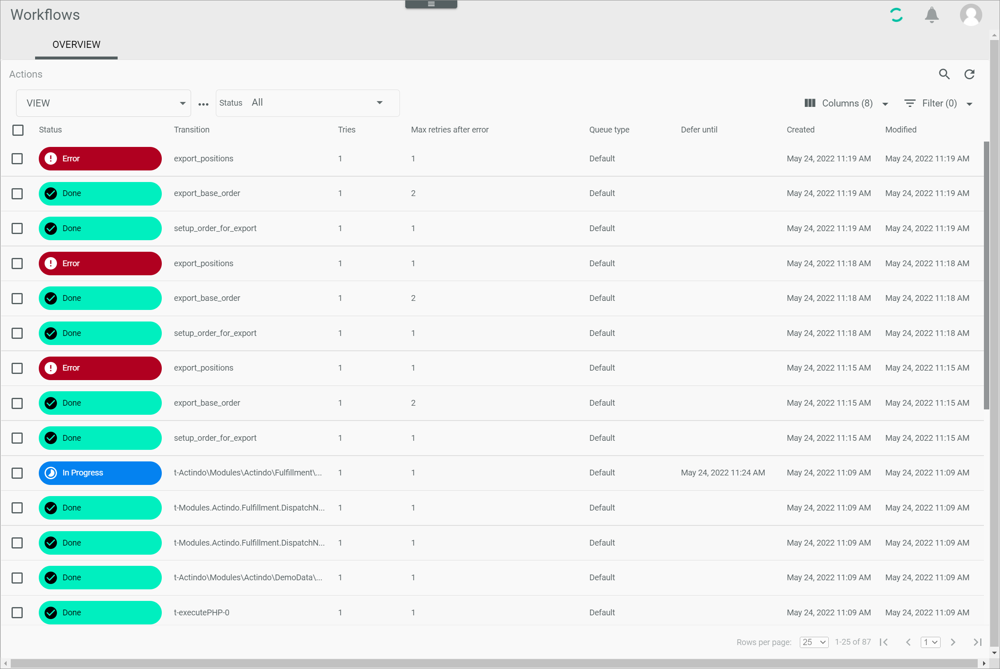

[!!Configure the queue types](../Integration/01_ConfigureQueueTypes.md)
[!!Manage the workflows](../Operation/01_ManageWorkflows.md)

# OVERVIEW (Process Actions)

*Process Orchestration > Process actions > Tab OVERVIEW*

**Process actions**   
The list displays all actions that are matching the selected status. Depending on the settings, the displayed columns may vary. All fields are read-only. Click an action to display the corresponding process in the *Process ID* view, see [Process ID](./03a_Processes.md#process-id).

> [Info] When clicking an action in the *Process actions* view, the selected action is displayed in the *Actions* tab of the corresponding *Process ID* view. The *Actions* tab of the *Process ID* view is, in fact, an excerpt of the *Process actions* menu entry. Click the *Logs* tab in the *Process ID* view for detailed information about the selected process actions, see [Logs](./06a_Logs.md).

- *Status*  
    Click the drop-down list to select an action status. The following options are available:  
    - **All**  
        Select this option to display all actions, regardless of their status.   
    - **Active**   
         Select this option to display the actions that are currently active.
    - **Done**  
        Select this option to display the actions that have been already executed.  
    - **Error**  
        Select this option to display the actions that have given an error.
    - **Error; automatic retry**   
        Select this option to display the actions that have given an error, but will be automatically retried.
    - **Suspended**  
        Select this option to display the actions that have been manually paused. 
    - **Process aborted**  
        Select this option to display the actions included in a process that has been manually ended.
    - **Aborted**   
        Select this option to display the actions that has been manually ended.
    - **Manual**    
        Select this option to display the actions that require a user decision.

The following functions are available for the editing toolbar. Depending on the process status, the editing toolbar displays specific buttons:

- [x]    
    Select the checkbox to display the editing toolbar. If you click the checkbox in the header, all actions in the list are selected.

-  (Retry)  
    Click this button to retry the action. This button is displayed if the action status is *Error*, *Done*, or *Aborted*.

-  (Abort)    
    Click this button to abort the action. This button is displayed if the action status is *Error* or *In progress*.

-  (Suspend)  
    Click this button to temporarily suspend the action, for example, if you want to evaluate a process in detail and want to pause the process execution. This button is displayed if the action status is *In progress*<!---Status "In progress" gibt es nicht mehr. Status Active?-->. When clicking this button, the action status changes to *Suspended*.

-  (Start)  
    Click this button to resume the action. This button is displayed if the action status is *Suspended*. When clicking this button, the action status changes again to *In progress*. The warning sign in the *Suspended actions* column of the *Processes* view is no longer displayed.

- [REMOVE DEFER TIME]  
    Click this button to skip the defer time preconfigured in the action, if any. The action is then executed immediately. This button is displayed if the action status is *In progress*<!---Status "In progress" gibt es nicht mehr. Status Active?-->.

    > [Info] The defer time is preconfigured per action in the system. If the defer time is removed once, the action is executed immediately. If the action gives an error again, it will be retried once that preconfigured defer time has elapsed.

The following functions and fields are available in the list.

- *Status*  
    Status of the action. The different process statuses are displayed in different colors. The following statuses are possible:   
    - **In progress** (blue)   
    - **Done** (green)   
    - **Error** (red)     
    - **Suspended** (dark gray)  
    - **Process aborted** (black)   

- *Transition*  
    Transition key.

- *Tries*  
    Number of times the action execution has been tried.

- *Max retries after error*  
    Number of times the action execution must be retried after an error has occurred. This setting depends on the transition and is usually preconfigured. 

- *Queue type*  
    Queue type assigned to the action. By default, the *Default* queue type is assigned.

    > [Info] A different queue type can be selected by editing an action in the workflow editor.

- *Defer until*  
    Next point in time when the action is being tried. This setting depends on the action and is not available in all actions. It is also filled when a user performs a manual action and sets a follow-up date.

-  *Duration*   
    Processing time of the process action in seconds.

- *Execution start*   
    Start time of the execution.

- *Execution end*   
    End time of the execution.
<!-- zurzeit noch nicht aktiv
- *Profile*   
    Click the *Profile* link that was created for the action.   
    The run report is displayed in a new browser window. For detailed information, see [Profile](06d_Profile.md).-->

- *Created*  
    Date and time of creation.

- *Modified*  
    Date and time of modification.

- *ID*  
    Action identification number. The ID number is automatically assigned by the system.

- *Transition ID*  
    Transition identification number. The ID number is automatically assigned by the system.
