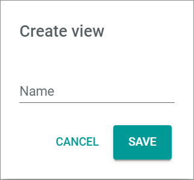

# Overview

*Workflows > Process Actions > Tab OVERVIEW*

[comment]: <> (vor nächster Version prüfen, möglicher neuer Pfad: *Workflows > Process actions > Tab PROCESS ACTIONS*)

**Process actions**
- *VIEW*  
Click the drop-down list to select the view. All created views are displayed in the drop-down list. Click the  (Points) button to the right of the *VIEW* drop-down list to display the context menu and create a view. For detailed information, see [Create view](#create-view).

  - View context menu  
  Click the  (Points) button to the right of the *View* drop-down list to display the context menu. The following menu entries are available:

    -  create  
    Click this entry to create a view. The *Create view* window is displayed.

    -  rename  
    Click this entry to rename the selected view. The *Rename view* window is displayed. This menu entry is only displayed when a view is selected.

    -  reset  
    Click this entry to reset the view to the selected views settings. This menu entry is only displayed when a view is selected and any changes are made to the views settings.

    -  publish  
    Click this entry to publish the view. This menu entry is only displayed when a view is selected and unpublished.

    -  unpublish  
    Click this entry to unpublish the view. This menu entry is only displayed when a view is selected and published.

    -  save  
    Click this entry to save the current view settings in the selected view. This menu entry is only displayed when a view is selected.

     > [Info] When the settings of a view have been changed, an asterisk is displayed behind the view name. The asterisk is hidden as soon as the changes have been saved.

    -  delete  
    Click this entry to delete the selected view. A confirmation window to confirm the deletion is displayed. This menu entry is only displayed when a view is selected.

- *Status*  
Click the drop-down list to select a process status. The following statuses are available:  

    - **All**  
    Select this option to display all actions, regardless of their status.

    - **In progress**  
    Select this option to display the actions that are currently active.

    - **Done**  
    Select this option to display the actions that have been already executed.  

    - **Error**  
    Select this option to display the actions that have given an error.

    - **Suspended**  
    Select this option to display the actions that have been manually paused.

    - **Process aborted**  
    Select this option to display the actions included in a process that has been manually ended.

-  (Search)  
    Click this button to display the search bar and search for an action.

    > [Info] The search function can be used to search for a transition name. At least 3 characters must be entered.

-  (Refresh)  
    Click this button to update the list of actions.

-  Columns (x)  
    Click this button to display the columns bar and customize the displayed columns and the order of columns in the list. The *x* indicates the number of columns that are currently displayed in the list.

-  Filter (x)  
    Click this button to display the filter bar and customize the active filters. The *x* indicates the number of filters that are currently active.

The list displays all actions that are matching the selected status. Depending on the settings, the displayed columns may vary. All fields are read-only. Click an action to display the corresponding process in the *Process ID* view, see [Process ID](./03a_Processes.md#process-id).

> [Info] When clicking an action in the *Process Actions* view, the selected action is displayed in the *Actions* tab of the corresponding *Process ID* view. The *Actions* tab of the *Process ID* view is, in fact, an excerpt of the *Process Actions* menu entry. Click the *Logs* tab in the *Process ID* view for detailed information about the selected process actions, see [Logs](./06a_Logs.md).

  - [x]    
  Select the checkbox to display the editing toolbar. If you click the checkbox in the header, all actions in the list are selected.

  Depending on the action status, the editing toolbar displays the following buttons:

  -  (Retry)  
    Click this button to retry the action. This button is displayed when the action status is *Error*.
  -  (Suspend)  
    Click this button to suspend the action temporarily. This button is displayed when the action status is *In progress*. When clicking this button, the action status changes to *Suspended*.
  -  (Start)  
    Click this button to resume the action. This button is displayed when the action status is *Suspended*. When clicking this button, the action status changes again to *In progress*. The warning sign in the *Suspended actions* column of the *Processes* view is no longer displayed.
  - [REMOVE DEFER TIME]  
    Click this button to skip the defer time preconfigured in the action, if any. The action is then executed immediately. This button is displayed when the action status is *In progress*.

    > [Info] The defer time is preconfigured pro action in the system. If the defer time is removed once, the action is executed immediately. If the action gives an error again, it will be retried once that preconfigured defer time has elapsed.

  - *Status*  
  Status of the action. The different process statuses are displayed in different colors. The following statuses are possible:

    - **In progress** (blue)
    - **Done** (green)
    - **Error** (red)  
    - **Suspended** (dark gray)
    - **Process aborted** (black)

  - *Transition*  
  Transition key.

  - *Tries*  
  Number of times the action execution has been tried.

  - *Max retries after error*  
  Number of times the action execution must be retried after error.

  > [Info] This setting depends on the transition and is usually preconfigured. In the current version, this value can be modified in the *Import JSON* window, see [Import JSON](./02a_Workflows.md#import-json).

  - *Queue Type*  
  Queue type assigned to the action. By default, the *Default* queue type is assigned. For detailed information about configuring queue types, see [Configure the queue types](../Integration/01_ConfigureQueueTypes.md).

  > [Info] A different queue type can be selected by editing an action in the workflow editor, see [Edit an action](../Operation/01_ManageWorkflows.md#edit-an-action).

  - *Defer until*  
  Next point in time when the action is being tried.  

  > [Info] This setting depends on the action and is not available in all actions.

  - *Created*  
  Date and time of creation.

  - *Modified*  
  Date and time of modification.

  - *ID*  
  Action identification number. The ID number is automatically assigned by the system.

  - *Transition ID*  
  Transition identification number. The ID number is automatically assigned by the system.

## Create view

*Workflows > Process Actions > Tab OVERVIEW > Button Points > Menu entry create*

- *Name*  
Enter a name for the view.

- [CANCEL]  
Click this button to cancel creating a view. The *Create view* window is closed.

- [SAVE]  
Click this button to save the new view. The *Create view* window is closed. The view is saved and displayed in the *View* drop-down list.

## Rename view

*Workflows > Process Actions > Tab OVERVIEW > Button Points > Menu entry rename*

- *Name*  
Click the field to edit the view name.

- [CANCEL]  
Click this button to cancel renaming a view. The *Rename view* window is closed.

- [SAVE]  
Click this button to save the changes to the view name. The *Rename view* window is closed. The new name for the view is saved and displayed in the *View* drop-down list.
