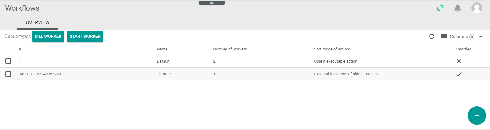
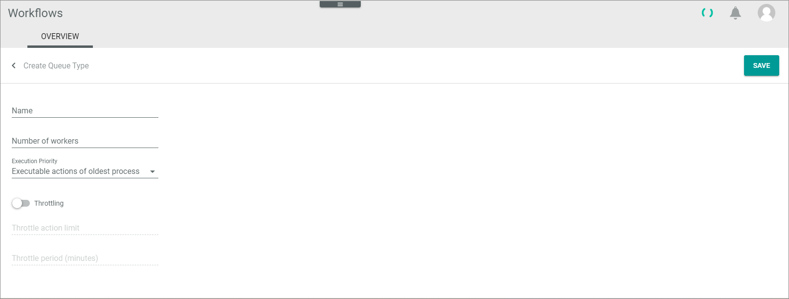

[!!Configure the queue types](../Integration/01_ConfigureQueueTypes.md)

# Overview

*Process Orchestration > Queue types > Tab OVERVIEW*

**Queue types**

The list displays all queue types. All fields are read-only. Depending on the settings, the displayed columns may vary. Click a queue type in the list to display the *Edit queue type* view.    

- [KILL WORKER]   
    Click this button to stop all workers that are currently executing actions in all processes.  

- [START WORKER]   
    Click this button to start all workers again, for example, if you have previously stopped all workers.

The following functions are available for the editing toolbar:

- [x]      
    Select the checkbox to display the editing toolbar.

- [DELETE]   
    Click this button to delete the selected queue type. A confirmation message is displayed. The *Default* queue type cannot be deleted.  

- [KILL WORKER OF THIS QUEUE TYPE]   
    Click this button to stop all workers that are currently executing an action of the selected queue type.   

The following functions and fields are available in the list:

- *ID*   
    Queue type identification number. The ID number is automatically assigned by the system when the queue type is created.

- *Name*   
    Queue type name.  

- *Number of workers*   
    Number of the workers assigned to the queue type.

- *Sort mode of actions*   
    Execution priority assigned to the queue type. The following options can be displayed:   
    - **Oldest executable action**
    - **Executable actions of oldest process**

- *Throttled*
     -  (Checkmark): The queue type is defined to throttle a process.
    -  (Cross): The queue type is not defined to throttle a process. 

-  (Add)   
    Click this button to create a queue type. The *Create queue type* view is displayed, see [Create a queue type](../Integration/01_ConfigureQueueTypes.md#create-a-queue-type).

## Create queue type

*Process Orchestration > Queue types > Tab OVERVIEW > Button Add*

- [SAVE]   
    Click this button to save the new queue type.

- *Name*   
    Enter a name for the queue type.  

- *Number of workers*   
    Enter the number of workers for the queue type.

    > [Info] The number of workers you can assign to queue types depends on the number of booked vCores. For one worker, 4 vCores are needed. Additionally, 10 % of the booked vCores, but at least 4 vCores are blocked for the daily business and cannot be used for workers. The number of vCores needed always refers to the total number of workers in all queue types. For example, for a queue type with 2 workers and a queue type of 4 workers, 28 vCores are needed:    
    *4 vCores per worker (4 \* 6 = 24) plus 4 vCores blocked for the daily business (24 + 4 = 28)*

- *Execution priority*   
    Click the drop-down list and select the execution priority for the queue type. The following options are available:
    - **Oldest executable action**   
        The oldest executable actions within all existing processes is executed first by the workers.
    - **Executable actions of oldest process**   
        The executable actions within the oldest process are executed first by the workers.

-  (Throttling)   
    Enable this toggle if you want to use the queue type to throttle a process.

- *Throttle action limit*  
    Specify the maximum number of actions to be executed by this action.   

- *Throttle period (minutes)*   
    Specify the period in minutes in which the maximum number of actions are to be executed.

## Edit queue type

*Process Orchestration > Queue types > Tab OVERVIEW > Select queue type*

- [SAVE]   
    Click this button to save all changes to the queue type.

- *Name*   
    Click this field to edit the name for the queue type.  

- *Number of workers*   
    Click this field to edit the number of workers for the queue type. To edit the number of workers, no more workers must be active.   

    > [Info] The number of workers you can assign to queue types depends on the number of booked vCores. For one worker, 4 vCores are needed. Additionally, 10 % of the booked vCores, but at least 4 vCores are blocked for the daily business and cannot be used for workers. The number of vCores needed always refers to the total number of workers in all queue types. For example, for a queue type with 2 workers and a queue type of 4 workers, 28 vCores are needed:   
   *4 vCores per worker (4 \* 6 = 24) plus 4 vCores blocked for the daily business (24 + 4 = 28)*

- *Execution priority*   
    Click the drop-down list to change the execution priority for the queue type. The following options are available:
    - **Oldest executable action**   
        The oldest executable actions within all existing processes is executed first by the workers.
    - **Executable actions of oldest process**   
        The executable actions within the oldest process are executed first by the workers.

-  (Throttling)   
    Enable this toggle if you want to use the queue type to throttle a process.

- *Throttle action limit*  
    Specify the maximum number of actions to be executed by this action.   

- *Throttle period (minutes)*   
     Specify the period in minutes in which the maximum number of actions are to be executed.
