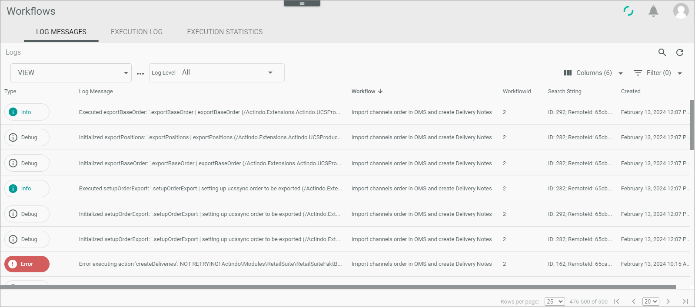

# LOG MESSAGES

*Process Orchestration > Logs > Tab LOG MESSAGES*

**Logs**

The list displays all logs that are matching the selected log level. Depending on the settings, the displayed columns may vary. All fields are read-only. Click a log to display the *Log ID* view, see [Log ID](#Log-ID).

- *Log level*     
    Click the drop-down list to select a log level. The following options are available:  
    - **All**   
        Select this option to display all logs regardless of their level.
    - **Debug**   
        Select this option to display all logs with *Debug* level.
    - **Info**   
        Select this option to display all logs with *Info* level.
    - **Notice**   
        Select this option to display all logs with *Notice* level.
    - **Warning**   
        Select this option to display all logs with *Warning* level.
    - **Error**   
        Select this option to display all logs with *Error* level.
    - **Critical**   
        Select this option to display all logs with *Critical* level.
    - **Alert**   
        Select this option to display all logs with *Alert* level.
    - **Emergency**   
        Select this option to display all logs with *Emergency* level.

The following fields and functions are available in this view:

- *Type*  
    Log level. The following levels can be displayed:
    - **Debug**
    - **Info**
    - **Notice**
    - **Warning**
    - **Error**
    - **Critical**
    - **Alert**
    - **Emergency**

- *Log message*   
    Description of the issue.

- *Workflow*   
    Workflow to which the log message refers.

- *Workflow ID*       
    Workflow identification number. The ID number is automatically assigned by the system.

- *Search string*   
    String that can be used to search for a log. In most cases, the column is empty.
   
- *Created*   
    Date and time of creation.

- *ID*   
    Log identification number. The ID number is automatically assigned by the system.

- *Process*  
    Description of the process to which the log refers.

- *Process ID*  
    Identification number of the process to which the log refers. The ID number is automatically assigned by the system.

- *Transition*  
    Key of the transitions to which the log refers.

- *Transition ID*  
    Identification number of the transition to which the log refers. The ID number is automatically assigned by the system.

- *Created by*  
    Name and username of the user who initiated the process.

## Log ID

*Process Orchestration > Logs > Tab OVERVIEW > Select Log message*

**Log message**  

In the *Log message* window, detailed information about the log is displayed. All fields are read-only.

- *Log level*    
    Log level type. The following levels are available:
    - **Debug**
    - **Info**
    - **Notice**
    - **Warning**
    - **Error**
    - **Critical**
    - **Alert**
    - **Emergency**

- Log message box   
    Detailed log message with further information.

    > [Info] In case of an error, detailed information is provided (stack trace) for reporting and debugging purposes.

- *Created - by*    
    Date and time of creation, name and username of the user who initiated the process.

- *Workflow*    
    Workflow ID number and name.

- *Process*    
    Process ID number and description.

- *Transition*     
    Transition ID number and description.

> [Info] You can access this window also via the [Logs](./03a_Processes.md#log-id) tab in the user interface.

