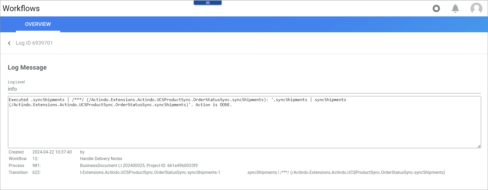
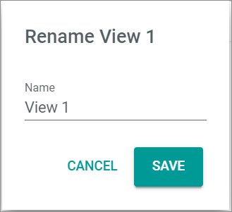

# Overview

*Workflows > Logs > Tab OVERVIEW*

**Logs**

- *VIEW*  
    Click the drop-down list to select the view. All created views are displayed in the drop-down list. Click the  (Points) button to the right of the *VIEW* drop-down list to display the context menu and create a view.   

    -  (Points)      
        Click this button to the right of the *View* drop-down list to display the context menu. The following menu entries are available:

      -  create  
          Click this entry to create a view. The *Create view* window is displayed, see [Create view](#create-view).

      -  rename  
          Click this entry to rename the selected view. The *Rename view* window is displayed, see [Rename view](#rename-view). This menu entry is only displayed if a view has been selected.

      -  reset  
          Click this entry to reset all unsaved changes to the settings of the selected view. This menu entry is only displayed if a view has been selected and any changes have been made to the view settings.

      -  publish  
          Click this entry to publish the view. This menu entry is only displayed if a view has been selected and unpublished.

      -  unpublish  
          Click this entry to unpublish the view. This menu entry is only displayed if a view has been selected and published.

      -  save  
          Click this entry to save the current view settings in the selected view. This menu entry is only displayed if a view has been selected.

          > [Info] When the settings of a view have been changed, an asterisk is displayed next to the view name. The asterisk is hidden as soon as the changes have been saved.

      -  delete  
          Click this entry to delete the selected view. A confirmation window to confirm the deletion is displayed. This menu entry is only displayed if a view has been selected.

- *Log level*     
    Click the drop-down list to select a log level. The following options are available:  
    - **All**   
        Select this option to display all logs regardless of their level.
    - **Debug**   
        Select this option to display all logs with *Debug* level.
    - **Info**   
        Select this option to display all logs with *Info* level.
    - **Notice**   
        Select this option to display all logs with *Notice* level.
    - **Warning**   
        Select this option to display all logs with *Warning* level.
    - **Error**   
        Select this option to display all logs with *Error* level.
    - **Critical**   
        Select this option to display all logs with *Critical* level.
    - **Alert**   
        Select this option to display all logs with *Alert* level.
    - **Emergency**   
        Select this option to display all logs with *Emergency* level.

-  (Search)   
    Click this button to display the search bar and search for a log.

-  (Refresh)    
    Click this button to update the list of logs.

-  Columns (x)    
    Click this button to display the columns bar and customize the displayed columns and the order of columns in the list. The *x* indicates the number of columns that are currently displayed in the list.

-  Filter (x)    
    Click this button to display the filter bar and customize the active filters. The *x* indicates the number of filters that are currently active.

The list displays all logs that are matching the selected log level. Depending on the settings, the displayed columns may vary. All fields are read-only. Click a log to display the *Log ID* view, see [Log ID](#Log-ID).

- *Type*  
    Log level. The following levels can be displayed:
    - **Debug**
    - **Info**
    - **Notice**
    - **Warning**
    - **Error**
    - **Critical**
    - **Alert**
    - **Emergency**

- *Log message*   
    Description of the issue.

- *Workflow*   
    Workflow which the log message refers to.

- *Workflow ID*       
    Workflow identification number. The ID number is automatically assigned by the system.

- *Created*   
    Date and time of creation.

- *ID*   
    Log identification number. The ID number is automatically assigned by the system.

- *Process*  
    Description of the process to which the log refers.

- *Process ID*  
    Identification number of the process to which the log refers. The ID number is automatically assigned by the system.

- *Transition*  
    Key of the transitions to which the log refers.

- *Transition ID*  
    Identification number of the transition to which the log refers. The ID number is automatically assigned by the system.

- *Created by*  
    Name and user name of the user who initiated the process.

## Log ID

*Workflows > Logs > Tab OVERVIEW > Select Log message*

-  (Back)   
    Click this button to close the *Log ID* view and return to the *Logs* tab. All changes are rejected.

**Log message**  

In the *Log message* section, detailed information about the log is displayed. All fields are read-only.

- *Log level*    
    Log level type. The following levels are available:
    - **Debug**
    - **Info**
    - **Notice**
    - **Warning**
    - **Error**
    - **Critical**
    - **Alert**
    - **Emergency**

- Log message box   
    Detailed log message with further information.

    > [Info] In case of an error, detailed information is provided (stack trace) for reporting and debugging purposes.

- *Created - by*    
    Date and time of creation, name and user name of the user who initiated the process.

- *Workflow*    
    Workflow ID number and name.

- *Process*    
    Process ID number and description.

- *Transition*     
    Transition ID number and description.

> [Info] This window can also be accessed from the [*OVERVIEW (Processes)*](./03a_Processes.md#log-id) tab in the user interface.

## Create view

*Workflows > Logs > Tab OVERVIEW > Button Points > Menu entry create*

For a detailed description of this window and the corresponding functions, see [Create view](./02a_Workflows.md#create-view).

## Rename view

*Workflows > Logs > Tab OVERVIEW > Button Points > Menu entry rename*

For a detailed description of this window and the corresponding functions, see [Rename view](./02a_Workflows.md#rename-view).
