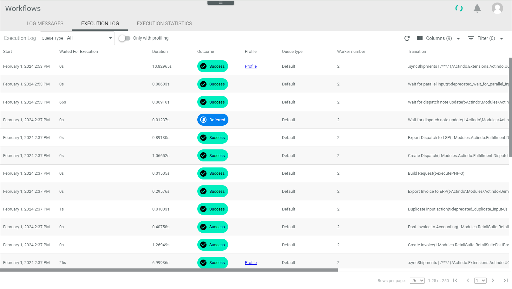

[!!Track the workflow process](../Operation/09_TrackWorkflowProcess.md)

# Execution log

*Process Orchestration > Logs > Tab EXECUTION LOG*

The list displays all logs that have been created for each process action performed. It allows you to analyze what each worker did and how long it took to execute an action.   
For example, a process may have taken a long time to be executed. Here you can see if a certain process action has caused the delay, perhaps sending an email, or if the process action or the process had to wait a long time for execution.

The list displays all execution logs that have been created within the time period defined for the *Lifetime execution log in days* setting. For detailed information, see [Settings](../UserInterface/07a_Settings.md#lifetime-execution-log-in-days).
If you want a process-specific view on the execution log, the same list is available for tracking a workflow process. For detailed information, see [Check the execution log](../Operation/09_TrackWorkflowProcess.md#check-the-execution-log).

- *Queue type*   
   The drop-down list contains all queue types created for your company. For detailed information, see [Create a queue type](../Integration/01_ConfigureQueueTypes.md#create-a-queue-type). Select a specific queue type if you want to filter the list.

-  Only with profiling   
    Enable this toggle if you only want to view execution logs with profiling. For detailed information, see [Profile](06d_Profile.md).

- *Start*   
   Time stamp when process action processing started.

- *Waited for execution*   
   Time in seconds to wait before processing the process action.

- *Duration*    
   Processing time of the process action in seconds.

- *Outcome*    
   The following outcomes are available:

   - **Success**   
    The process action has been processed successfully.   

   - **Deferred**   
    The process action has run through, but it needs to wait for something. It will start automatically again when the expected event or data is available.  

   - **Retry**    
    The process action failed, but will be retried after a period of time has elapsed. 

   - **Error**   
    The process action has finally failed.

- *Profile*   
    Click the *Profile* link that was created for the action.   
    The run report is displayed in a new browser window. For detailed information, see [Profile](06d_Profile.md).

- *Queue type*   
   Queue type of the transition.

- *Worker number*   
   Number of the worker who has processed this process action.
 

- *Transition*   
   Key of the transition.

- *Process*    
<!--- Hallo Julian, Spalte ist leer, was sollte hier angezeigtwerden? -->   
   

- *ID*   
<!--- Hallo Julian, was ist das für eine ID? Stimmt nicht mit Process ID überein-->
   
 