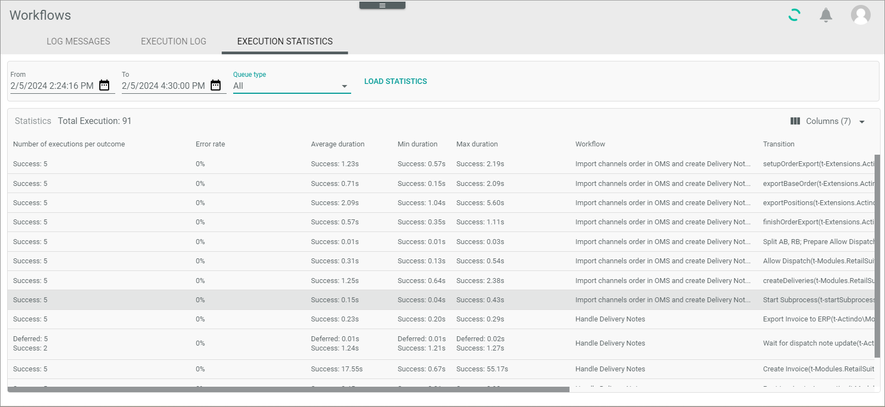

# EXECUTION STATISTICS

*Process Orchestration > Logs > Tab EXECUTION STATISTICS*

The list displays the average processing time in seconds for each process action over a specific time period. For example, you can use it to review your workflow processes to identify process actions that take longer than average and to use this information for further analysis of your workflow.   

The following functions and fields are available for this list:

 - *From-to*    
   Enter the time stamp of the start and end time you want to analyze. The default is the current time minus one hour. 

- *Queue type*   
    If desired, click the drop-down list and select a specific queue type to display only transitions to which this queue type has been assigned.

- [LOAD STATISTICS]    
   Click this button to display the statistic.

   
- *Number of executions per outcome*   
    Specifies how often a process action has been processed per outcome.

- *Error rate*    
    Specifies the percentage of failed process actions. 

- *Average duration*   
   If a process action was processed by more than one process, the average processing time in seconds per outcome.

- *Max duration*     
   The longest processing time in seconds per outcome.

- *Min duration*   
   The shortest processing time in seconds per outcome.

- *Workflow*   
   Name of the workflow that was run through.

- *Transition*   
   Transition that has been executed.
