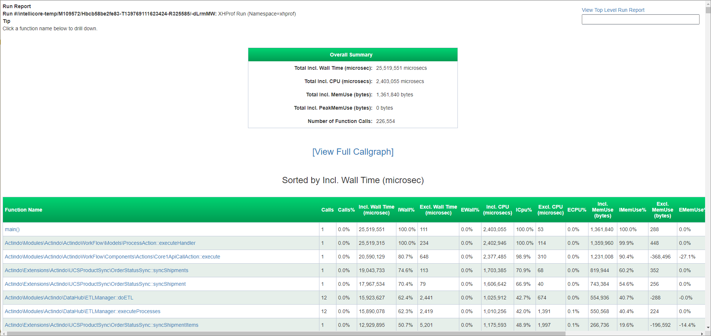

# Profile

*Workflows > Logs > Tab Execution log > Click Profile in the Profile column*   
*Workflows > Processes > Select process > Tab Execution log > Click Profile in the Profile column*

The report output is displayed in an additional browser window. It shows detailed processing times for each function of a specific for each function executed for a specific process action. This includes information on Wall Time, CPU, memory uses, peak memory used, and the number of function calls.