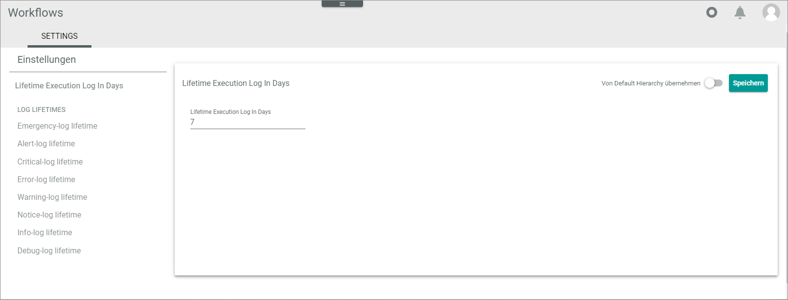
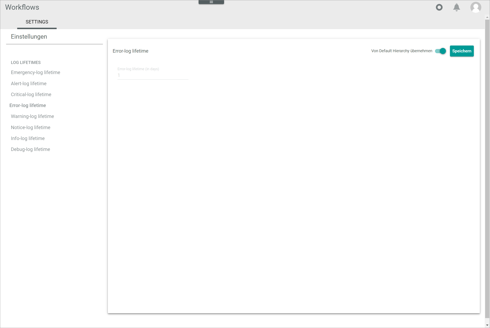
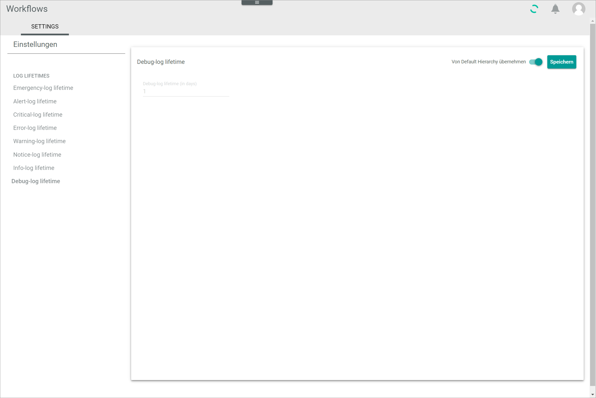

[!!Workflows](ActindoWorkFlow)

# Settings
*Workflows > Settings > Tab SETTINGS*

**Settings**

The side menu displays the different log types. The log lifetime view on the right side changes to the corresponding log type when another entry is selected in the side menu.

**LOG LIFETIMES**

- *Emergency-log lifetime*   
  Click this menu entry to display the *Emergency-log lifetime* view on the right side.

- *Alert-log lifetime*   
  Click this menu entry to display the *Alert-log lifetime* view on the right side.

- *Critical-log lifetime*   
  Click this menu entry to display the *Critical-log lifetime* view on the right side.

- *Error-log lifetime*   
  Click this menu entry to display the *Error-log lifetime* view on the right side.

- *Warning-log lifetime*   
  Click this menu entry to display the *Warning-log lifetime* view on the right side.

- *Notice-log lifetime*   
  Click this menu entry to display the *Notice-log lifetime* view on the right side.

- *Info-log lifetime*   
  Click this menu entry to display the *Info-log lifetime* view on the right side.

- *Debug-log lifetime*   
  Click this menu entry to display the *Debug-log lifetime* view on the right side.

## Emergency-log lifetime

*Workflows > Settings > Tab SETTINGS > Side menu entry Emergency-log lifetime*

- *Apply from default*    
  Activate this toggle to apply the default log lifetime of 1 day to logs with the *Emergency* type. The *Emergency-log lifetime (in days)* field is locked. Deactivate the toggle to unlock the *Emergency-log lifetime (in days)* field and enter a different log lifetime. By default, this toggle is active.

- [SAVE]   
  Click this button to save the defined log lifetime for the selected log type.

- *Emergency-log lifetime (in days)*   
  Enter the number of days the selected log will be stored. This field is locked when the *Apply from default* toggle is active.

## Alert-log lifetime

*Workflows > Settings > Tab SETTINGS > Side menu entry Alert-log lifetime*

- *Apply from default*    
  Activate this toggle to apply the default log lifetime of 1 day to logs with the *Alert* type. The *Alert-log lifetime (in days)* field is locked. Deactivate the toggle to unlock the *Alert-log lifetime (in days)* field and enter a different log lifetime. By default, this toggle is active.

- [SAVE]   
  Click this button to save the defined log lifetime for the selected log type.

- *Alert-log lifetime (in days)*   
  Enter the number of days the selected log will be stored. This field is locked when the *Apply from default* toggle is active.

## Critical-log lifetime

*Workflows > Settings > Tab SETTINGS > Side menu entry Critical-log lifetime*

- *Apply from default*    
  Activate this toggle to apply the default log lifetime of 1 day to logs with the *Critical* type. The *Critical-log lifetime (in days)* field is locked. Deactivate the toggle to unlock the *Critical-log lifetime (in days)* field and enter a different log lifetime. By default, this toggle is active.

- [SAVE]   
  Click this button to save the defined log lifetime for the selected log type.

- *Critical-log lifetime (in days)*   
  Enter the number of days the selected log will be stored. This field is locked when the *Apply from default* toggle is active.

## Error-log lifetime

*Workflows > Settings > Tab SETTINGS > Side menu entry Error-log lifetime*

- *Apply from default*    
  Activate this toggle to apply the default log lifetime of 1 day to logs with the *Error* type. The *Error-log lifetime (in days)* field is locked. Deactivate the toggle to unlock the *Error-log lifetime (in days)* field and enter a different log lifetime. By default, this toggle is active.

- [SAVE]   
  Click this button to save the defined log lifetime for the selected log type.

- *Error-log lifetime (in days)*   
  Enter the number of days the selected log will be stored. This field is locked when the *Apply from default* toggle is active.

## Warning-log lifetime

*Workflows > Settings > Tab SETTINGS > Side menu entry Warning-log lifetime*

- *Apply from default*    
  Activate this toggle to apply the default log lifetime of 1 day to logs with the *Warning* type. The *Warning-log lifetime (in days)* field is locked. Deactivate the toggle to unlock the *Warning-log lifetime (in days)* field and enter a different log lifetime. By default, this toggle is active.

- [SAVE]   
  Click this button to save the defined log lifetime for the selected log type.

- *Warning-log lifetime (in days)*   
  Enter the number of days the selected log will be stored. This field is locked when the *Apply from default* toggle is active.

## Notice-log lifetime

*Workflows > Settings > Tab SETTINGS > Side menu entry Notice-log lifetime*

- *Apply from default*    
  Activate this toggle to apply the default log lifetime of 1 day to logs with the *Notice* type. The *Notice-log lifetime (in days)* field is locked. Deactivate the toggle to unlock the *Notice-log lifetime (in days)* field and enter a different log lifetime. By default, this toggle is active.

- [SAVE]   
  Click this button to save the defined log lifetime for the selected log type.

- *Notice-log lifetime (in days)*   
  Enter the number of days the selected log will be stored. This field is locked when the *Apply from default* toggle is active.

## Info-log lifetime

*Workflows > Settings > Tab SETTINGS > Side menu entry Info-log lifetime*

- *Apply from default*    
  Activate this toggle to apply the default log lifetime of 1 day to logs with the *Info* type. The *Info-log lifetime (in days)* field is locked. Deactivate the toggle to unlock the *Info-log lifetime (in days)* field and enter a different log lifetime. By default, this toggle is active.

- [SAVE]   
  Click this button to save the defined log lifetime for the selected log type.

- *Info-log lifetime (in days)*   
  Enter the number of days the selected log will be stored. This field is locked when the *Apply from default* toggle is active.

## Debug-log lifetime

*Workflows > Settings > Tab SETTINGS > Side menu entry Debug-log lifetime*

- *Apply from default*    
  Activate this toggle to apply the default log lifetime of 1 day to logs with the *Debug* type. The *Debug-log lifetime (in days)* field is locked. Deactivate the toggle to unlock the *Debug-log lifetime (in days)* field and enter a different log lifetime. By default, this toggle is active.

- [SAVE]   
  Click this button to save the defined log lifetime for the selected log type.

- *Debug-log lifetime (in days)*   
  Enter the number of days the selected log will be stored. This field is locked when the *Apply from default* toggle is active.
