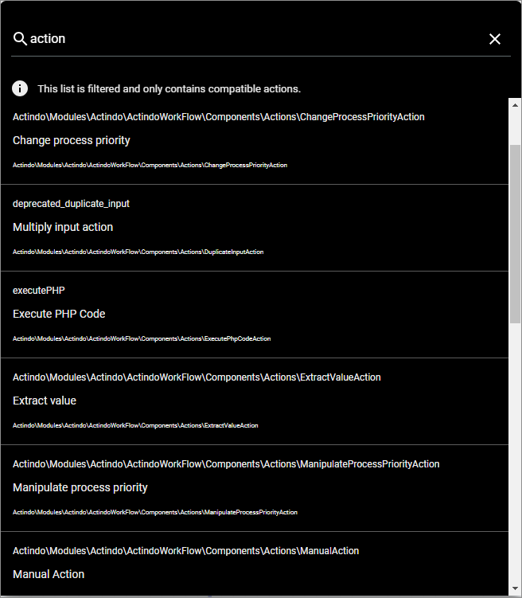

# Workflow core actions

To create a workflow, you have to include one or several workflow actions.   
In the *Workflows* module, a certain number of workflow actions is always preconfigured, the so called *Core actions*. These core actions are used to be able to establish control flow structures in a workflow.   
Other workflow actions are available depending on the plugins installed in the current system.
In the following, the core actions, their use and their settings are described in detail:

- [Change process priority](#change-process-priority)
- [Multiply input action](#multiply-input-action)
- [Execute PHP code](#execute-php-code)
- [Split by criterion](#split-by-criterion)
- [Start subprocess](#start-subprocess)
- [Switch case action](#switch-case-action)
- [Update process name and search string](#update-process-name-and-search-string)
- [Wait for criterion](#wait-for-criterion)
- [Wait for parallel input](#wait-for-parallel-input)
- [Waiting action](#waiting-action)

## Change process priority

The *Change process priority* core action is used to change the preconfigured priority of the process while the process is already running.   
The data runs over the *loop_through* input port into the workflow action and is output over the *p* output port. However, the data is only output when data has also been incoming in the input *priority* port. To change the priority, the data in the *priority* input port has to be an integer.

[comment]: <> (ticket in arbeit: static inputs sollen im priority input port möglich sein, ändern sobald möglich)

### Configuration   

This core action has no further configuration settings.

## Multiply input action

The *Multiply input action* core action is used to output the data coming in on one port to two ports. This core action is often used, when data is needed for two different purposes. To merge the duplicated data again, the *Wait for parallel input* core action can be used, see [Wait for parallel input](#wait-for-parallel-input) .   
The data runs over the *p* input port into the workflow action and is output over both, the *p0* and the *p1* output port.

[comment]: <> (ticket in arbeit: static inputs sollen im priority input port möglich sein, ändern sobald möglich, außerdem sollen mehr als zwei output ports hinzukommen)

### Configuration   

This core action has no further configuration settings.

## Execute PHP code

The *Execute PHP code* core action is used to execute a custom PHP code defined in the configuration.
As the complete functionality of the PHP code is accessible, this core action enables complete variability in programming and is therefore often used when more complex actions which require more logic need be executed within a workflow step.   
Depending on which ports are connected to the places and which ports are defined in the PHP code, the data runs over the *in0* to *in9* input ports into the workflow action and is output over the *out0* to *out9* output ports.   
It is also possible to include a static input via the unconnected input ports. These inputs have to be defined in the *Static inputs* section in the settings side bar, see [Transitions](../Overview/04_WorkflowProcessElements#transitions).

> [Info] It is recommended to give the action a name that describes what the PHP code does.

[comment]: <> (ticket in arbeit: static inputs sollen im priority input port möglich sein, ändern sobald möglich)

### Configuration   

- *PHP Code*   
  Click this field to display the code editor and enter the desired PHP code. There are no restrictions in the PHP code. Just remember to include the input ports whose date should be read using **$in0** for the *in0* input port, **$in1** for the *in1* input port, etc. as well as to return the output via the output ports using the *return [output1, output2];* return array. The first value within the array is output in the *out0* output port, the second value in the *out1* output port, etc.  

  

## Split by criterion

The *Split by criterion* core action is used to compare the input value with a certain criterion and if it matches, a different branch is followed up than if it differs.   
The data runs over the *in* input port into the workflow action and is either output over the *match* output port if the input value matches the criterion to be compared with, or over the *noMatch* output port if the input value does not match the criterion to be compared with.   
The criterion to be compared with is defined in the configuration.

> [Info] It is recommended to give the action a name that describes with which criterion the input value is compared.

### Configuration  

- *Path*   
  Enter the path to the property of the input object to be compared with.

  > [Info] The properties of an entity you can refer to are described in the relevant API documentation.

- *Operator*   
  Enter the applicable operator for the comparison. The following operators are available:
  - **=**  
    It is a match if the input value equals the defined value.
  - **!=**    
    It is a match if the input value does not equals the defined value.
  - **in**    
    It is a match if the input value is included in the defined value. For this operator, it is possible to enter an array in the *Value* field.
  - **notIn**   
    It is a match if the input value is not included in the defined value. For this operator, it is possible to enter an array in the *Value* field.
  - **regexp**   
    It is a match if the input value equals the regular expression entered in the *Value* field.    
    For detailed information about regular expressions, see https://regex101.com/.

- *Value*   
  Enter the value to be compared with the input value. The value must be valid JSON and is type strict, for example a string must be specified as a string (**\"example\"**), an integer as an integer (**123**), and so on.

[comment]: <> (Weitere operatoren geplant: <=, <, >=, >)

## Start subprocess

The *Start subprocess* core action is used to start a different subprocess within the currently running process.       
The data runs over the *p* input port into the workflow action and is output over the *p* output port. However, the action does not wait until the subprocess has been finished, but outputs the input data after having started the subprocess. The input data is also put in the start place of the subprocess.   
The subprocess to be started is defined in the configuration.

### Configuration  

- *Workflow Key*   
  Enter the workflow key of the workflow that has to be started as a subprocess.

## Switch case action

The *Switch case action* core action is used to compare the input value with up to 6 criteria and output this value via a different branch for each case. Additionally, this core action enables to output the input value via a separate branch without any comparison or if the input value does not match any of the specified cases.    
The data runs over the *in* input port into the workflow action and can be output over each connected output port. If the *origin* output port is connected, the input value is output via this port without any further action. If one or several of the *case1* to *case6* output ports are connected, the input value is compared with the criterion specified in the respective case and output over the output port of the case where the criterion matches the input value. If no criterion matches of the cases matches the input value, the input value is output via the *default* output port, or, if the *default* output port is not connected, the action will fail.    
The criteria to be compared with are defined in the configuration. Further, you can configure to stop the comparison after a match.

> [Info] It is recommended to give the action a name that describes with which criterion the input value is compared.

[comment]: <> (ticket in arbeit: static inputs sollen im priority input port möglich sein, ändern sobald möglich)

### Configuration  

- *Path*   
  Enter the path to the property of the input object to be compared with.

  > [Info] The properties of an entity you can refer to are described in the relevant API documentation.

-  *Stop on match*   
  Enable this toggle to stop comparing the input value with the specified cases once the input value matches the first case. Disable the toggle to compare the input value with all specified cases, regardless of whether a case matches or not. By default, this toggle is disabled.

- *Case X*    
  Enter the value to be compared with the input value. The value must be valid JSON. You can enter a single value or an array with multiple values. If you enter single value, it is always checked, if the input value equals the specified value. If you enter an array, it is checked, if the input value equals one of the values in the array.   
  You can specify up to 6 cases. The cases are checked in order, that means, first *Case 1*, then *Case 2*, etc.

[comment]: <> (sind die values in den Feldern auch type strict?)

## Update process name and search string

The *Update process name and search string* core action is used to change the preconfigured name of a process and its search string while the process is already running.  
The data runs over the input port into the workflow action. The input value must be a string representation,  which is replacing the current process name and its corresponding search string. The new string representation is output over the output port.

### Configuration

This core action has no further configuration settings.

## Wait for criterion

The *Wait for criterion* core action is used to insert a stop point when you have to wait that the data input matches a certain criterion.   
The data runs over the *in* input port into the workflow action and is output over the *match* output port if the input value matches the criterion to be compared with. If the input value does not match the criterion to be compared with after the defined timeout, the data is, depending on the configuration, either output over the *timeout* output port or the actions fails.   
The criterion to be compared with as well as all wait time settings are defined in the configuration.

> [Info] It is recommended to give the action a name that describes with which criterion the input value is compared.

### Configuration  

- *Initial wait time*   
  Enter the time in minutes to wait until the next comparison if the criterion does not initially match the input data.

  > [Info] The initial wait time defines the time after the initial comparison, not until the initial comparison. The initial comparison is executed automatically when the action is triggered for the first time.

- *Wait time interval*   
  Enter the time in minutes to wait for each additional comparison attempt if the criterion does not yet match the input data.

- *Timeout*   
  Enter the time in minutes after which no further attempts should be started and the input data will either be output over the *timeout* output port or the action will fail.

-  *Fail on timeout*   
  Enable this toggle to make the action fail after the defined timeout. Disable the toggle to output the current input value over the *timeout* output port after the defined timeout. By default, this toggle is disabled.

- *Path*   
  Enter the path to the property of the input object to be compared with.

  > [Info] The properties of an entity you can refer to are described in the relevant API documentation.

- *Operator*   
  Enter the applicable operator for the comparison. The following operators are available:
  - **=**  
    It is a match if the input value equals the defined value.
  - **!=**    
    It is a match if the input value does not equals the defined value.
  - **in**    
    It is a match if the input value is included in the defined value. For this operator, it is possible to enter an array in the *Value* field.
  - **notIn**   
    It is a match if the input value is not included in the defined value. For this operator, it is possible to enter an array in the *Value* field.
  - **regexp**   
    It is a match if the input value equals the regular expression entered in the *Value* field.    
    For detailed information about regular expressions, see https://regex101.com/.

- *Value*   
  Enter the value to be compared with the input value. The value must be valid JSON and is type strict, for example a string must be specified as a string (**\"example\"**), an integer as an integer (**123**), and so on.

[comment]: <> (Weitere operatoren geplant: <=, <, >=, >)

## Wait for parallel input

The *Wait for parallel input* core action is used to insert a stop point when you have to wait for certain data in order to synchronize branches running in parallel in a workflow.  
The data runs over the *p_data* input port into the workflow action and is output over the *p* output port. However, the data is only output when data has also been incoming in the input *p_trigger* port.

### Configuration  

This core action has no further configuration settings.

## Waiting action

The *Waiting action* core action is used to insert a stop point when you have to wait for a certain time. The data runs over the *p* input port into the workflow action and is output over the *p* output port. However, the data is only output after a defined period of time.    
The time to wait is defined in the configuration.

### Configuration  

- *Wait time modifier*   
  Enter the period of time the action has to wait before the value is output. The modifier must be a valid PHP date and time format, for example **"+ 1 day"** .    
  For detailed information about the valid modifiers, see [Supported PHP DateTime formats](https://www.php.net/manual/en/datetime.formats.php).
