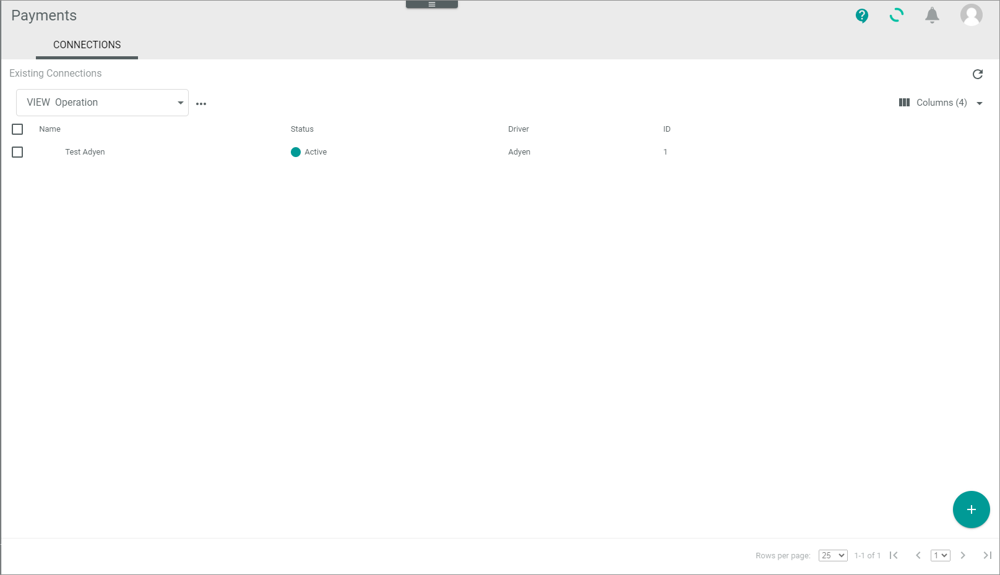
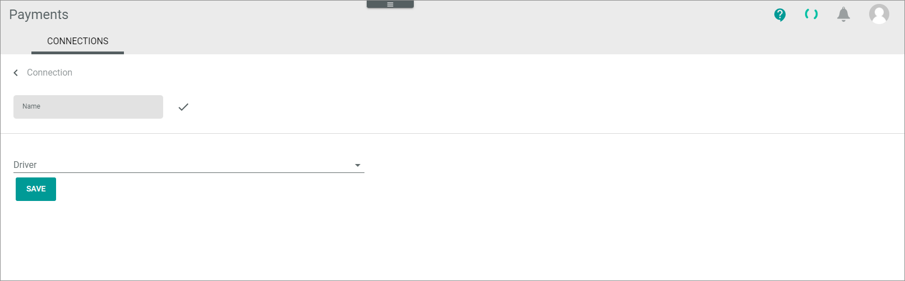
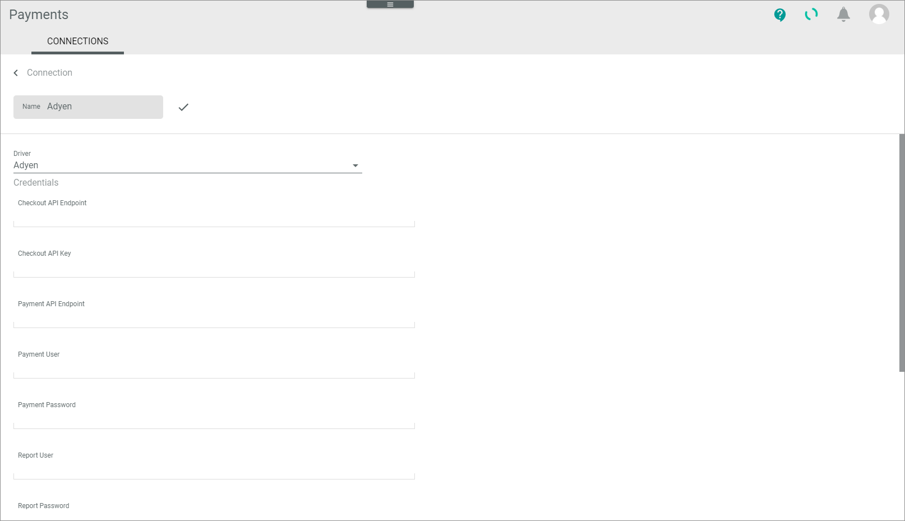

# Manage Connections

In the following, the procedures to create, edit, enable, or disable *Adyen* connections are described.

## Create Adyen connection
Create a connection to the payment service provider *Adyen*.

#### Prerequisites

- You have an Adyen customer account to log in to Adyen.
- You have your *Adyen* credentials at hand.
- In the *Actindo Core1 Platform*, you have permission to create connections in the *Payments* module.

#### Procedure
 *Payments > Settings > Tab CONNECTIONS*
 
 

1.  Click the  (Add) button in the bottom right corner.   
    The *Create Connection* view is displayed.  

    

2.  Enter a name for the connection in the *Name* field.

3.  Click the *Driver* drop-down list and select **Adyen**. 
   The *Credentials* section is displayed.

    >[Info] *Adyen* offers the possibility to work with two separate environments, a staging environment for testing purposes and a live environment for production. You must configure the connection to the environments separately.

    

4. Enter the credentials you have got from *Adyen*:    
    a. Checkout API endpoint field.   
    b. Checkout API key field.   
    c. Payment API endpoint field.   
    d. Enter the technical user for payment transactions in the *Payment user* field.   
    e. Enter the password for the API to transfer the payment transactions in the *Payment password* field  
    f. Enter the technical user for the reporting API in the *Report user* field.   
    g. Enter the password for the reporting API in the *Report password* field.  
    h. nter the technical user for the notification API in the *Notification user* field.
    i.  Enter the password for the notification API in the *Notification password* field
    j. Merchant account

5. Enable the *MIT fraud check* toggle if you do not trust the *Adyen* fraud check and want to do your own.

6. Click the [SAVE] button.

## Edit Adyen connection

## Configure Adyen connection