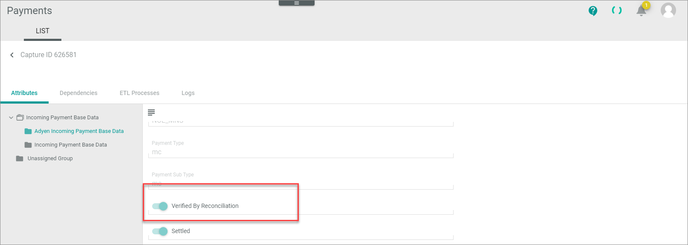
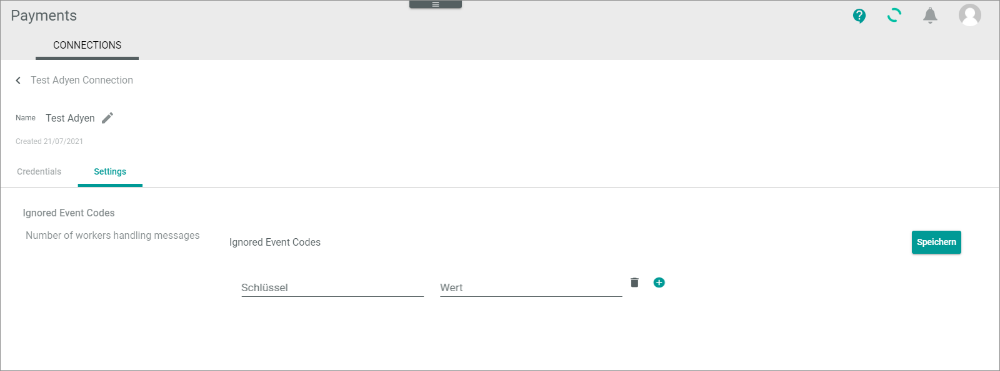

# Manage Connections

In the following, the procedures to create, edit, configure, enable, or disable Adyen connections are described.  

Note the following:   
- If you have more than one merchant account in Adyen that you want to manage with *Actindo*, you must create a connection for each.   
- Adyen offers the possibility to work with two separate environments, a staging environment for testing purposes and a live environment for production. You must configure the connection for each environment separately.

## Create Adyen connection
Create a connection to the Adyen payment service provider.

#### Prerequisites

- You have an Adyen customer account to log in to Adyen.
- You have your Adyen credentials at hand.
- In the *Actindo Core1 Platform*, you have permission to create connections in the *Payments* module.

#### Procedure

 *Payments > Settings > Tab CONNECTIONS*
 
 

1.  Click the  (Add) button in the bottom right corner.   
    The *Create Connection* view is displayed.  

    

2.  Enter a name for the connection in the *Name* field.

3.  Click the *Driver* drop-down list and select *Adyen*. 
   The *Credentials* section is displayed.

    

4. Enter the API credentials. There are some standard access points for the testing environment. For your productive environment, Adyen provides you with individual API credentials.

    -  Enter the endpoint of the checkout in the *Checkout API endpoint* field. 

       > [Info] The *Adyen Checkout API* provides a simple and flexible way to initiate and authorize online payments. You can use the same integration for payments made with cards (including 3D Secure), mobile wallets, and local payment methods (for example, iDEAL and Sofort). The endpoint for the test environment is **https://checkout-test.adyen.com/checkout/**.

    - Enter the key field of the checkout API in the *Checkout API key* field.   
    -  Enter the payment API endpoint field in the *Payment API endpoint* field. For the test environment it is **https://pal-test.adyen.com/pal/servlet/Payment/**
    - Enter the user for the payment API in the *Payment API user* field.

5. Enter the API credentials of the API users that you have created in Adyen:     
    
    -  Enter the technical user for the API to transfer the payment transactions in the *Payment user* field.   
      You will need this technical user to transfer authorizations, captures, refunds, and all other *Payments* transactions.  
    -  Enter the password for the API to transfer the payment transactions in the *Payment password* field.  
    -  Enter the technical user for the reporting API in the *Report user* field.    

       You will need the reporting API for the following: Adyen generates a daily report that collects all events of the day in a CSV file. The *Payments* module then automatically checks if all these events have been successfully transferred (reconciliation).   
       Note that you can check the attributes of each *Payments* transaction to see if the reconciliation has been processed:
         
         

    -  Enter the password for the reporting API in the *Report password* field.  
5. Enter the credentials for notifications that Adyen shall send to the *Payments* module via the *http://basic_out_credentials* API.  <!---Stimmt der Name des APIs?--> 

    -  Define the technical user for the notification API in the *Notification user* field. You can freely assign the username. Make a note of this technical user to store this username in the Adyen configuration later. For detailed information, see    
    -  Define the password for the notification API in the *Notification password* field. You can freely assign the password. Make a note of this password to store the password in the Adyen configuration later. For detailed information, see 

6. Enter the merchant account relevant for this connection in the *Merchant account* field. This is the merchant account for which you currently create the connection. You have created it in the Adyen configuration.
    
5. Enable the  *MIT fraud check* toggle if you do not trust the Adyen fraud check and want to do your own. This might be relevant if there is a longer period between the Adyen fraud check and the authorization receipt. 

6. Click the [SAVE] button.   
   The connection will be created. The *Checking credentials...* notice is displayed. After a few seconds, the *Loading data...* notice is displayed.

    The data are synchronized between *Actindo* and Adyen. The view for creating connections is automatically closed when the connection has been created and synchronized. The *Edit connection* view of the newly created connection is displayed. The *Settings* tab is selected.

    

## Edit Adyen connection

For detailed information, see [Edit PSP connection](../../Payments/Integration/01_ManageConnection.md#edit-psp-connection) in the *Payments* documentation.

## Configure Adyen connection

Configure the Adyen connection after you have created it.

In the *Payments* connection settings, you can define the event codes that are to be ignored. The reason for this is that Adyen sends many event codes. Not all of them can be processed in the *Payments* module. Each of them generates an error. Here you can specify the event codes you do not want to process. Alternatively, you can specify the unwanted event codes in the Adyen settings. 

In addition, you can configure the number of workers to process messages in asynchronous processing. The Adyen API has two endpoints, one for a synchronous and one for an asynchronous processing. 
- At synchronous processing, Adyen creates a connection for each event that occurs. It has the advantage that Adyen is informed directly if a message cannot be processed. The disadvantage is that the message transfer might be slowly if a lot of events are to be transferred.
- In asynchronous processing, a message is not processed directly so that a lot of traffic can be handled. The message is first accepted and roughly checked for plausibility. It is then written to a message queue. After that, the message queue is processed periodically and can be sent with parallel jobs. Here you can define the number of workers that will process the jobs in parallel.

#### Prerequisites

- In the *Actindo Core1 Platform*, you are permitted to create connections in *Payments*.
- An Adyen connection has been created.

#### Procedure

*Payments > Settings > Tab CONNECTIONS*
 
 

 1. Click the Adyen connection you want to edit in the list of connections.   
   The *Edit connection* view is displayed. By default, the *Credentials* tab is selected.

    

2. Click the *Settings* tab.   
  The *Ignored event codes* setting is displayed by default.

   

3. If desired, enter an event code to be ignored in the *Key* field and in the *Value* field as well. Note that you can also define the event codes to be ignored in the Adyen backend. For detailed information, see [Define event codes to be ignored](./02_ManageAdyenSettings.md#define-event-codes-to-be-ignored).   
    The event code to be ignored is entered. 

    

4. If desired, enter further event codes to be ignored. To add a new row, click the  (Add) button. You can also do this in the Adyen backend. For detailed information, see [Create webhook in Adyen](./02_ManageAdyenSettings.md#create-adyen-webhook).

5. Click the *Number of workers handling messages* setting.   
   The *Number of workers handling messages* setting is displayed. 
   

6. Enter the number of workers you want to use for asynchronous processing of messages. For connections with a lot of traffic, a number between 5-10 might be sufficient. See also [Define synchronous or asynchronous processing](02_ManageAdyenSettings.md#define-synchronous-or-asynchronous-processing).

7. If desired, you can apply the standard settings by enabling the  (Apply default) toggle in the top right corner.

8. Click the [SAVE] button in the top right corner.   
   The connection settings are applied. The list of connections is displayed.

## Enable Adyen connection

For detailed information, see [Enable PSP connection](../../Payments/Integration/01_ManageConnection.md#enable-psp-connection) in the *Payments* documentation.

## Disable Adyen connection

For detailed information, see [Disable PSP connection](../../Payments/Integration/01_ManageConnection.md#disable-psp-connection) in the *Payments* documentation.