# Manage settings in Adyen

The following procedures contain information on the settings to be configured in the Adyen&trade; backend. It shows the standard procedure and screens that was current at the time this documentation was created. For the latest detailed descriptions, refer to the Adyen&trade; documentation. 

In addition to the credentials settings in the *Payments* module, the same data is required in the Adyen&trade; backend to ensure a smooth data transfer. Note that once you have saved the credentials in Adyen&trade; or the Payments module, you can no longer copy them to specify them on the other side of the connection. You can enter the connection data in parallel, what means alternately in the *Payments* module and in the Adyen&trade; backend. Alternatively, you can also write the credentials in a file to enter them later in Actindo. For detailed information, see also [Configure Adyen connection](./02_ManageAdyenConnection.md#configure-adyen-connection).

**Additional information**   

Adyen&trade; uses TLS certificates that are changed from time to time. Adyenn&trade;users will be informed about this. Note that Actindo only checks if the certificate is valid in general and does not validate specific certificates. So you can ignore this information from Adyen. See also an update example from Adyen&trade;: [TLS Certificates on Adyen services](https://help.adyen.com/updates/tls-certificates-on-adyen-services "[https://help.adyen.com/updates/tls-certificates-on-adyen-services]"). 

## Create Adyen webhook

Create a webhook to receive payment notifications from Adyen&trade; to the *Payments* module such as authorizations and cancellations. For detailed information, see [Webhooks](https://docs.adyen.com/development-resources/webhooks/ "[https://docs.adyen.com/development-resources/webhooks/]") in the Adyen&trade; documentation. It includes a video that may also be helpful.

#### Prerequisites

- You have a valid user account in Adyen&trade;.
- You are assigned to the required roles in Adyen&trade;. 
- You are logged in to your Actindo instance under *Payments > Settings > Select connection > Credentials tab*

#### Procedure

*Adyen&trade; Backend > Developers > Webhooks*

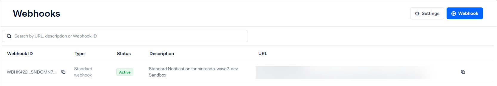

1. Click the [+ Webhook] button and select the [Add] button at the Standard webhook entry.   
    The settings for the standard webhook are displayed.

   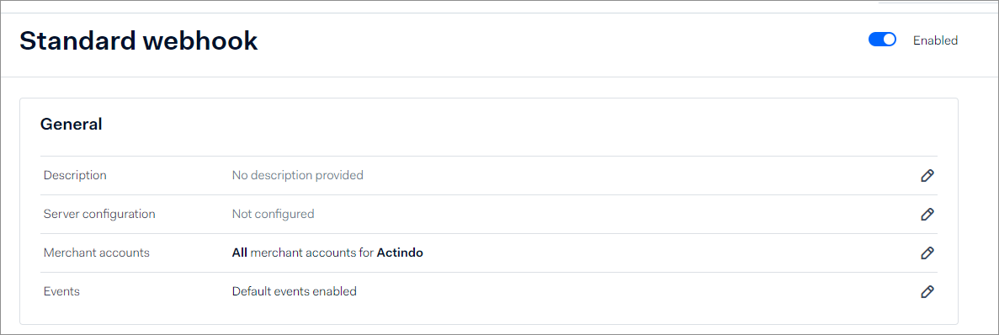

2. Enter the following settings in the *General* section.
    - *Description*  
        Enter a description for the webhook.
    - *Server configuration section*   
         - *URL*   
           Enter the server URL of the Actindo productive system or sandbox you want to connect.    
           For example: `https://customeraccount.dev.actindo.com/Actindo.Extensions.Actindo.Adyen.Notification.notificationAsync`. This example displays the server URL for asynchronous processing. For detailed information on synchronous processing, see [Define synchronous or asynchronous processing](#define-synchronous-or-asynchronous-processing). 
      
         - *Method*   
            You can use the standard setting **JSON** if you have no other requirements.

        - *Encryption protocol*     
           You can use the standard setting **TLSv1.3** if you have no other requirements

        - *Service version*   
            Displays the version number.
            
          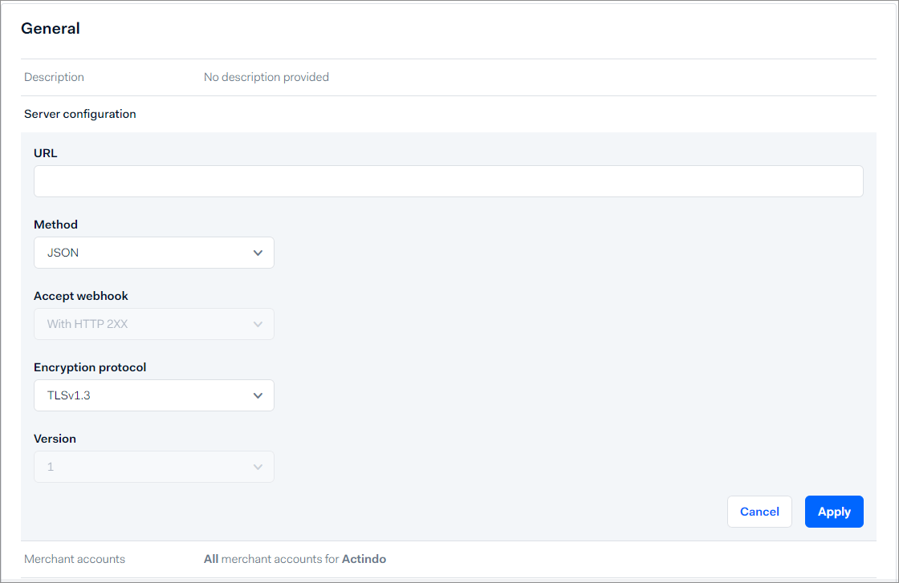.

3. Click the [Apply] button and proceed with the following fields in the *General* section.

    - *Merchant accounts*   
        Enter the merchant account(s) you want to connect.
    - *Events*   
        Select all the events whose messages you want to transfer to the *Payments* module. All listed events can be handled by Actindo. You can exclude an event if you want to process specific events by another third-party application, for example. Alternatively, you can define the events to be ignored in the *Payments* module settings, see [Configure Adyen connection](./02_ManageAdyenConnection.md#configure-adyen-connection).

        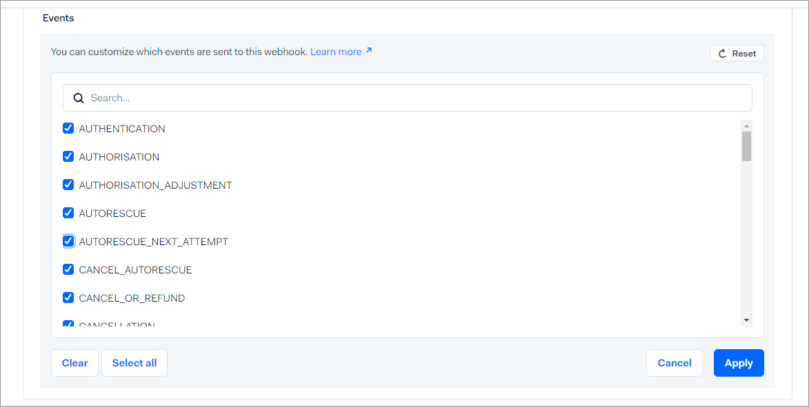

3. Click the [Apply] button and enter the following settings in the *Security* section.

     - *Basic authentication*   
         - Define a username and password for the notification user, so that you can get notifications from Adyen&trade;. You can freely define them.

            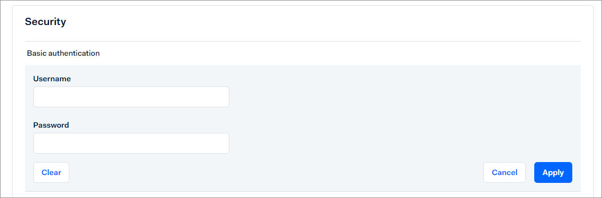

         - Change to your Actindo instance and enter the server's username and password in the *Notification user* and *Notification password* fields the *Payments* settings. 
         
            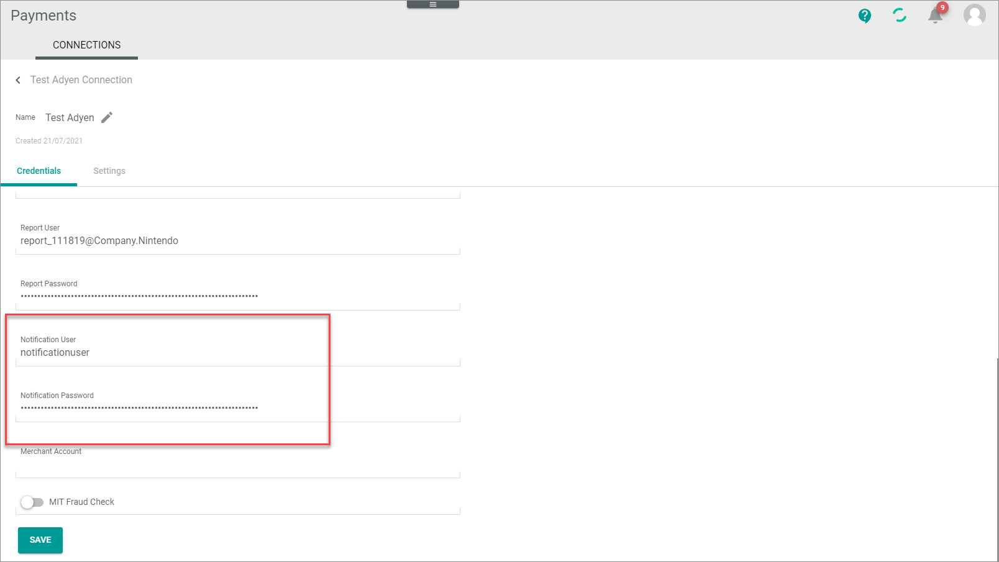

         - Change back to Adyen&trade; and click the [Apply] button.
      
     - *HMAC key*   
         You can ignore this setting. It is currently not supported by the *Payments* module.   

4. Enter the following settings in the *Additional settings* section.
     - *3D secure*   
        Select all entries and click the [Apply] button.

        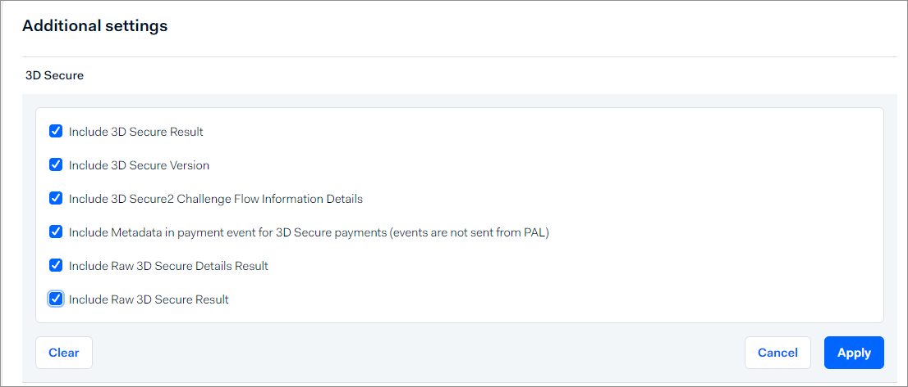

5. Click the [Save changes] button in the bottom right corner.

6. Enable the standard webhook and test your configuration after you have saved the notification user and password in Actindo.  
<!--- Stefan, geht das hier schon, oder muss alles in Actindo eingetragen sein?-->

## Define synchronous or asynchronous processing

Define whether you want to transfer the payment data using synchronous or asynchronous processing. 
- At synchronous processing, Adyen&trade; creates a connection for each event that occurs. This has the advantage that Adyen&trade; is immediately informed if a message cannot be processed. The disadvantage is that the message transfer might be slowly if a lot of events are to be transferred. See also [Synchronous processing](../Troubleshooting/02_SynchronousProcessing.md) in the Troubleshooting chapter.   
- At asynchronous processing, a message is not processed directly so that a lot of traffic can be handled. The message is first accepted and roughly checked for plausibility. It is then written to a message queue. After that, the message queue is processed periodically and can be run with parallel jobs. 

#### Prerequisites

- You have a valid user account in Adyen&trade;.
- You are assigned to the required roles in Adyen&trade;.

#### Procedure

*Adyen&trade; Backend > Developers > Webhooks*

1. Click on your standard webhook.

2. Expand the *Server configuration* setting in the *General* section.

    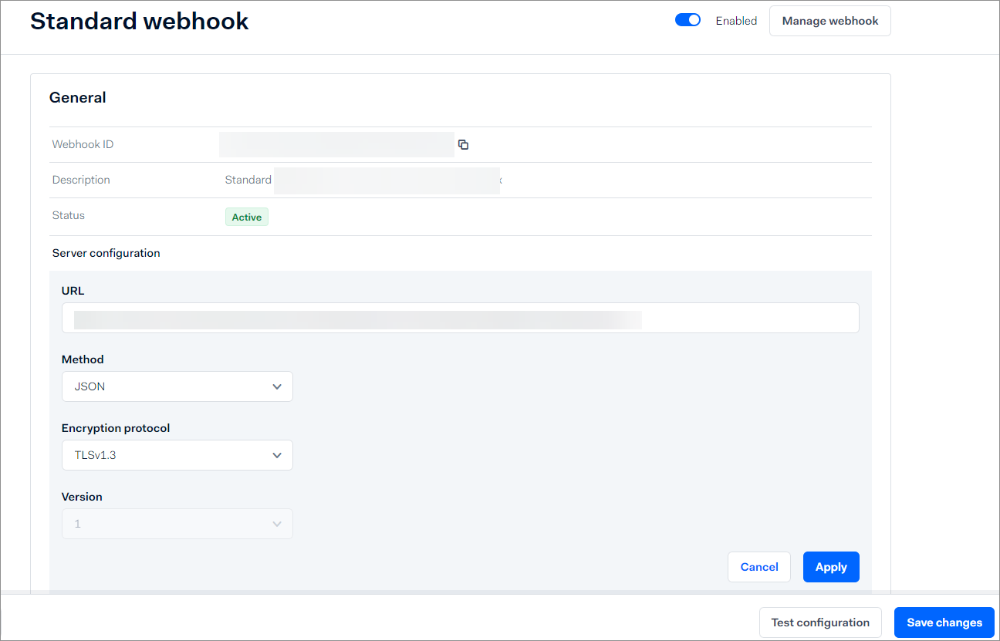.

3. Configure the server URL as follows:   
    - If you want to process the messages asynchronously, add an **Asynch** to the address. For example: `https://customeraccount.dev.actindo.com/Actindo.Extensions.Actindo.Adyen.Notification.notificationAsync`.

    - If you want to process the messages synchronously, add a **2** to the address. For example: `https://customeraccount.actindo.com/Actindo.Extensions.Actindo.Adyen.Notification.notification2`.

4. Click the [Apply] button.   
    The synchronous or asynchronous processing has been defined.

5. Click the [Save changes] button in the bottom right corner.

## Create web service API credentials

Create the web service API credentials to send messages from the *Payments* module to the Adyen&trade; backend. For detailed information, see [API credentials](https://docs.adyen.com/development-resources/api-credentials/ "https://docs.adyen.com/development-resources/api-credentials/") in the Adyen&trade; documentation. 

When you switch to a live environment, you must repeat this procedure in your live customer area.

#### Prerequisites

- You have a valid user account in Adyen&trade;.
- You are assigned to the required user roles in Adyen&trade;.
- You are logged in to your Actindo instance under *Payments > Settings > Select connection > Credentials tab*. For detailed information, see [Configure Adyen connection](02_ManageAdyenConnection.md#configure-adyen-connection).

#### Procedure

*Adyen&trade; Backend > Developers > API credentials*

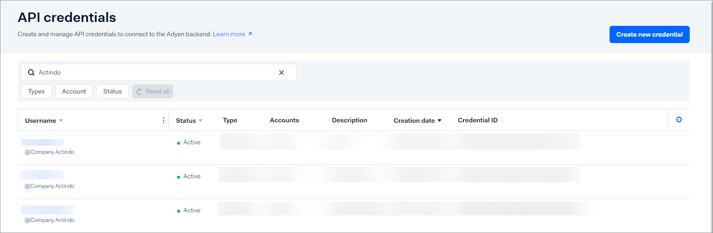

1. Click the *Create new credentials* button.   
   The *Create API credential* window is displayed. The *Web service user* credential type is selected by default. The username was automatically created by the system.
   
   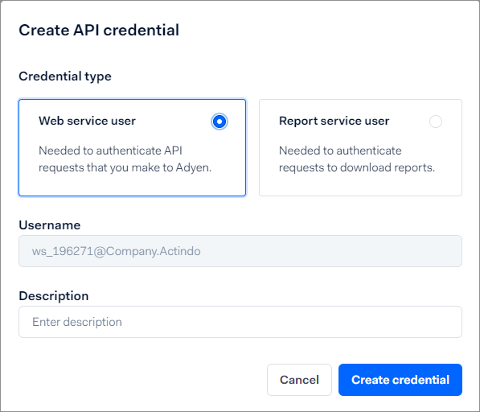

2. Copy the username.

3. Change to your Actindo instance. Enter the username in the *Payment user* field.
 
     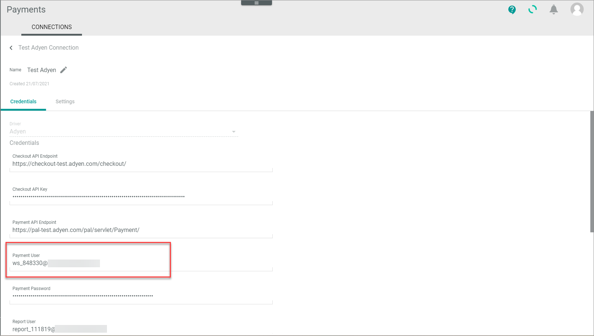

4. Return to your Adyen&trade; account.

5. Enter a description for the web service user in the *Description* field.

    

5. Click the [Create credential] button.   
    The *Configure API credential* view is displayed. The API key tab is displayed by default.

6. Generate the *Web service* API key and enter it in Actindo. To do this, follow these steps:

    - Click the *API key* tab in the *Server settings > Authentication* section. 

    - Click the [Generate API key] button.    
      The API key is automatically generated.

        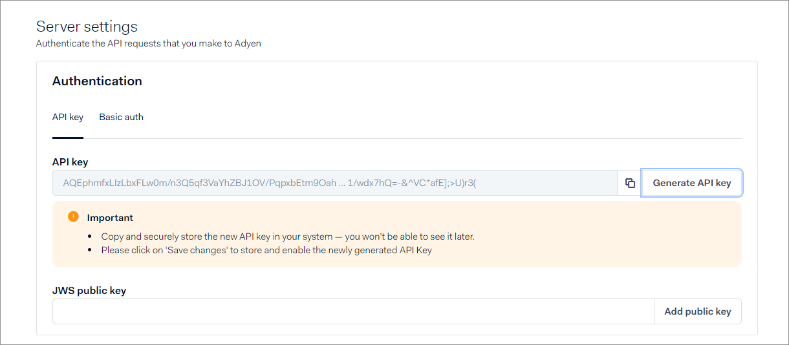
    
    - Click the [Copy] button.

    - Change to your Actindo instance and insert the API key in the *Checkout API key* field. 

        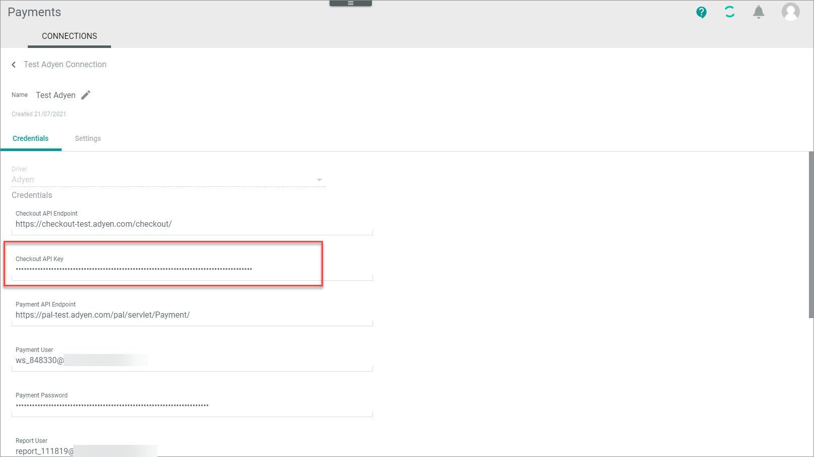

7. Return to your Adyen&trade; account and generate the *Web service* API password and enter it in Actindo. To do this, follow these steps:

    - Click the *Basic auth* tab and click the [Generate password] button.
      The password is automatically created.

        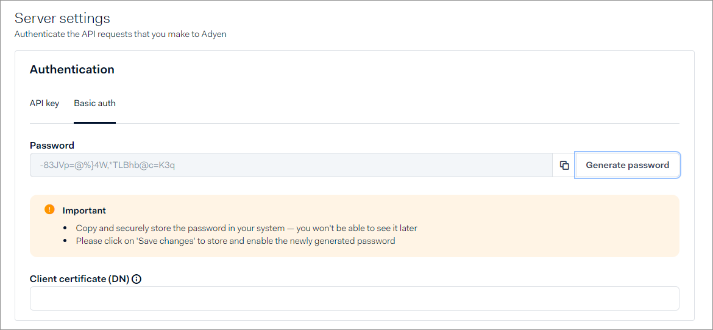
    
    - Click the [Copy] button. 

    - Change to your Actindo instance and insert the password in the *Payment password* field.

       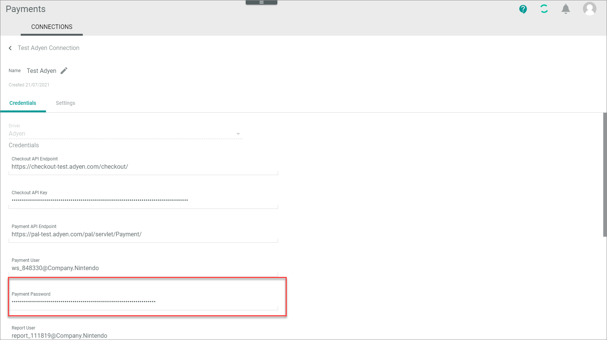

7. Return to Adyen&trade; and click the [Save changes] button in the bottom right corner.   
    The credentials for the *Web service* API are applied.

8. If necessary, configure your wallet payment methods in the *Wallet payment methods* section. Follow the Adyen&trade; documentation. 

9. If necessary, assign roles to change the permissions of the API credentials in the *Permissions > Roles* section. For dteailed information, see [API permissions](https://docs.adyen.com/development-resources/api-credentials/#api-permissions "[https://docs.adyen.com/development-resources/api-credentials/#api-permissions]") in the Adyen&trade; documentation.

## Create report service API credentials

Create the report service API credentials to send messages from the *Payments* module to the Adyen&trade; backend. You can use this report service to ensure that all messages have been successfully transferred from Adyen&trade; to the *Payments* module.
For detailed information, see [API credentials](https://docs.adyen.com/development-resources/api-credentials/ "[https://docs.adyen.com/development-resources/api-credentials/]") in the Adyen&trade; documentation. 

When you switch to a live environment, you must generate another report service API key in your live customer area.

#### Prerequisites

- You have a valid user account in Adyen.
- You are assigned to both the user roles *Merchant admin role* and
*Manage API credentials*.
- You are logged in to your Actindo instance. You have selected *Payments > Settings > Select connection > Credentials tab*

#### Procedure

*Adyen&trade; Backend > Developers > API credentials*

1. Click the *Create new credentials* button.   
   The *Create API credential* window is displayed. The *Web service user* credential type is automatically selected.

       
    
   
  2. Select the *Report service user* credential type.   
   The username is automatically created by the system.

       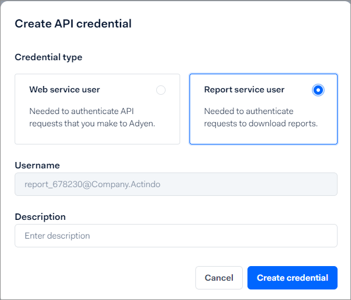

3. Copy the username.

4. Change to your Actindo instance and paste the report username in the *Report user* field.
  
   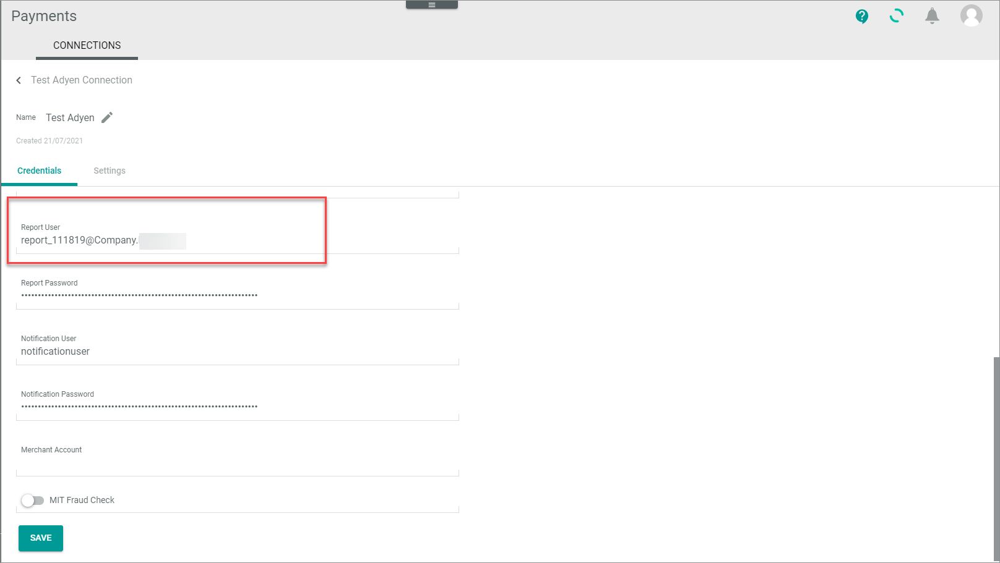

4. Return to your Adyen&trade; account. 

5. Enter a description for the report service user in the *Description* field.

    

6. Click the [Create credential] button.   
    The *Configure API credential* view is displayed. The API key tab is displayed by default.

7. Generate the *Report service* API key and password. To do this, follow these steps:

    - Click the *API key* tab in the *Server settings > Authentication* section.
    
    - Click the [Generate API key] button.   
        The API key is automatically applied.  
        
        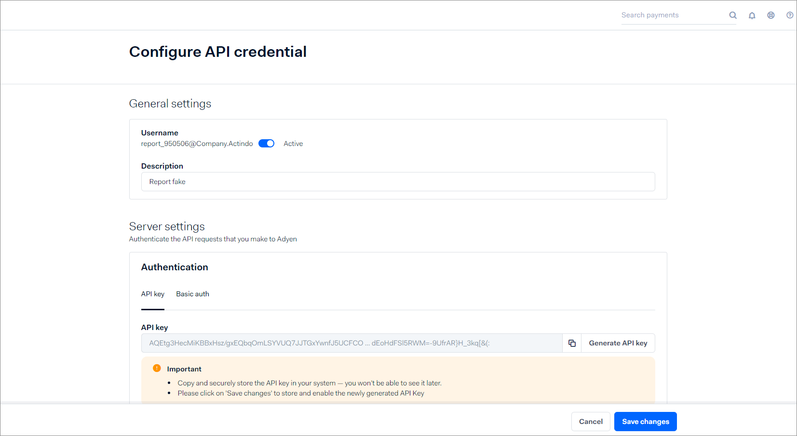

        > [Info] You do not need to enter the report API key in your Payments connection settings. For the *Payments* module, the report name and password are sufficient.

    - Click the *Basic auth* tab in the *Server settings > Authentication* section.
   
    - Click the [Generate password] button.   
      The password is automatically created.
   
       

    - Click the [Copy] button.

7. Change to your Actindo instance and insert the password in the *Report password* field. 

   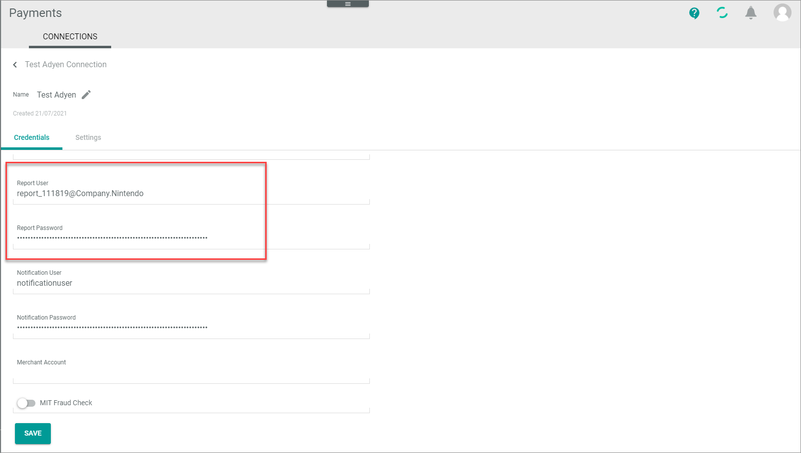

8. Return to your Adyen&trade; account and click the [Save changes] button in the bottom right corner.   
    The credentials for the *Report service* API are applied.

9. If necessary, assign the required report role to allow the technical user to download reports in the *Permissions > Roles > REPORT* section. Additionally, you can control access to merchant accounts. For detailed information, see [API permissions](https://docs.adyen.com/development-resources/api-credentials/#api-permissions "[https://docs.adyen.com/development-resources/api-credentials/#api-permissions]") in the Adyen&trade; documentation.

