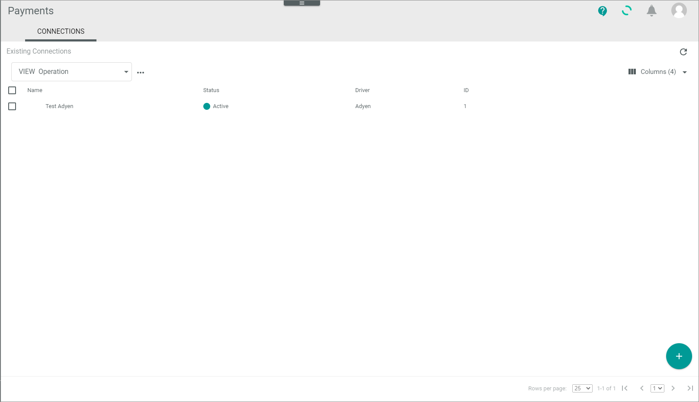
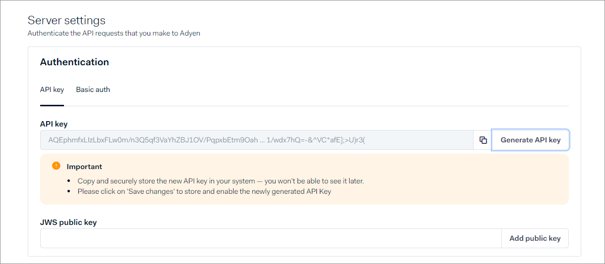

# Manage Adyen connections

In the following, the procedures to create, edit, configure, enable, or disable Adyen&trade; connections in the *Payments* module are described.  

Note the following:   
- If you have more than one merchant account in Adyen&trade; that you want to manage with Actindo, you must create a connection for each.   
- Adyen&trade; offers the possibility to work with two separate environments, a staging environment for testing purposes and a live environment for production. You must configure the connection for each environment separately.
- It is recommended that you manage the Adyen&trade; settings in parallel, so that you can enter the connection data alternately. Note that you can no longer copy the credentials after you have saved the Adyen&trade; or Payments settings. For detailed information, see [Manage Adyen settings](01_ManageAdyenSettings.md).

## Create Adyen connection
Create a connection to the Adyen&trade; payment service provider.

#### Prerequisites

- You have an Adyen&trade; customer account to log in to Adyen&trade;.
- You are logged in to Adyen&trade;.
- In case you are creating connection to an Adyen™ live account, you have the API endpoints for both the *Checkout API* endpoint and the *Payment API* endpoint at hand.
- In the *Actindo Core1 Platform*, you have permission to create connections in the *Payments* module.

#### Procedure

 *Payments > Settings > Tab CONNECTIONS*
 
 

1.  Click the  (Add) button in the bottom right corner.   
    The *Create Connection* view is displayed.  

    

2.  Enter a name for the connection in the *Name* field.

3.  Click the *Driver* drop-down list and select *Adyen*. 
   The *Credentials* section is displayed.

    

4. Enter the API endpoints and credentials. To do this, follow these steps:
    > [Info] There are some standard access points for a testing environment. For your productive/live environment, Adyen&trade; provides you with individual API endpoints. 

    -  Enter the endpoint of the Checkout API in the *Checkout API endpoint* field. 

       > [Info] The *Adyen Checkout API* provides a simple and flexible way to initiate and authorize online payments. You can use the same integration for payments made with cards (including 3D Secure), mobile wallets, and local payment methods (for example, iDEAL and Sofort). The endpoint for the test environment is `https://checkout-test.adyen.com/checkout/`.

    - Enter the key of the Checkout API in the *Checkout API key* field. You have generated this key in the Adyen settings under *Server settings > Authentication > Select API key tab* before:

       

    -  Enter the payment API endpoint in the *Payment API endpoint* field. For the test environment it is `https://pal-test.adyen.com/pal/servlet/Payment/`.

    - Enter the user for the payment API in the *Payment API user* field. Adyen has created the username under *Create API credential > Web service user credential type*  before:

        
     
5. Enter the API credentials of the API user that you have created in Adyen&trade;. To do this, follow these steps:   

    - Enter the user for the payment API in the *Payment API user* field. Adyen has created the username under *Create API credential > Web service user credential type > Display Username* before:

        
    
    -  Enter the password for the API to transfer the payment transactions in the *Payment password* field. You have generated the password for the Web service under *Server settings > Authentication> Select Basic auth tab* in Adyen&trade; before: 

        

    -  Enter the technical user for the report service in the *Report user* field. Adyen has created this username under *Create API credential > Report service user credential type* before:

        

        You will need the reporting API for the following: Adyen&trade; generates a daily report that collects all events of the day in a CSV file. The *Payments* module then automatically checks if all these events have been successfully transferred (reconciliation).   
        Note that you can check the attributes of each Payments transaction to see if the reconciliation has been processed:
         
        

    -  Enter the password for the report service in the *Report password* field. You have generated this password under *Server settings > Authentication> Select Basic auth tab* in Adyen&trade; before: 

        
     
5. Enter the credentials for notifications that Adyen shall send to the *Payments* module via the *http://basic_out_credentials* API. <!---Stimmt der Name des APIs?--> To do this, follow these steps:   
      -  Enter the technical user for the notification API in the *Notification user* field. You have defined this user in Adyen under *Developers > Webhooks > Security section* before.

    -  Enter the password for the notification API in the *Notification password* field. You have defined this user in Adyen under *Developers > Webhooks > Security section* before.

        

6. Enter the merchant account relevant for this connection in the *Merchant account* field. This is the merchant account for which you currently create the connection. You have created it in the Adyen&trade; configuration.
    
7. Enable the  *MIT fraud check* toggle if you do not trust the Adyen&trade; fraud check and want to do your own. This might be relevant if there is a longer period between the Adyen&trade; fraud check and the authorization receipt. 

8. Click the [SAVE] button.   
   The connection will be created. The *Checking credentials...* notice is displayed. After a few seconds, the *Loading data...* notice is displayed.

    The data are synchronized between Actindo and Adyen&trade;. The view for creating connections is automatically closed when the connection has been created and synchronized. The *Edit connection* view of the newly created connection is displayed. The *Settings* tab is selected.

    

## Edit Adyen connection

For detailed information, see [Edit PSP connection](../../Payments/Integration/01_ManageConnection.md#edit-psp-connection) in the *Payments* documentation.

## Configure Adyen connection

Configure the Adyen&trade; connection after you have created it. In the *Payments* connection settings, you can enter the event codes that are to be ignored. Alternatively, you can select the unwanted event codes in the Adyen&trade; webhook settings. 

The Adyen&trade; API has two endpoints, one for a synchronous and one for an asynchronous processing. If you decide for asynchronous processing, what is recommended, you can configure the number of workers to process messages in asynchronous processing. For detailed information, see [Define synchronous or asynchronous processing](./01_ManageAdyenSettings.md#define-synchronous-or-asynchronous-processing).

#### Prerequisites

In the *Actindo Core1 Platform*, you are permitted to create connections in *Payments*.

#### Procedure

*Payments > Settings > Tab CONNECTIONS*
 
 

 1. Click the Adyen&trade; connection you want to edit in the list of connections.   
   The *Edit connection* view is displayed. By default, the *Credentials* tab is selected.

    

2. Click the *Settings* tab.   
  The *Ignored event codes* setting is displayed by default.

   

3. If desired, enter an event code to be ignored in the *Key* field and in the *Value* field as well. Note that you can also define the event codes to be ignored in the Adyen&trade; backend. For detailed information, see [Create webhook in Adyen](./01_ManageAdyenSettings.md#create-adyen-webhook).
    The event code to be ignored is entered. 

    

4. If desired, enter further event codes to be ignored. To add a new row, click the  (Add) button. 

5. Click the *Number of workers handling messages* setting.   
   The *Number of workers handling messages* setting is displayed. 
   

6. Enter the number of workers you want to use for asynchronous processing of messages. For connections with a lot of traffic, a number between 5-10 might be sufficient. See also [Define synchronous or asynchronous processing](01_ManageAdyenSettings.md#define-synchronous-or-asynchronous-processing).

7. If desired, you can apply the standard settings by enabling the  (Apply default) toggle in the top right corner of the tab.

8. Click the [SAVE] button in the top right corner of the tab.   
   The connection settings are applied. Actindo validates the credentials. The list of connections is displayed.

## Enable Adyen connection

For detailed information, see [Enable PSP connection](../../Payments/Integration/01_ManageConnection.md#enable-psp-connection) in the *Payments* documentation.

## Disable Adyen connection

For detailed information, see [Disable PSP connection](../../Payments/Integration/01_ManageConnection.md#disable-psp-connection) in the *Payments* documentation.