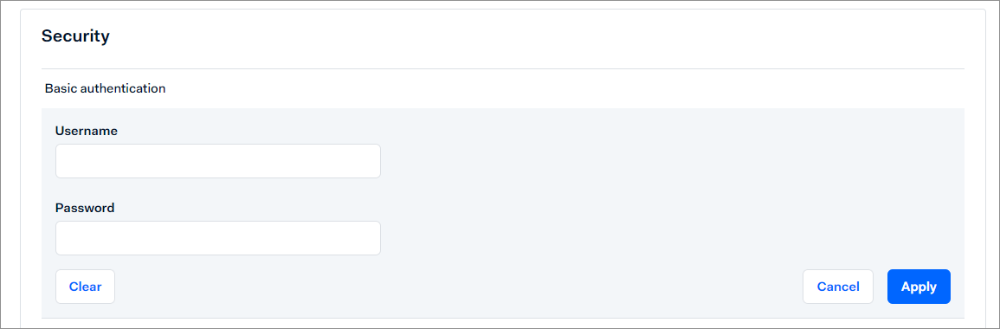

# Manage Adyen settings

In addition to the settings in the *Payments* module, there are some settings necessary in the Adyen backend to ensure a smooth data transfer.

The following procedures contain information on the settings to be configured in the Adyen backend. It shows the standard procedure that was current at the time this documentation was created. For the latest detailed descriptions, refer to the Adyen documentation. 

## Create Adyen webhook

Create a webhook to receive payment notifications from Adyen to the *Payments* module such as authorizations and cancellations. For detailed information, see [https://docs.adyen.com/development-resources/webhooks/](https://docs.adyen.com/development-resources/webhooks/) in the Adyen documentation. It includes a video that may also be helpful.

#### Prerequisites

- You have a valid user account in Adyen.
- You are assigned to the **Merchant technical integrator** role in Adyen.

#### Procedure

*Adyen Backend > Developers > Webhooks*

1. Add a new standard webhook.   
    The settings for the standard webhook are displayed.

   

2. Enter the following settings in the *General* section.
    - *Description*  
        Enter a description for the webhook.
    - *Server configuration section*   
         - *URL*   
           Enter the server URL of the Actindo productive system or sandbox you want to connect.    
           For example: https://kundenaccount.dev.actindo.com/Actindo.Extensions.Actindo.Adyen.Notification.notificationAsync. This example displays the server URL for asynchronous processing. For detailed information on synchronous processing, see [Define synchronous or asynchronous processing](#define-synchronous-or-asynchronous-processing). 
      
         - *Method*   
            You can use the standard setting **JSON** if you have no other requirements.

        - *Encryption protocol*     
           You can use the standard setting **TLSv1.3** if you have no other requirements

        - *Service version*   
            You can use the standard setting **1** if you have no other requirements.
            
          .

3. Click the [Apply] button and proceed with the following fields in the *General* section.

    - *Merchant accounts*   
        Enter the merchant account(s) you want to connect.
    - *Events*   
        Select all events you want to transfer to the *Payments* module. All listed events can be handled by Actindo. You can exclude an event if you want to process specific events by another third-party application, for example. Alternatively, you can define the events to be ignored in the *Payments* module settings, see [Configure Adyen connection](./01_ManageAdyenConnection.md#configure-adyen-connection).

3. Enter the following settings in the *Security* section.

     - *Basic authentication*   
         In the *Payments* module connection credentials, you have defined the credentials for the notification user. You must declare these credentials also in the Adyen backend settings, so that you can get notifications from Adyen. 

         

         Enter the server's username and password that you have defined as *Notification user* and *Notification password* in the *Payments* settings and click the [Apply] button.

         

     - *HMAC key*   
         You can ignore this setting. It is currently not supported by the *Payments* module.   

4. Enter the following settings in the *Additional settings* section.
     - *3D secure*   
        Select all entries and click the [Apply] button.

        

5. Click the [Save changes] button.

6. Enable the standard webhook and test your configuration.

## Define synchronous or asynchronous processing

Define whether you want to transfer the payment data using synchronous or an asynchronous processing. For detailed information, see [Configure Adyen connection](./01_ManageAdyenConnection.md).

#### Prerequisites
- An Adyen connection has been created, see [Create Adyen connection](./01_ManageAdyenConnection.md#create-adyen-connection).
- You have a valid user account in Adyen.

#### Procedure

*Adyen Backend > Developers > Webhooks*

1. Click on your standard webhook.

2. Expand the *Server configuration* setting in the *General* section.

    .

3. Configure the server URL as follows:
     - If you want to process the messages asynchronously, add an **Asynch** to the address. For example: https://kundenaccount.dev.actindo.com/Actindo.Extensions.Actindo.Adyen.Notification.notificationAsync

    - If you want to process the messages synchronously, add a **2** to the address. For example: https://kundenaccount.actindo.com/Actindo.Extensions.Actindo.Adyen.Notification.notification2.

4. Click the [Apply] button.   
    The synchronous or asynchronous processing has been defined.

5. Click the [Save changes] button.

## Create web service API credentials

Create the web service API credentials to send messages from the *Payments* module to the Adyen backend. For detailed information, see [https://docs.adyen.com/development-resources/api-credentials/](https://docs.adyen.com/development-resources/api-credentials/) in the Adyen documentation. 

When you switch to your live environment, you must generate another web service API key in your live customer area.

#### Prerequisites

- You have a valid user account in Adyen.
- You are assigned to both the user roles *Merchant admin role* and
*Manage API credentials*
- You are logged in to your Actindo backend.

#### Procedure

*Adyen Backend > Developers > API credentials*

1. Click the *Create new credentials* section.   
   The *Create API credential* window is displayed.
   
   

2. Select the *Web service user* credential type.   
   The username is automatically created by the system.

3. Enter a description for the web service user in the *Description* field.

4. Click the [Create credential] button.
    The *Configure API credential* view is displayed. The API key tab is displayed by default.

**Generate web service API key**

1. Click the *API key* tab in the *Sever settings > Authentication* section. 

2. Click the [Generate API key] button and copy it.

3. Change to your Actindo instance and insert the API key in the *Checkout API key* field. For detailed information, see [Configure Adyen connection](01_ManageAdyenConnection.md#configure-adyen-connection).

**Generate web service password**

1. Change to your Adyen account.

2. Click the *Basic auth* tab.

3. Click the [Generate password] button and copy it.

4. Change to your Actindo instance and insert the password in the *Payment password* field.

5. Click the [Save changes] button.

## Create report service credentials

Create the report service API credentials to send messages from the *Payments* module to the Adyen backend. You can use this report service to ensure that all messages have been successfully transferred from Adyen to the *Payments* module.
For detailed information, see [https://docs.adyen.com/development-resources/api-credentials/](https://docs.adyen.com/development-resources/api-credentials/) in the Adyen documentation. 

When you switch to your live environment, you must generate another report service API key in your live customer area.

#### Prerequisites

- You have a valid user account in Adyen.
- You are assigned to both the user roles *Merchant admin role* and
*Manage API credentials*
- You are logged in to your Actindo backend.

#### Procedure

*Adyen Backend > Developers > API credentials*

1. Click the *Create new credentials* section.   
   The *Create API credential* window is displayed. The *Web service user* credential type is automatically selected.

       
    
   
  2. Select the *Report service user* credential type.   
   The username is automatically created by the system.

       

3. Enter a description for the report service user in the *Description* field.

4. Click the [Create credential] button.
    The *Configure API credential* view is displayed. The API key tab is displayed by default.

**Generate report service API key**

1. Click the *API key* tab in the *Sever settings > Authentication* section. 

2. Click the [Generate API key] button and copy it.
<!---muss man das machen?-->

<!---3. Change to your Actindo instance and insert the API key in the *Checkout API key* field. For detailed information, see [Configure Adyen connection](01_ManageAdyenConnection.md#configure-adyen-connection).-->

**Generate report service password**

1. Change to your Adyen account.

2. Click the *Basic auth* tab.

3. Click the [Generate password] button and copy it.

4. Change to your Actindo instance and insert the password in the *Report password* field. For detailed information, see [Configure Adyen connection](01_ManageAdyenConnection.md#configure-adyen-connection)

5. Return to your Adyen account and click the [Save changes] button.

<!---Was ist mit den weiteren Einstellungen wie Payment wallets und roles?-->

