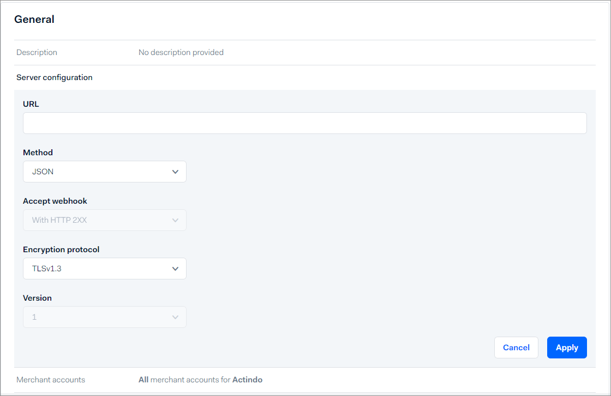

# Manage Adyen settings

In addition to the settings in the *Payments* module, there are some settings necessary in the Adyen backend to ensure a smooth data transfer.

## Create Adyen webhook

Create a webhook to receive payment notifications from Adyen such as authorizations and cancellations. 
For detailed information, see [https://docs.adyen.com/development-resources/webhooks/](https://docs.adyen.com/development-resources/webhooks/) in the Adyen documentation. It includes a video that may also be helpful.

This procedure contains information on the settings to be configured in the Adyen backend. It shows the standard procedure that was current at the time this documentation was created. For the latest detailed descriptions, refer to the Adyen documentation.

#### Prerequisites

- You have a valid user account in Adyen.
- You are assigned to the **Merchant technical integrator** role in Adyen.

#### Procedure

*Adyen Backend > Developers > Webhooks*

1. Add a new standard webhook.
    A new standard webhook is added.

   

2. Enter the following settings in the *General* section.
    - *Description*  
        Enter a description for the webhook.
    - *Server configuration*   
        Enter the server URL of the Actindo productive system or sandbox you want to connect. For example: https://kundenaccount.dev.actindo.com/Actindo.Extensions.Actindo.Adyen.Notification.notificationAsync.   
        This example displays the server URL for asynchronous processing. For detailed information on synchronous processing, see [Define synchronous or asynchronous processing](#define-synchronous-or-asynchronous-processing). 

         .

         You can define the other settings as described in the image, if you have no other requirements.

    - *Merchant account*   
        Enter the merchant account(s) you want to connect.
    - *Events*   
        Select all events you want to transfer to the *Payments* module. All listed events can be handled by Actindo. You can exclude an event if you want to process specific events by another third-party application, for example.

3. Enter the following settings in the *Security* section.

     - *Basic authentication*   
         In the *Payments* module connection credentials, you have defined the credentials for the notification user. You must declare these credentials also in the Adyen backend settings, so that you can get notifications from Adyen.   
         Enter the server's username and password that you have defined as *Notification user* and *Notification password* in the *Payments* settings.

         

     - *HMAC key*   
         You can ignore this setting. It is currently not supported by the *Payments* module.   

4. Enter the following settings in the *Additional settings* section.
     - *3D secure*   
        Select all entries.

5. Save your settings.

6. Enable the standard webhook and test your configuration.

## Declare notification user and password

In the *Payments* module connection credentials, you have defined the credentials for the notification user. You must declare these credentials also in the Adyen backend settings, so that you can get notifications from Adyen.

#### Prerequisites

You have defined the credentials for the notification user, see [Configure Adyen connection](./01_ManageAdyenConnection.md).

#### Procedure

https://kundenaccount.dev.actindo.com/Actindo.Extensions.Actindo.Adyen.Notification.notificationAsync

## Specify webhooks credentials

#### Prerequisites

#### Procedure

## Define synchronous or asynchronous processing

Define whether you want to transfer the payment data using synchronous or an asynchronous processing. For detailed information, see [Configure Adyen connection](./01_ManageAdyenConnection.md).

#### Prerequisites
- An Adyen connection has been created, see [Create Adyen connection](./01_ManageAdyenConnection.md#create-adyen-connection).
- You have a valid user account in Adyen.

#### Procedure

*Adyen Backend > Developers > Webhooks*

1. Open your standard webhook for editing in the Adyen backend.

2. Edit the *Server configuration* setting in the *General* section.

    .

3. Configure the server URL as follows:
     - If you want to process the messages asynchronously, add an **Asynch** to the address. For example: https://kundenaccount.dev.actindo.com/Actindo.Extensions.Actindo.Adyen.Notification.notificationAsync

    - If you want to process the messages synchronously, add a **2** to the address. For example: https://kundenaccount.actindo.com/Actindo.Extensions.Actindo.Adyen.Notification.notification2.

4. Save your changes.

## Create API credentials

For detailed information, see [https://docs.adyen.com/development-resources/api-credentials/](https://docs.adyen.com/development-resources/api-credentials/) in the Adyen documentation. 

