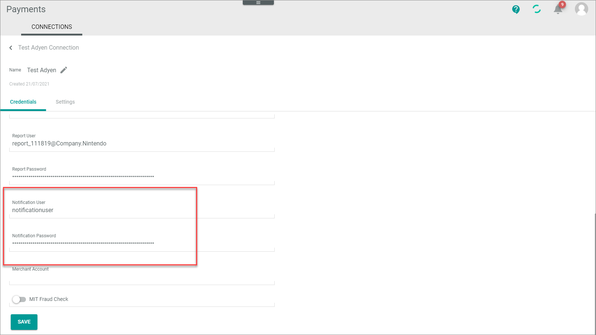

# Manage Adyen connection

In the following, the procedures to create, edit, configure, enable, or disable Adyen&trade; connections in the *Payments* module are described.  

It is recommended that you manage the Payments credentials for the Adyen driver and the Adyen&trade; settings in parallel, so that you can enter the connection settings alternately. Note that you can no longer copy the credentials after you have saved the Adyen&trade; or Payments settings.

Note the following:   
- If you have more than one merchant account in Adyen&trade; that you want to manage with Actindo, you must create a connection for each.   
- Adyen&trade; offers the possibility to work with two separate environments, a staging environment for testing purposes and a live environment for production. You must configure the connection for each environment separately.
- Adyen&trade; uses TLS certificates that are changed from time to time. Adyen users are informed about this. Actindo only checks if it is a valid certificate in general and does not validate specific certificates. So you can ignore this information from Adyen. See also an update example from Adyen&trade;: [TLS Certificates on Adyen services](https://help.adyen.com/updates/tls-certificates-on-adyen-services "[https://help.adyen.com/updates/tls-certificates-on-adyen-services]"). 

 
The following procedures contain information on the settings to be configured both in the Adyen&trade; and the Payments backend. As far as the Adyen&trade; backend is concerned, this is the standard procedure at the time this documentation was created. For the latest detailed descriptions, refer to the Adyen&trade; documentation. 

## Create Adyen connection
Create a connection to the Adyen&trade; payment service provider in the Actindo backend.

#### Prerequisites

- You have an Adyen&trade; customer account to log in to Adyen&trade;.
- You are logged in to Adyen&trade;.
- In case you are editing a connection to an Adyen™ live account, you have the API endpoints for both the Checkout API endpoint and the Payment API endpoint at hand.
- In the *Actindo Core1 Platform*, you have permission to create connections in the *Payments* module.

#### Procedure

 *Payments > Settings > Tab CONNECTIONS*
 
 

1. Click the  (Add) button in the bottom right corner.   
    The *Create Connection* view is displayed.  

    

2. Enter a name for the connection in the *Name* field.

3. Click the *Driver* drop-down list and select *Adyen*. 
   The *Credentials* section is displayed.

    

4. Change to the Adyen backend.

## Create Adyen webhook

In the Adyen backend, create a webhook to receive payment notifications from Adyen&trade; to the *Payments* module such as authorizations and cancellations. For detailed information, see [Webhooks](https://docs.adyen.com/development-resources/webhooks/ "[https://docs.adyen.com/development-resources/webhooks/]") in the Adyen&trade; documentation. It includes a video that may also be helpful.

#### Prerequisites

- You have a valid user account in Adyen&trade;.
- You are assigned to the **Merchant technical integrator** role in Adyen&trade;.
- You are logged in to your Actindo instance under *Payments > Settings > Select connection > Credentials tab*

#### Procedure

*Adyen Backend > Developers > Webhooks*

1. Add a new standard webhook.   
    The settings for the standard webhook are displayed.

   

2. Enter the following settings in the *General* section.
    - *Description*  
        Enter a description for the webhook.
    - *Server configuration section*   
         - *URL*   
           Enter the server URL of the Actindo productive system or sandbox you want to connect.    
           For example: `https://customeraccount.dev.actindo.com/Actindo.Extensions.Actindo.Adyen.Notification.notificationAsync`. This example displays the server URL for asynchronous processing. For detailed information on synchronous processing, see [Define synchronous or asynchronous processing](#define-synchronous-or-asynchronous-processing). 
      
         - *Method*   
            You can use the standard setting **JSON** if you have no other requirements.

        - *Encryption protocol*     
           You can use the standard setting **TLSv1.3** if you have no other requirements

        - *Service version*   
            You can use the standard setting **1** if you have no other requirements.
            
          .

3. Click the [Apply] button and proceed with the following fields in the *General* section.

    - *Merchant accounts*   
        Enter the merchant account(s) you want to connect.
    - *Events*   
        Select all the events whose messages you want to transfer to the *Payments* module. All listed events can be handled by Actindo. You can exclude an event if you want to process specific events by another third-party application, for example. Alternatively, you can define the events to be ignored in the *Payments* module settings, see [Configure Adyen connection](./02_ManageAdyenConnection.md#configure-adyen-connection).

4. Enter the following settings in the *Security* section.

     - *Basic authentication*   
         - Define the technical user for the notification API in the *Username* field. You can freely assign the username.

         - Define the password for the notification API in the *Password* field. You can freely assign the password.

         

5. Change to the Actindo backend.

     - Enter the username in the *Notification user* field.

     - Enter the password in the *Notification password* field.

        

6. Change back to the Adyen backend.

     - *HMAC key*   
         You can ignore this setting. It is currently not supported by the *Payments* module.   

7. Enter the following settings in the *Additional settings* section.
     - *3D secure*   
        Select all entries and click the [Apply] button.

        

8. Click the [Save changes] button.

9. Enable the standard webhook and test your configuration after you have saved the notification user and password in Actindo.  

## Define synchronous or asynchronous processing

Define whether you want to transfer the payment data using synchronous or asynchronous processing. 
- At synchronous processing, Adyen&trade; creates a connection for each event that occurs. This has the advantage that Adyen&trade; is immediately informed if a message cannot be processed. The disadvantage is that the message transfer might be slowly if a lot of events are to be transferred. See also [Synchronous processing](../Troubleshooting/02_SynchronousProcessing.md) in the Troubleshooting chapter.   
- At asynchronous processing, a message is not processed directly so that a lot of traffic can be handled. The message is first accepted and roughly checked for plausibility. It is then written to a message queue. After that, the message queue is processed periodically and can be sent with parallel jobs. 

#### Prerequisites
- In Actindo, an Adyen&trade; connection has been created, see [Create Adyen connection](./02_ManageAdyenConnection.md#create-adyen-connection).
- You have a valid user account in Adyen.

#### Procedure

*Adyen Backend > Developers > Webhooks*

1. Click on your standard webhook.

2. Expand the *Server configuration* setting in the *General* section.

    .

3. Configure the server URL as follows:   
    - If you want to process the messages asynchronously, add an **Asynch** to the address. For example: `https://customeraccount.dev.actindo.com/Actindo.Extensions.Actindo.Adyen.Notification.notificationAsync`.

    - If you want to process the messages synchronously, add a **2** to the address. For example: `https://customeraccount.actindo.com/Actindo.Extensions.Actindo.Adyen.Notification.notification2`.

4. Click the [Apply] button.   
    The synchronous or asynchronous processing has been defined.

5. Click the [Save changes] button.

