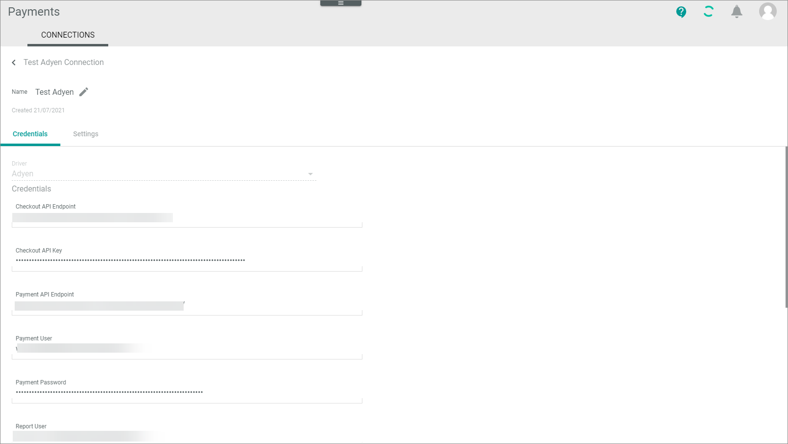

[!! Manage Adyen connection](../Integration/01_ManageAdyenConnection.md)

# CONNECTIONS (Adyen)

The CONNECTIONS tab provides an overview of all connections created for *Payments*. It also allows you to configure these connections.   
For detailed information on general UI functions of the *CONNECTIONS* tab, see [Connections](../../Payments/UserInterface/08a_Connections.md) in the *Payments* documentation.

## Edit Adyen connection &ndash; Credentials

*Payments > Settings > Tab CONNECTIONS > Select Adyen connection > Tab Credentials*

- *Driver*  
    Selected driver name. This drop-down list is read-only.

- *Checkout API endpoint*   

- *Checkout API key*

- *Payment API endpoint*

- *Payment user*

- *Payment password*

- *Notification user*

- *Merchant account*

-  *MIT fraud check*   
   Enable this toggle if you do not trust the *Adyen* fraud check and want to do your own.
   

- [SAVE]  
    Click this button to save any changes made.

## Edit Adyen connection &ndash; Credentials

