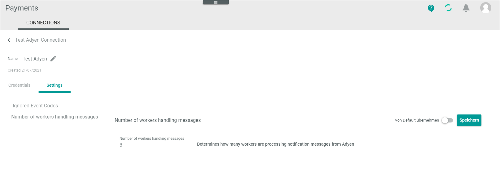

[!! Manage Adyen connection](../Integration/01_ManageAdyenConnection.md)

# CONNECTIONS (Adyen)

The CONNECTIONS tab provides an overview of all connections created for *Payments*. It also allows you to configure these connections.   
For detailed information on general UI functions of the *CONNECTIONS* tab, see [Connections](../../Payments/UserInterface/08a_Connections.md) in the *Payments* documentation.

## Edit Adyen connection &ndash; Credentials

*Payments > Settings > Tab CONNECTIONS > Select Adyen connection > Tab Credentials*

- *Driver*  
    Selected driver name. This drop-down list is read-only.

**Credentials**

- *Checkout API endpoint*   
   Edit the endpoint of the checkout API. For detailed information, see https://docs.adyen.com/api-explorer/Checkout/71/overview in the Adyen documentation.  
     
- *Checkout API key*    
   Edit the key of the *Checkout API* which you have created in the settings of the *Checkout API* in the Adyen backend.

- *Payment API endpoint*   
  Edit the endpoint of the *Payment API*.  

- *Payment user*   
   Edit the username of the technical user which you have created in the settings of the *Payment API* in the Adyen backend.

- *Payment password*   
   Edit the password of the *Payment API* you have created in the settings of the Adyen backend.

 - *Report user*  
     Edit the username of the *Report API* you have created in the settings of the Adyen backend.

 - *Report password*    
    Edit the password of the *Report API* you have created in the settings of the Adyen backend.

- *Notification user*  
    Edit the username of the technical user.<!---welches API?--> If you do any changes here, remember to follow the changes in the Adyen configuration.

- *Notification password*   
   Edit the password of the technical user.<!---welches API?--> If you do any changes here, remember to follow the changes in the Adyen configuration.

- *Merchant account*   
  Edit the merchant account of the connection you are currently editing.

-  *MIT fraud check*   
   Enable this toggle if you want to do your own fraud check.
 
- [SAVE]  
    Click this button to save any changes made.

## Edit Adyen connection &ndash; Settings

*Payments > Settings > Tab CONNECTIONS > Select Adyen connection > Tab Settings*

The *Settings* tab is composed of the following setting entries:
- [Ignored event codes](#ignored-event-codes)
- [Number of workers handling messages](#number-of-workers-handling-messages)

### Ignored event codes

*Payments > Settings > Tab CONNECTIONS > Select Adyen connection > Tab Settings*

- [SAVE]  
  Click this button to save any changes made.

- *Key*   
   Edit the name of the event code you want to ignore.

- *Value*   
   Edit the name of the event code you want to ignore.

-  (Delete)   
   Delete an event code you no longer want to ignore.    
      
-  (Add)    
   Add an event code you want to ignore.

### Number of workers handling messages

*Payments > Settings > Tab CONNECTIONS > Select Adyen connection > Tab Settings > Select Number of workers handling messages*

- *Number of workers handling messages*   
   Enter the number of parallel processes with which the Adyen transactions are to be transferred. 

-  (Apply from default)   
   Enable this toggle if you want to apply the default value. Disable this toggle if you do not want to apply the default value.

- [SAVE]  
  Click this button to save any changes made.

