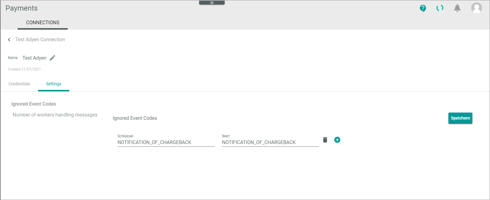

[!! Manage Adyen connection](../Integration/02_ManageAdyenConnection.md)

# CONNECTIONS (Adyen)

The CONNECTIONS tab provides an overview of all connections created for *Payments*. It also allows you to configure these connections.   
For detailed information on general UI functions and procedures of the *CONNECTIONS* tab, see [Connections](../../Payments/UserInterface/08a_Connections.md) in the *Payments* documentation.

## Edit Adyen connection &ndash; Credentials

*Payments > Settings > Tab CONNECTIONS > Select Adyen&trade; connection > Tab Credentials*

- *Driver*  
    Selected driver name. This drop-down list is read-only.

**Credentials**

The *Credentials* tab displays the connection credentials that you have defined in Adyen&trade;. This is a copy of those credentials. This means that the credentials must be the same. 

- *Checkout API endpoint*   
   Endpoint of the Checkout API that is managed in Adyen&trade;. For detailed information on the Checkout API, see [Adyen Checkout API](https://docs.adyen.com/api-explorer/Checkout/71/overview "[https://docs.adyen.com/api-explorer/Checkout/71/overview]") in the Adyen&trade; documentation. For the test environment it is `https://checkout-test.adyen.com/checkout/`, for the live account you get the endpoint directly from Adyen&trade;. 
     
- *Checkout API key*    
   Key of the *Checkout API* endpoint that is managed in the Adyen&trade; backend.

- *Payment API endpoint*   
   Endpoint of the *Payment API* that is managed in Adyen&trade;. For the test environment, it is `https://pal-test.adyen.com/pal/servlet/Payment/`, for the live account you get the endpoint directly from Adyen&trade;.

- *Payment user*   
   Username of the technical user that is managed in the Adyen&trade; backend.

- *Payment password*   
   Password of the *Checkout* API that is managed in the Adyen&trade; backend.

 - *Report user*  
     Username of the *Report API* that is managed in the Adyen&trade; backend.

 - *Report password*    
    Password of the *Report API* you have created in the settings of the Adyen&trade; backend.

- *Notification user*  
    Edit the username of the technical user. You can edit the notification user both in Actindo or in Adyen&trade;. If you do any changes here, remember to follow these changes in the Adyen&trade; webhook configuration. For detailed information, see [Create Adyen webhook](../Integration/01_ManageAdyenSettings.md#create-adyen-webhook).

- *Notification password*   
   Edit the password of the technical user. If you do any changes here, remember to follow these changes in the Adyen&trade; webhook configuration.

- *Merchant account*   
  Edit the merchant account of the connection you are currently editing.

-  *MIT fraud check*   
   Enable this toggle if you want to do your own fraud check.
 
- [SAVE]  
    Click this button to save any changes made.

## Edit Adyen connection &ndash; Settings

*Payments > Settings > Tab CONNECTIONS > Select Adyen&trade; connection > Tab Settings*

The *Settings* tab is composed of the following setting entries:
- [Ignored event codes](#ignored-event-codes)
- [Number of workers handling messages](#number-of-workers-handling-messages)

### Ignored event codes

*Payments > Settings > Tab CONNECTIONS > Select Adyen&trade; connection > Tab Settings*

- [SAVE]  
  Click this button to save any changes made.

- *Key*   
   Edit the name of the event code you want to ignore.

- *Value*   
   Edit the name of the event code you want to ignore.

-  (Delete)   
   Delete an event code you no longer want to ignore.    
      
-  (Add)    
   Add an event code you want to ignore.

### Number of workers handling messages

*Payments > Settings > Tab CONNECTIONS > Select Adyen&trade; connection > Tab Settings > Select Number of workers handling messages*

- *Number of workers handling messages*   
   Enter the number of parallel processes with which the Adyen&trade; transactions are to be transferred. 

-  (Apply from default)   
   Enable this toggle if you want to apply the default value. Disable this toggle if you do not want to apply the default value.

- [SAVE]  
  Click this button to save any changes made.

