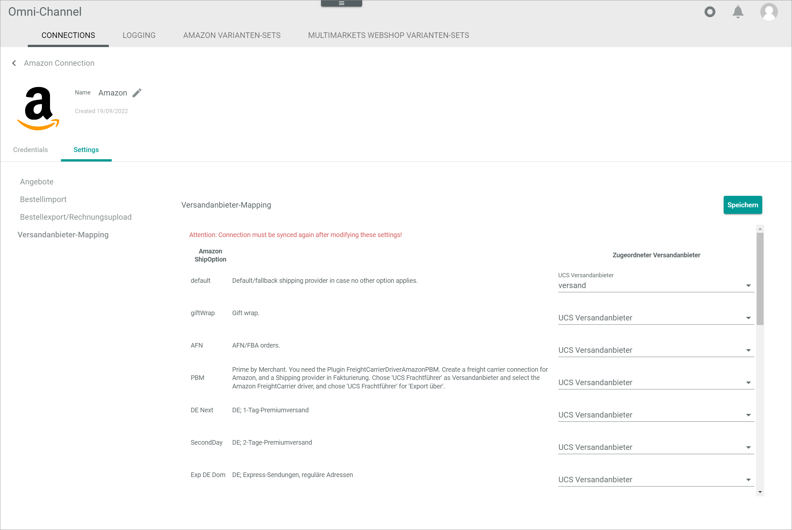

[!!Manage the connections](./01_ManageAmazonConnection.md)
[!!User interface Connections (Amazon)](../UserInterface/01_Connections.md)

# Manage the Amazon connection

To establish a connection to an Amazon shop, there are several particularities to consider. Therefore, the creation and the configuration of the Amazon connection are described in detail below.

## Create an Amazon connection

Create the connection to an Amazon shop using the Amazon driver. Further settings can only be configured after the connection has been established.

#### Prerequisites

- An Amazon seller account has been created.
- All columns of the order reports must be activated in your Amazon seller account, see [Add or remove order report columns](https://sellercentral.amazon.de/order-reports-and-feeds/column-picker?source=/order-reports-and-feeds/reports/ref=xx_orderrpt_dnav_xx). 
- A standard ship-from address must be set in your Amazon seller account, see [Set up a ship-from address](https://sellercentral.amazon.de/help/hub/reference/G201841320). 
    > [Info] Make sure that you are logged in to your Amazon seller account to access the links above. 
- The *Omni-Channel Amazon Integration* plugin has been installed. 
> [Info] For the *Omni-Channel* module version 4.1.0 or higher, the *Omni-Channel Amazon Integration* plugin is required in at least version 4.0.0. 

#### Procedure

*Omni-Channel > Settings > Tab CONNECTIONS*

1. Click the  (Add) button in the bottom right corner.    
    The *Create connection* view is displayed.

    

2. Enter a name for the connection in the *Name* field.

3. Click the *Driver* drop-down list and select the *Amazon* driver.  
    The *Credentials* section is displayed below the drop-down list.  

    

4. In a new browser window, go to your Amazon seller account and log in.   
    The *Amazon seller central* start page is displayed.

    

5. Click first the  (Settings) button in the upper right corner and then the *Account Info* menu entry.  
   The *Seller Account Information* window is displayed.

    

6. Click the [Your Merchant Token] button in the *Business Information* section.  
    The *Merchant Token* window is displayed.

    

7. Copy the merchant token in the *Merchant token* field to your clipboard.

8. Switch back to the *Actindo Core1 Platform* and paste the merchant token from your clipboard in the *Seller ID* field in the *Credentials* section.

9. Click the [AUTHORIZE] button.  
    You are automatically redirected to the *Authorize Actindo* window in your Amazon seller account.

    

10. Select the *I direct Amazon to provide Actindo access to my Selling Partner account and the related data. I am responsible for any actions taken by the application.* checkbox and click the [Confirm] button.    
    The *We are authorizing Actindo to access your seller data.* notice is displayed. As soon as the authorization has been completed, you are redirected to the *Actindo Core1 Platform*. If the authorization has been successful, the *Access token* field is filled in.

    

11. Click the *Amazon marketplace* drop-down list and select the applicable marketplace.
    > [Info] Once the connection has been saved, the selected marketplace cannot be changed.

12. Click the [SAVE] button.  
    The *Checking credentials* notice is displayed. The connection will be established and the synchronization is triggered. The *Sync triggered* pop-up window is displayed.  

    

    The *CONNECTIONS* tab in the *Settings* menu entry of the *Omni-Channel* module is displayed when the connection has been established. The *Amazon* connection is displayed in the list of connections.

    

13. If necessary, continue to configure the Amazon connection, see [Configure the Amazon connection](#configure-the-amazon-connection).

## Configure the Amazon connection   

After the connection to an Amazon shop has been established, further settings can be configured for the connection.

#### Prerequisites

An Amazon connection has been established, see [Create an Amazon connection](#create-an-amazon-connection).

#### Procedure

*Omni-Channel > Settings > Tab CONNECTIONS*

1. Click the Amazon connection in the list of connections.   
    The *Edit connection* view is displayed. By default, the *Credentials* tab is selected.

    

2. Click the *Settings* tab.   
    The *Settings* tab is displayed. By default, the *Offers* menu entry in the left side bar is selected and the offer settings are displayed on the right side.    

    

3. If necessary, disable the *Apply from default* toggle. By default, the toggle is enabled.  
    The *Update stock for 'Fulfillment by Amazon (FBA)' offers* toggle is unlocked.

4. Enable the *Update stock for 'Fulfillment by Amazon (FBA)' offers* toggle to manage the stock also via Actindo. It is recommended to leave this toggle disabled, since Amazon manages the stock for FBA offers.

5. Click the *Order import* menu entry in the left side bar.    
    The order import settings are displayed on the right side.    

    

6. If necessary, disable the *Apply from default* toggle. By default, the toggle is enabled.  
    All toggles and fields are unlocked.

7. Configure the following settings:

    + Enable the toggles of all orders you want to import in the *'Merchant Fulfilled Network' (MFN) orders* section. The following options are available:
        - *Import 'Merchant Fulfilled Network' (MFN) orders.*
        - *Import 'Prime by Merchant' orders.* 
         
    + If desired, click the  (Calendar) button in the *Import MFN orders from* field and select a date from which to import the orders. Alternatively, enter directly a date in the field. The valid date format is DD.MM.YYYY. If no date is selected, the orders of the last 90 days are automatically imported.

    + Enable the *Import 'Fulfillment by Amazon' (FBA) orders.* toggle in the *'Fulfillment by Amazon' (FBA) orders* section to import the FBA orders. Otherwise, disable the toggle.
    
    + Enable the *Mark 'Fulfillment by Amazon' orders as shipped during import and disable warehousing.* toggle in the *'Fulfillment by Amazon' (FBA) orders* section to prevent that the warehousing and the shipping for the FBA order is managed in Actindo. Otherwise, disable the toggle. 
    
    + Enable or disable the *Is the VAT calculation services (VCS) enabled?* toggle to specify if this feature is active in Amazon. If the VCS is disabled, the prices in the FBA reports are gross; if the VCS is enabled, the prices are net. 
    
        > [Info] To check or modify the status of the VCS in the Amazon seller account, see [VAT calculation services](https://sellercentral.amazon.de/tax/settings/summary).   
        Make sure that you are logged in to your Amazon seller account to access the link above. 

    + If desired, click the  (Calendar) button in the  *Import FBA orders from* field and select a date from which to import the orders. Alternatively, enter directly a date in the field. The valid date format is DD.MM.YYYY. If no date is selected, the orders of the last 90 days are automatically imported.

    + Click the *Packing station address layout* drop-down list in the *Addresses* section and select the position of the customer number if you use a packing station as address. The following options are available:  
        - **Customer number in address line**
        - **Customer number in company** 
    
    > [Info] The orders are imported from Amazon via order reports. As only a limited of reports can be imported simultaneously, it may take some time to import a greater number of orders. Further, for each order to be imported, two order reports must be retrieved. Therefore, the order status is always **Not imported** after the first order report has been retrieved and changes to **Order complete** as soon as the second order report has been retrieved. This retrieval may take some time.         

8. Click the *Order export/invoice upload* menu entry in the left side bar.    
    The order export and invoice upload settings are displayed on the right side.    

    

9. If necessary, disable the *Apply from default* toggle. By default, the toggle is enabled.  
All checkboxes are unlocked.

10. Configure the following settings:

    + Select the checkboxes of all marketplaces for whose orders you want to export the shipments in the *Export shipments* section. You can specify the marketplaces for B2B orders in the *B2B orders* section and for B2C orders in the *B2C orders* section. All available marketplaces from Amazon are displayed in the list.

    + Select the checkboxes of all marketplaces for whose orders you want to export the invoices in the *Export invoices* section. You can specify the marketplaces for B2B orders in the *B2B orders* section and for B2C orders in the *B2B orders* section. All available marketplaces from Amazon are displayed in the list.

11. Click the *Shipping provider mapping* menu entry in the left side bar.    
    The shipping provider mapping settings with all shipping options offered by Amazon are displayed on the right side.

    

12. Click the *UCS shipping provider* drop-down list for the default shipping option in the *Assigned shipping provider* column and select the applicable shipping provider. All available shipping providers are displayed in the list. 

    > [Info] The default shipping provider is used as a fallback shipping provider for all shipping options that have no shipping provider assigned.

13. If desired, click the *UCS shipping provider* drop-down list for the gift wrap shipping option in the *Assigned shipping provider* column and select the **Gift wrap** option in the drop-down list, so that a line item for gift wraps can be added to the OMS orders.   
    The *Gift wrap* option must be configured in the *Order management* module: *Order management > Settings > Tab SHIPPING PROVIDER*.
    + Create a *Gift wrap* shipping provider that will be displayed on invoices as a gift wrap line item.
    + Select the *Gift wrap* shipping provider.
    + Navigate to *Sub-tab Shipping > Settings*
    + Select the *Shipper* entry in the *Settings* bar and select the *Others (CSV)* option in the *Shipping provider* drop-down list on the right side.
    + Select the *Export* entry in the *Settings* bar and select the *No export* option in the *Export via* drop-down list on the right side.
    + Select the *Receipt export* entry in the *Settings* bar and select the *No* option in all drop-down lists on the right side.
    + Select the *Reimport* entry in the *Settings* bar and select the *No* option in the *Active* drop-down lists on the right side.
 
14. Click the *UCS shipping provider* drop-down list for all other shipping options in the *Assigned shipping provider* column and select the applicable shipping provider. All available shipping providers are displayed in the list. If no shipping provider is selected, the default shipping provider applies.

    > [Info] The shipping providers are configured in the *Order management* module: *Order management > Settings > Tab SHIPPING PROVIDER*.

15. Click the [SAVE] button.  
    All changes have been saved. The *Saving successful* pop-up window is displayed.

       

> [Info] If the shipping provider mapping has been modified, you must synchronize the connection to apply all changes to the mapping, see [Synchronize a connection](../../Channels/Integration/01_ManageConnections.md#synchronize-a-connection). 
