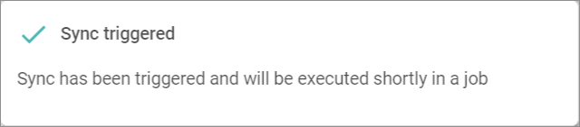

[!!Manage the Amazon connection](../Integration/01_ManageAmazonConnection.md)

# Connections

*Omni-Channel > Settings > Tab CONNECTIONS*

**Connections**

-  (Refresh)   
    Click this button to update the list of connections.

- *VIEW*   
    Click the drop-down list to select the view. All created views are displayed in the drop-down list. Click the  (Points) button to the right of the *VIEW* drop-down list to display the context menu and create a view.   

    -  (Points)      
        Click this button to the right of the *VIEW* drop-down list to display the context menu. The following menu entries are available:

        -  create  
            Click this entry to create a view. The *Create view* window is displayed, see [Create view](#create-view).

        -  rename  
            Click this entry to rename the selected view. The *Rename view* window is displayed, see [Rename view](#rename-view). This menu entry is only displayed if a view has been selected.

        -  reset  
            Click this entry to reset all unsaved changes to the settings of the selected view. This menu entry is only displayed if a view has been selected and any changes have been made to the view settings.

        -  publish  
            Click this entry to publish the view. This menu entry is only displayed if a view has been selected and unpublished.

        -  unpublish  
            Click this entry to unpublish the view. This menu entry is only displayed if a view has been selected and published.

        -  save  
            Click this entry to save the current view settings in the selected view. This menu entry is only displayed if a view has been selected.

            > [Info] When the settings of a view have been changed, an asterisk is displayed next to the view name. The asterisk is hidden as soon as the changes have been saved.

        -  delete  
            Click this entry to delete the selected view. A confirmation window to confirm the deletion is displayed. This menu entry is only displayed if a view has been selected.

-  Columns (x)   
    Click this button to display the columns bar and customize the displayed columns and the order of columns in the list. The *x* indicates the number of columns that are currently displayed in the list.

- [x]     
    Select the checkbox to display the editing toolbar. If you click the checkbox in the header, all connections in the list are selected.

- [DELETE]  
    Click this button to delete the selected connection. This button is only displayed if a single checkbox in the list of connections is selected.
    
    > [Info] Deleting a connection is a very complex process and can therefore take a long time. 

- [SYNCHRONIZE]  
    Click this button to synchronize the selected connection. This button is only displayed if a single checkbox in the list of connections is selected. The *Sync triggered* pop-up window is displayed.

    

- [DISABLE]  
    Click this button to disable the selected connection(s). This button is only displayed if the checkbox of at least one active connection is selected.

- [ENABLE]  
    Click this button to enable the selected connection(s). This button is only displayed if the checkbox of at least one inactive connection is selected. 

-  (Edit)  
    Click this button to edit the Amazon connection. This button is only displayed if a single checkbox in the list of connections is selected. Alternatively, you can click directly a row in the list to edit a connection. The *Edit connection* view is displayed, see [Edit Amazon connection](#edit-amazon-connection).

The list displays all available connections. Depending on the settings, the displayed columns may vary. All fields are read-only.

- *Name*  
    Connection name.

- *Status*  
    Connection status. The following statuses are available:
    -  **Active**   
        The connection is enabled and data is being synchronized via the connection.
    -  **Inactive**   
        The connection is disabled and no data is being synchronized via the connection.   

- *Order/Return have errors*  
    Indication whether errors have occurred in orders or  returns:. The following options are available:  
    - **Yes**   
        Errors have occurred.   
    - **No**   
        No errors have occurred.

- *Driver*  
    Driver name.

- *ID*  
    Connection identification number. The ID number is automatically assigned by the system.

-  (Add)  
    Click this button to add an Amazon connection. The *Create connection* view is displayed, see [Create connection](#create-Amazon-connection).

## Create view

*Omni-Channel > Settings > Tab CONNECTIONS > Button Points > Menu entry create*

- *Name*   
    Enter a name for the view.

- [CANCEL]   
    Click this button to cancel creating a view. The *Create view* window is closed.

- [SAVE]   
    Click this button to save the new view and display it in the *VIEW* drop-down list. The *Create view* window is closed.

## Rename view

*Omni-Channel > Settings > Tab CONNECTIONS > Button Points > Menu entry rename*

- *Name*   
    Click this field to edit the view name.

- [CANCEL]   
    Click this button to cancel renaming the view. The *Rename view* window is closed.

- [SAVE]   
    Click this button to save the changes and display it in the *VIEW* drop-down list. The *Rename view* window is closed.

## Create Amazon connection

*Omni-Channel > Settings > Tab CONNECTIONS > Button Add*

-  (Back)   
    Click this button to close the *Create connection* view and return to the connection list. All changes are rejected.

- *Name*   
    Enter a connection name.

-  (Apply)  
    Click this button to apply the entered connection name. This button is only displayed if the connection name has not yet been confirmed. 

-  (Edit)  
    Click this button to edit the connection name. This button is only displayed if the connection name has been confirmed. 

- *Driver*  
    Click the drop-down list and select the Amazon driver. All installed drivers are displayed. The *Credentials* section is displayed below the drop-down list.

    > [Info] Drivers are licensed and must be acquired via the app store or the corresponding e-commerce partner platform. The applicable driver credentials to establish the connection are obtained when acquiring the corresponding license.

**Credentials**

- *Seller ID*  
    Enter your merchant token as provided in your Amazon seller account.

- *Access token*  
    This field is locked and cannot be changed manually. The access token is filled automatically once the Actindo authorization process has been successfully performed in your Amazon seller account, see [Create an Amazon connection](../Integration/01_ManageAmazonConnection.md#create-an-amazon-connection). 

- [AUTHORIZE]  
    Click this button to start the Actindo authorization process in your Amazon seller account.

- *Amazon marketplace*  
    Click this drop-down list and select the applicable marketplace.

- [SAVE]  
    Click this button to save the connection.

## Edit Amazon connection

*Omni-Channel > Settings > Tab CONNECTIONS > Select Amazon connection*

-  (Back)   
    Click this button to close the *Edit connection* view and return to the connection list. All changes are rejected.

- *Name*   
    Connection name. Click the button  (Edit) to the right of the name to edit it.

-  (Edit)  
    Click this button to edit the connection name.

-  (Apply)  
    Click this button to apply the changes to the connection name.  This button is only displayed if you are editing the connection name.

- *Created DD/MM/YYYY*  
    Creation date of the connection. This field is read-only.  

## Edit Amazon connection &ndash; Credentials

*Omni-Channel > Settings > Tab CONNECTIONS > Select Amazon connection > Tab Credentials*

- *Driver*  
    Driver name. For Amazon, the Amazon driver is displayed. This drop-down list is read-only.

**Credentials** 

- *Seller ID*  
    Click to edit your merchant token.

- *Access token*  
    This field is locked and cannot be changed manually. The access token is filled automatically once the Actindo authorization process has been successfully performed in your Amazon seller account, see [Create an Amazon connection](../Integration/01_ManageAmazonConnection.md#create-an-amazon-connection). 

- [AUTHORIZE]  
    Click this button to start the Actindo authorization process in your Amazon seller account.

- *Amazon marketplace*  
    Click this drop-down list and select the applicable marketplace.

- [SAVE]  
    Click this button to save any changes made.

## Edit Amazon connection &ndash; Settings

*Omni-Channel > Settings > Tab CONNECTIONS > Select Amazon connection > Tab Settings*

The *Settings* tab is composed of the following settings entries:  

- [Offers](#offers)
- [Order import](#order-import)
- [Order export/invoice upload](#order-exportinvoice-upload)
- [Shipping provider mapping](#shipping-provider-mapping)

### Offers

*Omni-Channel > Settings > Tab CONNECTIONS > Select Amazon connection > Tab Settings > Menu entry Offers*

**Offers**

-  *Apply from default*  
    Disable this toggle if you do not want to apply the default value to the FBA offers. By default, this toggle is enabled. The *Update stock for 'Fulfillment by Amazon (FBA)' offers* toggle is unlocked.

- [Save]  
    Click this button to save any changes made.

-  *Update stock for 'Fulfillment by Amazon (FBA)' offers*    
    Enable this toggle to manage the stock for FBA offers also via Actindo. By default, this toggle is disabled.
  

### Order import

*Omni-Channel > Settings > Tab CONNECTIONS > Select Amazon connection > Tab Settings > Menu entry Order import*

**Order import**

-  *Apply from default*  
    Disable this toggle if you do not wanto to apply the default value to MFN and FBA offers. By default, this toggle is enabled. All *Order import* settings are unlocked.  

- [Save]  
    Click this button to save any changes made.

- *'Merchant Fulfilled Network' (MFN) orders*   
    Configure the following options to determine the 'Merchant Fulfilled Network' (MFN) orders to be imported: 

    -  *Import 'Merchant Fulfilled Network' (MFN) orders.*   
        Disabled this toggle if you do not want to import 'Merchant Fulfilled Network' (MFN) orders. By default, this toggle is enabled.
    -  *Import 'Prime by Merchant' orders.*   
        Disabled this toggle if you do not want to import 'Prime by Merchant' orders. By default, this toggle is enabled.
    - *Import MFN orders from*  
        Enter a date from which to import the orders. The valid date format is DD.MM.YYYY. If no date is selected, the orders of the last 90 days are automatically imported.
    -  (Calendar)  
        Click this button and select a date from which to import the others.

- *'Fulfillment by Amazon' (FBA) orders*   
    Configure the following options to determine the 'Fulfillment by Amazon' (FBA) orders to be imported: 

    -  *Import 'Fulfillment by Amazon' (AFN) orders.*   
        Disabled this toggle if you do not want to import 'Fulfillment by Amazon' (AFN) orders. By default, this toggle is enabled.
    -  *Mark 'Fulfillment by Amazon' orders as shipped during import and disable warehousing.*   
        Disabled this toggle to prevent that the warehousing and the shipping for the FBA order is managed in Actindo. By default, this toggle is enabled.
    -  *Is the VAT calculation service (VCS) enabled?*   
        Enable or disabled this toggle to specify if this feature is active in Amazon. If the VCS is disabled, the prices in the FBA reports are gross; if the VCS is enabled, the prices are net. By default, this toggle is disabled.
    - *Import AFN/FBA orders from*  
        Enter a date from which to import the orders. The valid date format is DD.MM.YYYY. If no date is selected, the orders of the last 90 days are automatically imported.
    -  (Calendar)  
        Click this button and select a date from which to import the others.

- *Addresses*

    - *Packaging station address layout*  
    Click the drop-down list and select the position of the customer number if you use a packing station as address. The following options are available:  
        - **Customer number in address line**
        - **Customer number in company**

### Order export/invoice upload

*Omni-Channel > Settings > Tab CONNECTIONS > Select Amazon connection > Tab Settings > Menu entry Order export/invoice upload*

**Order export/invoice upload**

-  *Apply from default*  
    Disable this toggle to apply the default value to order export and invoice upload. By default, this toggle is enabled. All *Export shipments* and *Export invoices* checkboxes are unlocked.

- [Save]  
    Click this button to save any changes made.

- *Export shipments*  
    Select the checkboxes of all marketplaces for whose orders you want to export the shipments. You can specify the marketplaces for B2B orders in the *B2B orders* section and for B2C orders in the *B2C orders* section. All available marketplaces from Amazon are displayed in the list. 

- *Export invoices*  
    Select the checkboxes of all marketplaces for whose orders you want to export the invoices. You can specify the marketplaces for B2B orders in the *B2B orders* section and for B2C orders in the B2C orders* section. All available marketplaces from Amazon are displayed in the list. 

### Shipping provider mapping

*Omni-Channel > Settings > Tab CONNECTIONS > Select Amazon connection > Tab Settings > Menu entry Shipping provider mapping*

**Shipping provider mapping**

- [Save]  
    Click this button to save any changes made.

- *UCS shipping provider*  
    Click the drop-down list and select the applicable shipping provider for the corresponding shipping option. All available shipping providers are displayed in the list.