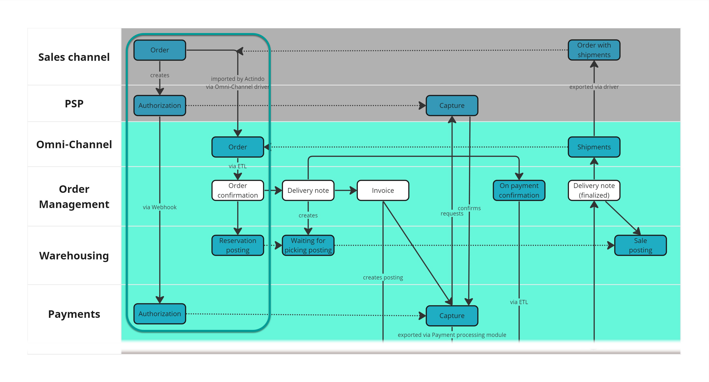
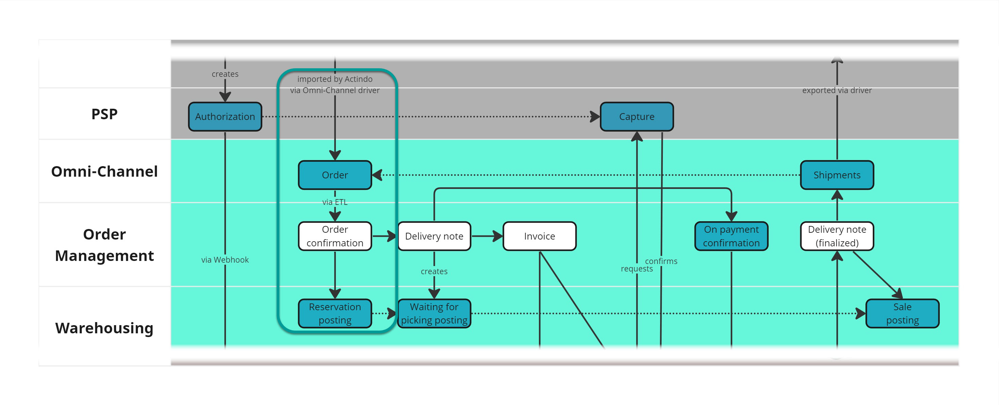
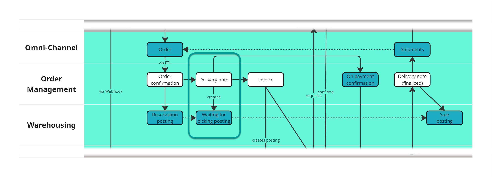
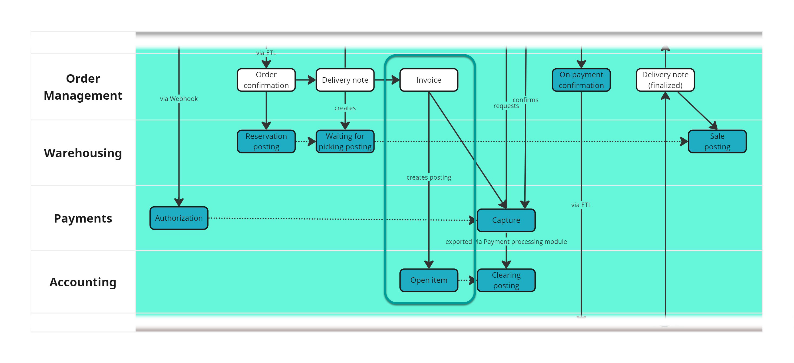
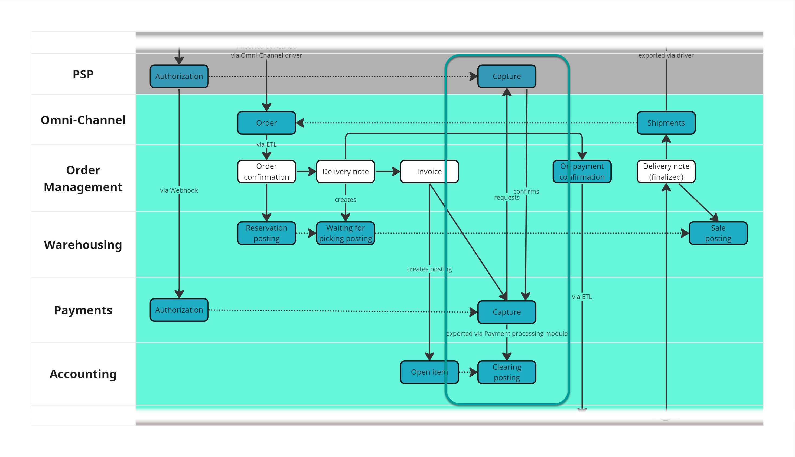
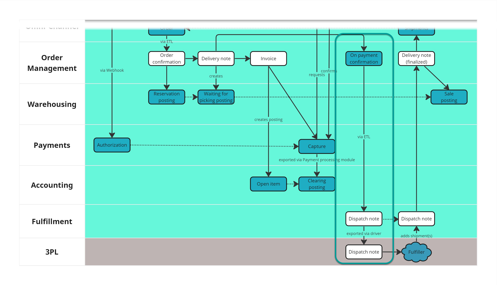
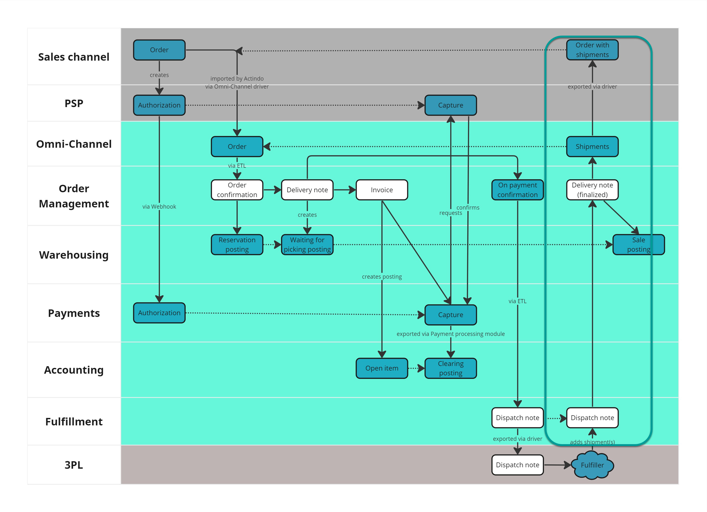

# Basic order management process

In this section, the basic order management process is presented and explained, from the moment the customer places an order in an online shop up to the product delivery, as implemented by most retailing companies. Further process steps can be added as necessary, and some steps may be omitted if not applicable to match your specific business needs. 

The whole order management process is steered through a specifically designed workflow and can be tracked in real time in the *Workflows* module. The workflow determines exactly what happens at every moment. Therefore, if there is no workflow in place, orders cannot be further processed after the initial import from the sales channel. 

## Basic principles

In the following, a few basic principles are briefly explained.

**The document chain**  

A business document is a basic entity containing data on an order. Among the business documents used in the *Actindo Core1 Platform* are the order confirmation, the delivery note, the invoice, and the dispatch note. The business documents are provided with logic, which allows them to carry out certain actions based on the data they contained.

The different business documents form a document chain, which can be completely customized to reflect a company's business processes. The main entity of the document chain is the head document, which is usually the order confirmation. The so-called deliver head, on the other hand, creates a reserve posting in the warehouse for all line items detailed in the business document. In most cases, the head document and the deliver head are the same business document, but this is not mandatory and can be determined by the company.

**Data exchange**  

For the data exchange between the different modules and systems, two methods are mainly used: ETL and communication via driver.

ETL stands for extract, transform and load, and is the system responsible for translating the different data models between modules, for instance from *Omni-Channel* to *Order Management*, or from *Order Management* to *Fulfillment*. For detailed information, see [ETL](#to-be-determined). 

The *Actindo Core1 Platform* and the external third-party systems are connected and communicate via driver. This way, order data is imported from the external online shop receiving orders into the *Omni-Channel* module, dispatch requests are transferred from the the *Fulfillment* module to the fulfiller external system, or the order shipment information is sent back to the online shop to keep the customer continuously up-to-date. 

**Workflow**

A workflow is a basic structure that represents a business process. It uses *places* containing data to be transferred and *transitions* defining the actions to be performed. When designing a workflow, you determine exactly when what happens, leaving nothing to chance. Each order is processed following this workflow, which allows a company to monitor the process in real time. For detailed information, see [Workflows](#to-be-determined).

## Modules and systems involved

The following Actindo modules and external systems are involved in the basic order management process:

- Sales channel (company's online shop, third-party retailer, external)
- Actindo *Omni-Channel* module
- Actindo *Order Management* module
- Actindo *Warehousing* module
- Actindo *Fulfillment* module (if warehouse externally managed)
- Fulfiller external system
- Actindo *Payments* module (if a PSP is used)
- PSP external system
- Actindo *Payment processing* module
- Actindo *Accounting* module

> [Info] Other modules and plug-ins, such as the *Taxes* module and the *UCS Product Sync* plug-in, are also involved in the process and must be configured accordingly, although they may run in the background.

## Basic process structure

The process depicted below is just a standard approach that can be completely configured according to a company's needs. None of the process steps are hard-coded, and can be left out or supplemented to fit any specific business process.

**Legend**   

| Color    | Meaning     |
|:-------|:-------------|
| Gray | External systems |  
| Green | Actindo modules |  
| White | Business document |
| Blue | Business process step |

### 1. From the shop to the *Actindo Core1 Platform*  

The customer places an order in an external sales channel, for example a company's shop or a third-party online retailer. As soon as the order is placed, the payment service provider creates an authorization that is sent, mostly via Webhooks, to the *Payments* module. For detailed information, see [Monitor authorizations](#to-be-determined).   

[comment]: <> (Julian: Ist die Autorisierung vom Shop oder vom PSP erstellt? Was genau ist Webhooks? Hat das was mit dem Treiber -PSP- zu tun oder ist es ein "externer" Mechanismus, abhängig vom jeweiligen Shop? Sollen wir es hier kurz erklären?)

The sales channel is connected via driver with the *Actindo Core1 Platform*. Depending on the settings, the sales channel can actively push orders into the *Omni-Channel* module or the *Omni-Channel* module can pull (called "import" in the *Actindo Core1 Platform*) new orders at configurable regular intervals. The order placed in the sales channel is then mapped into an Omni-Channel order. 

The order contains, at least, the following basic data:  
- Customer details, such as name, number, billing and delivery address
- Line items:
    - ordered products, including price, quantity and ID number (SKU or similar)
    - applicable discounts and ancillary services, for example gift wrapping oder express delivery 

### 2. Order confirmation and stock reservation  

The Omni-Channels order is a mere "data container" with no internal logic, intended only for transferring order data between the sales channel and the *Order Management* module. The order import status in the *Omni-Channel* module indicates the order data completeness. Orders are often not completely imported at once and changes occur at a later stage. In this case, the order status stays as **Imported**. When the order data is complete, the order import status changes to **Complete**. 

The order is then further processed in the *Order Management* module, which generates an order confirmation (business document). As soon as an order confirmation is generated, a reservation posting is created in the *Warehousing* module. The purpose of a reservation is to ensure the availability of material at a later point in time. The available stock is, therefore, reduced by the quantity of line items specified in the order confirmation. A negative posting is possible at this point of the process, in which case a redistribution can be configured, if necessary, to arrange for the missing item(s) to be picked from another warehouse.

Since a company may have several warehouses, the stock withdrawal matrix determines the warehouse where the material is taken from based on different criteria, such as geographical location, ordered quantity or available stock, among others. For detailed information, see [Stock withdrawal matrix](#to-be-determined).

 

### 3. Initiation of the delivery process  

Based on the order confirmation, a delivery note (business document) is created. Depending on the storage location of the ordered items, one or more delivery notes may be created, which will be handled independently. A delivery note is created per each warehouse group where the ordered items are stored. A warehouse group is an higher-level classification of storage facilities according to customer-defined criteria, for example location or type of product. Warehouse groups are physically separated from each other and can contain an unlimited number of warehouses. 

Besides, in order for a delivery note to be created, the stock level in the applicable storage location must be sufficient. In this case, the delivery note cancels the previous reservation posting and creates a waiting for picking posting in the *Warehouse* module. This kind of posting reduces the physical stock in the warehouse, as the line item ordered is assigned to a specific delivery note. 

### 4. Sales transaction posting 

Based on the delivery note, an invoice is created and posted in the *Accounting* module. In order for an invoice to be created, the payment must have been previously authorized in the sales channel. This usually happens asynchronously via Webhooks.

[comment]: <> (Julian: S. meine Frage oben zu Webhooks)

Once the invoice is created, an open item is posted to the customer account in the *Accounting* module. A customer account is automatically created in the system for every customer placing an order. The posting account is identified based on the customer number. 

> [Info] The tax rate to be applied depends on the ship-to country, the tax zone and the product type. Based on these parameters, a decision matrix determines automatically the tax rate to be applied in the invoice. This decision matrix is configured in the *Taxes* module, see [Manage the decision matrix](#to-be-determined).

### 5. Payment handling  

After receiving the authorization from the sales channel, the *Payments* module sends a request to the PSP to capture the payment. If the payment capture is successful, the PSP sends a confirmation back to the *Payments* module. The payment process is considered as paid by the *Actindo Core1 Platform*.

The payment is then sent to the *Accounting* module via the *Payment processing* module and matched with the open item based on different relevant data, such as amount, customer number, invoice number or payment reference. If the matching is successful, the open item is cleared. The order is considered as fully paid and its payment status accordingly updated in the *Order Management* module. 

> [Info] The *Payment processing* module serves as link between any available payment source and the *Accounting* module. Other payment methods, such as bank transfer or direct debit, can also be configured, as long as the necessary process steps are defined in a workflow. 

### 6. From the warehouse to the customer via fulfiller  

Companies usually outsource the order fulfillment to a third-party logistics provider. In this case, the *Fulfillment* module acts as link between the *Actindo Core1 Platform* and the fulfillment partner's external system. Both systems are connected and communicate via driver.

On payment confirmation and based on the delivery note, a dispatch note is generated in the *Fulfillment* module. A dispatch note is a request for the fulfiller to pick, pack and send the ordered material to the customer. The dispatch note contains, at least, the ordered line items, including quantity and SKU, that must be sent to the customer.

The fulfiller confirms receival of the dispatch note and begins processing the request. When all ordered line items have been sent to the customer, the fulfiller confirms the goods dispatch with one or, if necessary, several shipments. The dispatch note and the shipment status are updated accordingly in the *Fulfillment* module via driver.

> [Info] Some companies may also have an internally managed warehouse. In this case, the *Fulfillment* module is not necessary and this process step is omitted altogether.  

[comment]: <> (Julian: hier fehlte der Prozess in Janniks Notizen. Wollen wir ausführlich hier was  dazu erklären oder ist es unnötig?)

### 7. Final delivery to the customer  

When the dispatch note is completed, the delivery note is processed and finalized in the *Order Management* module. At this point, the waiting for picking posting changes to a sale posting in the *Warehousing* module. The sale posting releases the previously reserved line items from stock irrevocably, whereby the order process is concluded from the logistics perspective.

To ensure that the customer is always informed about the current status of his/her delivery, regular shipment status updates are sent to the *Omni-Channel* module. These updates are, in turn, exported to the online shop via driver.

 

