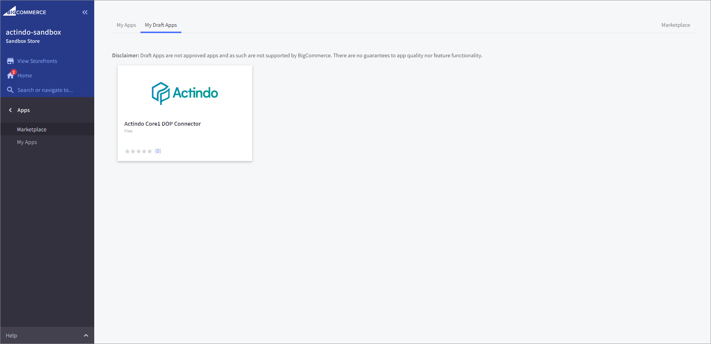
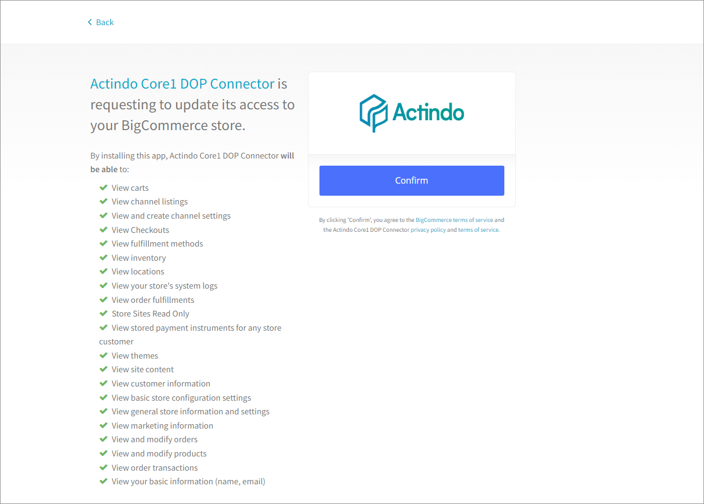
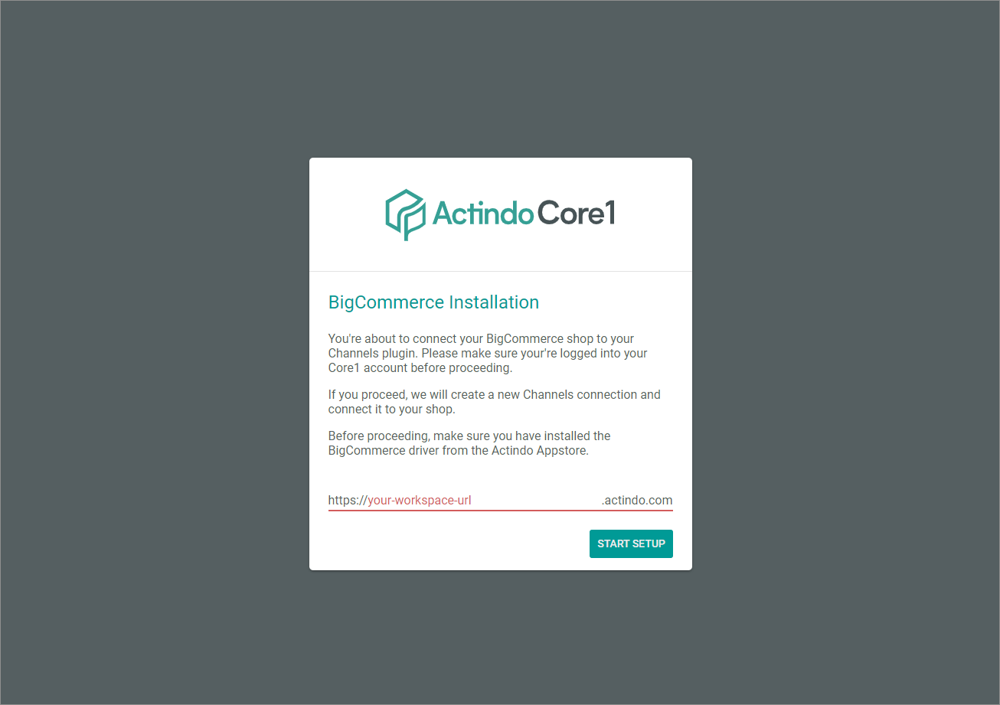
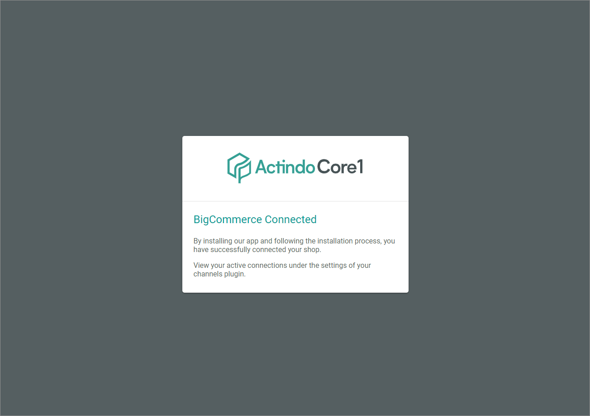
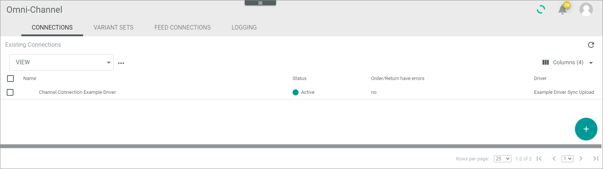

# Manage BigCommerce connection

*Actindo* features a special installation app in the *BigCommerce* App Store. The *Actindo Core1 DOP connector* app setups and authorizes a connection automatically. 
Note, if possible, you should not delete the app afterwards. If you delete the app, the connection in *Omni-Channel* will not be deleted. But deletion invalidates the access token you have created during connecting the app! In case of deletion, either reconnect the app or enter a valid access token manually to enable the connection again.

## Create a BigCommerce connection 

Create the connection using the *BigCommerce* driver. You can configure further settings only after the connection has been established.

## Prerequisites

- You have a *BigCommerce* customer account to login to *BigCommerce*.
- You have created a *BigCommerce* shop. 

## Procedure

1. In a new browser window, go to the [*BigCommerce app store*](https://www.bigcommerce.com/apps/) and log in to your *BigCommerce* account using the [Log In] button in the upper right corner.
  The *BigCommerce Actindo-sandbox* is opened.

2. Open the Apps folder.

3. Click the Marketplace folder. Search for the *Actindo Core1 DOP Connector* app.   
  The *Actindo Core1 DOP Connector* app entry is displayed.

   

 4. Click the Actindo Logo.   
  The app is selected. Further information is provided. 

    

5. Click the [Install] button.  
  The site for confirming the access is opened.

   

  
6. Click the [Confirm] button.   
  The *BigCommerce installation* window is opened.

   

7. Enter the workspace URL of the tenant, on which your *Omni-Channel* module is running, and click the [START SETUP] button.

   If the installation was successful, the *BigCommerce connected* window is displayed.
   In your tenant, a new Omni-Channel connection is created, which is connected to your *BigCommerce* shop.   
   
   

8. Change to your *Actindo Core1* tenant and select *Omni-Channel > Settings > Tab Connections*.   
  The new connection has been created, synchronized, and activated.
  All related standard attributes and attribute sets have been created. If required, you can adapt these objects to your needs later.

   

