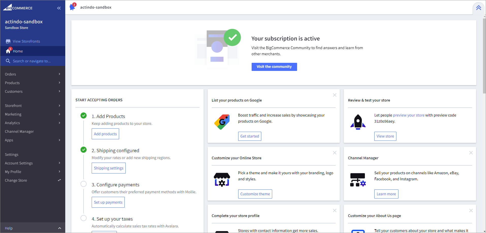
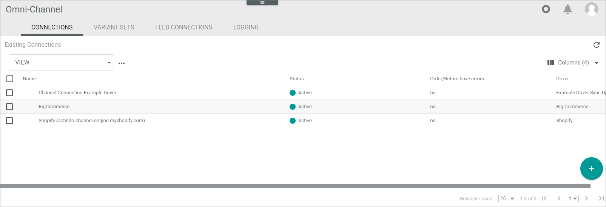
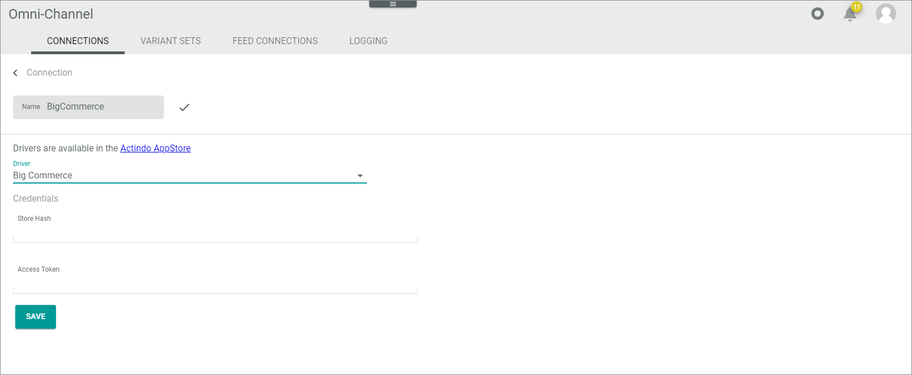
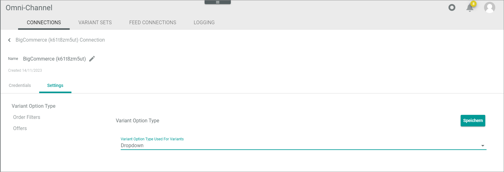
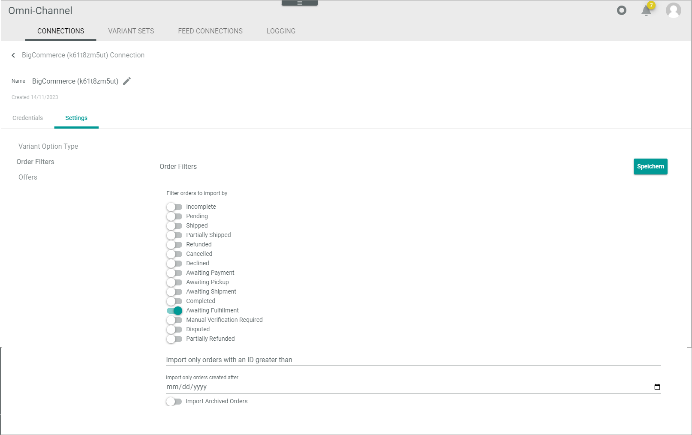

[!! Connections (BigCommerce)](../UserInterface/01a_Connections.md)

# Manage BigCommerce connection

*Actindo* features a special installation app in the *BigCommerce App Store*. The *Actindo Core1 DOP connector* app sets up and authorizes a connection automatically. 
Note, if possible, you should not delete the app in *BigCommerce* after creating the connection. Although deleting will not delete the connection in *Omni-Channel* itself, it will invalidate the access token you created when connecting to the app. If the app was deleted by mistake, either reconnect the app or enter a valid access token manually to enable the connection again.

Note that you can use the *Actindo Core1 DOP connector* app for one connection only. If you have more than one store in *BigCommerce*, you can <!--- Jannik, can oder must?-->create the first connection automatically with the *Actindo Core1 DOP connector* app. For all other stores, you must create the connection manually.

## Create BigCommerce connection automatically 

Create the connection using the *BigCommerce* driver. You will not be able to configure any other settings until the connection is established.

### Prerequisites

- You have a *BigCommerce* customer account to log in to *BigCommerce*.
- You have created a *BigCommerce* store. 
- In the *Actindo Core1 Platform*, you have permission to create connections in *Omni-Channel*.

### Procedure

1. Log in to your *Actindo Core1* instance on which you run the *Omni-Channel* module. To verify the successful creation later, it is important to be logged in.

2. In a new browser window, open the *BigCommerce App Store* (https://www.bigcommerce.com/apps/) and log in to your *BigCommerce* account using the [Log in] button in the upper right corner.   
  The *BigCommerce Actindo-sandbox* is opened.

   

3. Click the *Apps* folder.

4. Click the *Marketplace* folder and select the *Actindo Core1 DOP Connector* app.   
  The *Actindo Core1 DOP Connector* app entry is displayed.

   

   > [INFO] The app had not yet been released at the time the documentation was created.

 5. Click the *Actindo* logo.   
  The app is selected. Further information is provided. 

    

6. Click the [Install] button.  
  The site for confirming the access is opened.

   

  
7. Click the [Confirm] button.   
  The *BigCommerce installation* window is opened.

   

8. Enter the workspace URL of the instance on which your *Omni-Channel* module is running and click the [START SETUP] button.   
   If the installation was successful, the *BigCommerce connected* window is displayed.
   In your instance, a new *Omni-Channel* connection is created, which is connected to your *BigCommerce* store.   
   
   

9. Change to your *Actindo Core1* instance and select *Omni-Channel > Settings > Tab CONNECTIONS*.   
    - The new connection has been created, synchronized, and activated.   

       

    - The credentials of the connection have been automatically created.   

      

    - All related standard attributes, attribute sets, and attribute groups have been created. If required, you can adapt these objects to your needs later using the *DataHub* or *PIM* module.
    - All relevant API settings in *BigCommerce* are automatically created. See the *Store-level API account* in the *BigCommerce* app under *Settings > API*.

## Create BigCommerce connection manually

After automatically creating a connection for one *BigCommerce* store, you may need to manually create additional connections for additional stores, if applicable.      
If you create the connection manually, you have no functional limitations compared to the automatic creation.

### Prerequisite

- You have already created a connection automatically.<!---Janik stimmt das, ist das wirklich eine Voraussetzung?-->
- You have both the *Store hash* and the *Access token* provided by *BigCommerce* at your disposal.
- In the *Actindo Core1 Platform*, you have permission to create connections in *Omni-Channel*.

### Procedure

*Omni-Channel > Settings > CONNECTIONS*

1. Click the  (Add) button in the bottom right corner.   
    The *Create connection* view is displayed.

    

2. Enter a name for the connection in the *Name* field.

3. Click the *Driver* drop-down list and select the *BigCommerce* driver.  
    The *Credentials* section is displayed below the drop-down list.

     

4. Enter the hash key of your store in the *Store hash* field and the access token in the
  *Access token* field. Both data is provided by *BigCommerce*.

5. Click the [SAVE] button.
    - The connection will be established. The *Checking credentials...* notice is displayed. The *Create connection* view is automatically closed when the connection has been established. The initial sync has been automatically triggered. 
    - The new connection has been created, synchronized, and activated.   

      

    - All related standard attributes, attribute sets, and attribute groups have been created. If required, you can adapt these objects to your needs using the *DataHub* or *PIM* module later.
    - All relevant API settings in *BigCommerce* are automatically created. See the *Store-level API accounts* in the *BigCommerce* app under Settings > API.

   

## Configure BigCommerce connection 

Configure the *BigCommerce* connection after you have created it.   

In the *Omni-Channel* connection settings, you can configure the *Variant option type*, which defines how the offer variants are presented in the store.   
By the *Variant option type* setting, you can define how your customers can select a product variant in *BigCommerce*. Since *BigCommerce* allows multiple types for variant options, the driver needs a specification how to determine the preferred type for a variant option. You can define variant option types such as drop-down, radio button, or rectangle as default for your offers in the *Variant option type* setting.   
For specific offer types, you can use the color-swatch type that is determined in a specific way. For detailed information, see [Configure color-swatch variant option](./04_ManageProductData.md#configure-color‐swatch-variant-option).

With the *Order filter* setting, you can filter the orders that are to be imported from *BigCommerce* to *Omni-Channel*.  
Additionally, if you have worked with *BigCommerce* before starting with the *Actindo Core1 Platform*, you can define the date or ID, from which existing orders should be imported.

The *Offers* setting is only relevant for the first initial import of products from *BigCommerce*. You can specify that only those attributes are to be imported, that are mapped to the offer by the ETL data mapping. This allows you to maintain only certain attributes.

#### Prerequisites

- In the *Actindo Core1 Platform*, you are permitted to create connections in *Omni-Channel*.
- A *BigCommerce* connection has been created.

#### Procedure

*Ommi-Channel > Settings > Tab CONNECTIONS*

 1. Click the *BigCommerce* connection you want to edit in the list of connections.   
   The *Edit connection* view is displayed. By default, the *Credentials* tab is selected.

    

2. Click the *Settings* tab.   
     The *Variant option type* setting is displayed by default.

    

4. Click the *Variant option type* drop-down list and select the variant option type you want to use.
   The following option types are available:
   | Dropdown | Meaning   
   |-----|-------   
   |Dropdown| An offer variant is selected in a drop-down list
   |Rectangles | An offer variant is selected in a small rectangle that contains the offer variant value. For example:
    |Radio buttons | An offer variant is selected with a radio button.   

5. Click the *Order filters* entry.   
   A list of order status is displayed.

     

6. Enable the toggles at the order statuses you want to import to the *Actindo Core1 Platform*. For detailed information on the *BigCommerce* order statuses, see the *BigCommerce* documentation under [https://developer.bigcommerce.com/docs/rest-management/orders/order-status#get-all-order-statuses](https://developer.bigcommerce.com/docs/rest-management/orders/order-status#get-all-order-statuses).

7. If desired, enter the first order ID you want to import in the *Import only orders with an ID as of* field. This option is only relevant if you have orders in *BigCommerce* that should not be imported to *Actindo* in general.

8. If desired, enter the date as of which you want to import the orders in the *Import only orders created as of* field. The date is valid from 00:00. This option is only relevant if you have orders in *BigCommerce* that should not be imported to *Actindo* in general.

9. If desired, enable the *Import archived order* toggle to request the import of orders that have been already archived.

10. Click *Offers* entry.   
   The offers setting is displayed on the right side.

    

11. Enable the *Only push mapped attributes* toggle, if you want to import only those attributes that are mapped to the offer by the ETL data mapping. 

12. Click the [Save] button.   
  The connection settings are applied.

## Manage ETL mappings 

Create ETL mappings to map the *BigCommerce* attributes for subsequent processes in your *Actindo Core1 platform*. During connecting *BigCommerce* with *Actindo*, the *BigCommerce* attribute sets have been automatically created in the *DataHub* module.   
Especially if you want to exchange your product data available in the *PIM* module to *BigCommerce*, you must additionally create the ETL mappings and processes for the data transfer between the *PIM* product data and the *Omni-Channel* offer data.

#### Prerequisites

You have permission to create ETL mappings.

#### Procedure

1. Create the ETL mappings needed for subsequent processes in the *Actindo Core1 platform*. For detailed information on creating ETL mappings, see [Manage the ETL mappings](../../DataHub/Operation/01_ManageETLMappings.md).

2. If desired, create the ETL processes for the data exchange between the *Omni-Channel* and *PIM* modules. For detailed information on the creating ETL processes, see [Manage the ETL processes](../../DataHub/Operation/02_ManageETLProcesses.md).
