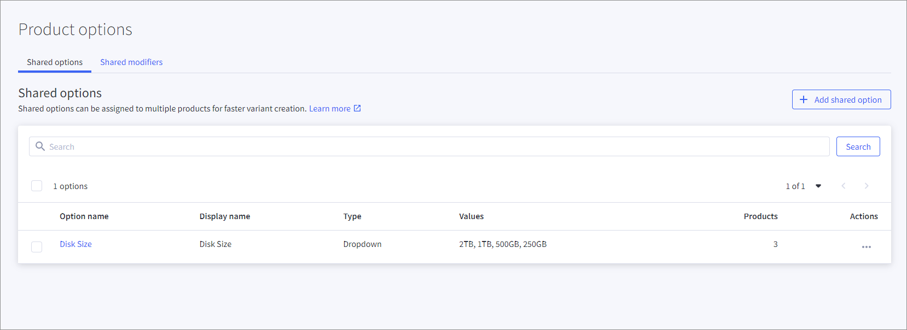

# BigCommerce particularities

There are several particularities regarding the *BigCommerce* product data that must be taking into account when establishing and using the *BigCommerce* connection. These particularities are described in detail below.
For detailed information on product data in *BigCommerce*, refer to the *BigCommerce* documentation.

## Offer handling

You have two options for exchanging offer data between *Actindo* and *BigCommerce*:
- If you start with *BigCommerce* and have created already all offers in *Actindo*, you can export your offers to your *BigCommerce* storefront.
- If you start with *Actindo* after you have started with *BigCommerce*, you can import the offers created in *BigCommerce* to *Actindo*.   
  Note, if you choose this way, you will not be able to import offer changes again from *BigCommerce* to *Actindo*. In this case, you must change the offers on the *Actindo* side and export them to *BigCommerce*.  
  For this reason, it is recommended to manage offer data at *Actindo*.

### Export of offers 

The following particularities are relevant, when you export your offers from the *Omni-Channel* module to *BigCommerce*.

**Variant options**

*BigCommerce* supports multiple types for the selection of variant options on the UI.  For detailed information, see [Configure BigCommerce connection](./02_ManageBigCommerceConnection.md#configure-bigcommerce-connection).

**Custom fields**

*BigCommerce* supports simple string values only. For this reason, only the following *Actindo* data types are supported as possible custom field values for attributes:

- Text field
- String
- Float 
- Integer
- Date time

All data types that are no string values are converted to string. 
The length of a custom field string is limited to 255 characters. 

**To do**:   
Check your custom fields if they meet the requirements. 
If necessary, create new ones. For detailed information on changing and editing of attributes, see [Manage attributes](../../DataHub/Integration/01_ManageAttributes.md) in the *DataHub* documentation. 

### Images

The first image in the corresponding attribute is marked as thumbnail image for the offer. The alt-text of an image will be added as description for that image. Every other field is not supported.
For detailed information, see [Check product images](../Integration/04_ManageProductData#check-product-images).  
 

### Videos

Offer videos are not supported by the driver. If you have a strong need to have videos available, contact your MPS consultant at *Actindo*.

### Related products

Related offers in *BigCommerce* are utilized differently than in the *Actindo* standard. <!---Janik noch mal fragen, ob das stimmt-->In the *Actindo* standard, the offer bundles define offers that complete an offer. For example, a power supply unit that is required in addition to a device and part of the offer. In *BigCommerce*, the related offers are used to present similar offers that may be of additional interest to the customer.
You can select related products in the corresponding attribute. You can select only those offers as related, if they exist as *Omni-Channel* offers for the *BigCommerce* connection. These offers are shown in *BigCommerce* as related if they are uploaded from *Actindo* and if they are available in the shop.

**To do**: 
1. Create offers that are applied the *BigCommerce* connection. These offers have automatically been assigned the attribute groups relevant for the *BigCommerce* connection.
2. For each offer, check the *Related product* attribute, that it only contains related products that you want to actively use in the *BigCommerce* storefront. 
<!--- ich kann ja gar keine Produkte als related kennzeichnen, wenn sie nicht BigCommerce zugeordnet sind??-->
For detailed information on creating offers see [Manage offers](../../Channels/Operation/01_ManageOffers.md) in the *Omni-Channel* documentation.

### Variants

**Variant options**

For detailed information on BigCommerce product variants, refer to the following *BigCommerce* documentation: [https://developer.bigcommerce.com/docs/rest-catalog/product-variants#create-a-product-variant](https://developer.bigcommerce.com/docs/rest-catalog/product-variants#create-a-product-variant).  
Since *BigCommerce* allows multiple types for variant options, the driver needs a way to determine the intended type for a variant option. You can use types such as dropdowns, radio buttons, or rectangles by the connection settings. For detailed information on these types, see [Configure BigCommerce connection](../Integration/02_ManageBigCommerceConnection.md#configure-bigcommerce-connection).

For certain cases, the color-swatch type is available which requires specific configuration, see [Configure color-swatch variant option](../Integration/04_ManageProductData.md#add-color-swatch-variant-option).

**Omni-Channel attributes to BigCommerce attributes**

In variant sets, the *Omni-channel* module allows to select any attribute as changeable, but *BigCommerce* allows only certain attributes to be changeable per variant. Note that only changeable attributes in *BigCommerce* are modified when changing or creating a variant. Others are skipped. For detailed information, see [Check variant sets](../Integration/04_ManageProductData.md#check-variant-sets).

**Multidimensional variants**

Multidimensional variants are variant sets containing more than one variant option as defining attribute, for example size and color for clothes. The *BigCommerce* API allows creating variants by using variant options (defining attributes) and values (changeable attributes). However, when creating an offer, the API allows the creation of more variants than those possible with *Actindo's* pre-defined options and values. As a result, your customers would be able to select and order offers in the *BigCommerce* shopfront that do not exist.   
   
For example, an offer is created by using the defining attributes *Size* and *Color*. By using these attributes, two variants are created t-shirt-s-red (S, red) and t-shirt-m-green (M, green). The driver creates the following options and values:
- Size (S, M),
- Color (Green, Red)  

While the *BigCommerce driver* of *Actindo* creates the variants "t-shirt-s-red" and "t-shirt-m-green" only, the *BigCommerce* shopfront displays all possible combinations of options and values. This includes products such as t-shirt-s-green (S, green), which do not exist. These product variants are not only visible to the customers, but they can also order these products that do not exist.  

**To do**: You must manage this issue by the shopfront itself.
You can access via /v3/catalog/products/{productId}/variants all variants the driver has created and only the ones the driver created.

## Import of offers 

The following particularities are relevant, when you import your offers from *BigCommerce* to the *Omni-Channel* module.

### Shared variant options

This information is only relevant if you have already created products in *BigCommerce* and you want to initially import them to the *Omni-Channel* module. *BigCommerce* has shared variant options that cannot be modified in any way using the API: 
- The driver can import offers with shared variant options, but you are not able to edit them after the import.   
- The driver cannot manage any changes after the import in the *BigCommerce* UI. Changing shared variant options after an import will cause *Omni-Channel* offer updates to fail.   

**To do:**   
Before the first import of offers, check your variant options in *BigCommerce*. It is strongly recommended not to use shared variant options. To check it, see your *BigCommerce* store under *Products > Product options > Shared option tab*. Remove any shared option that might be available there.

## Import of orders 

The following particularities are relevant, when you import your orders from *BigCommerce* to the *Omni-Channel* module.

The import of offers is supported by the *BigCommerce* driver.
- You can define the orders that are to be imported. For detailed information, see [Configure BigCommerce connection](../Integration/02_ManageBigCommerceConnection.md#configure-bigcommerce-connection).  
- The *BigCommerce* connection enables parallel imports to handle larger loads.

The following data are managed by the driver:
- Contained products
- Billing address
- Shipping address      
- Sales channels    
  All sale channels that you connect via *BigCommerce* are handled as sub sales channels. This architecture enables you to run multiple stores in *BigCommerce*.

Data that is not included in the above list is not included in the order import. For example, you may be interested in the following data, which is not part of the order import: 
- Gift wraps
- More than one shipping address
- Customer IDs   
   *Actindo* does not use the customer IDs of *BigCommerce* to prevent potential inconsistencies with already existing customer IDs. Instead, *Actindo* automatically creates a new customer ID, if the imported data does not match an existing *Actindo* customer.  

If you have a strong need to have this data available, contact your *Actindo* MPS consultant.

### Multiple Shipping Addresses

Although *BigCommerce* allows multiple shipping addresses, *Actindo* supports the import of one shipping address only. Any orders that use multiple shipping addresses cannot be imported and will fail during the import.  
For detailed information, see [Manage multiple shipping addresses](../Integration/02_ManageBigCommerceSettings#manage-multiple-shipping-addresses).

### Discounts

*BigCommerce* supports only one single discount coupon per order.  These coupons cannot be managed in the *Omni-Channel* module and subsequent processes in *Actindo*. Used discount coupons (name and code) are displayed in *Omni-Channel* as custom attributes on each line item.

*BigCommerce* processes discounts before taxes. To manage the discounts later in the *Accounting* module, the driver splits discounts on each line item, add them, and calculates a net discount value using the line items tax rate. Because of that even “discount in percent” discounts will be shown as absolute values on each line item. 

### Order status updates

**Order delivery Statuses**

The driver supports updates on the order statuses, but *BigCommerce* can only manage a few *Omni-Channel* statuses. The order statuses are assigned as follows:

| Status in Omni-Channel | Status in BigCommerce   
   |-----|-------   
   |Partially shipped|Partially shipped
   |Ready for shipping|Awaiting shipment
   |Shipped| Shipped   
  

**Order payment statuses**

This feature is not supported, as *BigCommerce* does not allow an update of the payment status.

## Shipments

Note that *BigCommerce* allows only specific values to for tracking the carrier of a shipment. You can only use one of these values, otherwise the export of the shipment will fail!   
For detailed information on the supported carriers, see the *BigCommerce* documentation in *GitHub* under https://github.com/bigcommerce/dev-docs/blob/main/assets/csv/tracking_carrier_values.csv.

## Checklist

**Initial import of products from *BigCommerce* to *Actindo***

