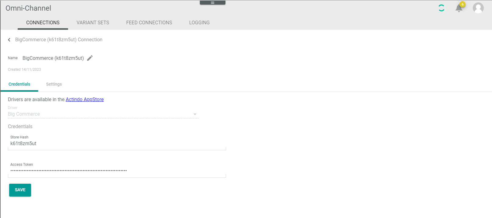

# Manage BigCommerce connection

*Actindo* features a special installation app in the *BigCommerce* App Store. The *Actindo Core1 DOP connector* app setups and authorizes a connection automatically. 
Note, if possible, you should not delete the app afterwards. If you delete the app, the connection in *Omni-Channel* will not be deleted. But deletion invalidates the access token you have created during connecting the app! In case of deletion, either reconnect the app or enter a valid access token manually to enable the connection again.
If you do not want to use the *Actindo Core1 DOP connector* app in *BigCommerce*, you can create the connection manually.

## Create BigCommerce connection automatically 

Create the connection using the *BigCommerce* driver. You can only configure further settings after the connection has been established.

### Prerequisites

- You have a *BigCommerce* customer account to login to *BigCommerce*.
- You have created a *BigCommerce* shop. 

### Procedure

1. Login to your *Actindo Core1* tenant, on which you run the *Omni-Channel* module.

2. In a new browser window, open the [*BigCommerce app store*] (https://www.bigcommerce.com/apps/) and log in to your *BigCommerce* account using the [Log In] button in the upper right corner.
  The *BigCommerce Actindo-sandbox* is opened.

2. Click the *Apps* folder.

3. Click the *Marketplace* folder. Search for the *Actindo Core1 DOP Connector* app.   
  The *Actindo Core1 DOP Connector* app entry is displayed.

   

 4. Click the *Actindo* logo.   
  The app is selected. Further information is provided. 

    

5. Click the [Install] button.  
  The site for confirming the access is opened.

   

  
6. Click the [Confirm] button.   
  The *BigCommerce installation* window is opened.

   

7. Enter the workspace URL of the tenant, on which your *Omni-Channel* module is running, and click the [START SETUP] button.

   If the installation was successful, the *BigCommerce connected* window is displayed.
   In your tenant, a new Omni-Channel connection is created, which is connected to your *BigCommerce* shop.   
   
   

8. Change to your *Actindo Core1* tenant and select *Omni-Channel > Settings > Tab Connections*.   
    - The new connection has been created, synchronized, and activated.   
    - The credentials of the connection has been automatically created.
    - All related standard attributes and attribute sets have been created. If required, you can adapt these objects to your needs later.<!---Stimmt das?-->

   

   

## Create BigCommerce connection manually

<!---In welcher Situation würde ich das tun?--->
It is possible, to create the connection to BigCommerce manually, if you do not want to use the *Actindo Core1 DOP connector* app in *BigCommerce*.

### Prerequisite

- You have the *Store hash* and the *Access token* given by *BigCommerce* available.
- In the *Actindo Core1 Platform*, you are permitted to create connections in *Omni-Channel*.

### Procedure

*Omni-Channel > Settings > Connection*

1. Click the  (Add) button in the bottom right corner.   
    The *Create connection* view is displayed.

    

2. Enter a name for the connection in the *Name* field.

3. Click the *Driver* drop-down list and select the *BigCommerce* driver.  
    The *Credentials* section is displayed below the drop-down list. 

4. Enter the hash key of your store In the *Store hash* field and the access token in the
  *Access token* field. Both data are given by *BigCommerce*.

5. Click the [SAVE] button.

6. Click the  [Back] button and check whether the new connection has been synchronized and activated.

   

## Configure BigCommerce connection

Configure the *BigCommerce* connection after you have created it.   

In *Omni-Channel*, you can configure the *Variant option type* that defines the way in which the offer variants are presented in the shop.
Since *BigCommerce* allows multiple types for variant options, the driver needs a way to determine the intended type for a variant option. Variant option types such as dropdown, radio button, or rectangles are controlled by the *Variant option type* setting. The “color-swatch type” is determined in a specific way. For detailed information, see <!----Link einfügen-->

By the *Order filter* option, you can filter the orders that are to be imported from *BigCommerce* to *Omni-Channel*.  
Additionally, if you have worked with *BigCommerce* before you have started with the *Actindo Core1 Platform*, you can define the date or ID, from which the orders are to be imported.

#### Prerequisites

- In the *Actindo Core1 Platform*, you are permitted to create connections in *Omni-Channel*.
- A *BigCommerce* connection has been created.

#### Procedure

*Ommi-Channel > Settings > Tab CONNECTIONS*

 1. Click the *BigCommerce* connection you want to edit in the list of connections.   
   The *Credentials* and the *Settings* tab are displayed in the *Edit connection* view.

    

2. Click the *Settings* tab.

3. Click the *Variant option type used for variants* entry.   
   The *Variant option type* dropdown is displayed.

    

4. Select the *Variant option type* you want to use.
   The following option types are available:
   | Dropdown | Meaning   
   |-----|-------   
   |Dropdown| The offer variants are selected in a dropdown
   |Rectangles | The offer variants are selected in a checkbox. The users can select multiple variants.
   |Radio buttons | The offer variants are selected with radio buttons, users can select one variant only. <!---???--> 

5. Click the *Order filters* option.   
   A list of order status is displayed.

     

6. Toggle the status of the orders you want to import to the *Actindo Core1 Platform*.

7. If desired, enter the first order ID you want to import the orders in the *Import only orders with an ID greater than* field.

8. If desired, enter the date as of which you want to import the orders in the *Import only orders created after* field. The date is valid from 00:00.

9. If desired, import orders that have been already archived by toggling the *Import archived order* field.

 

