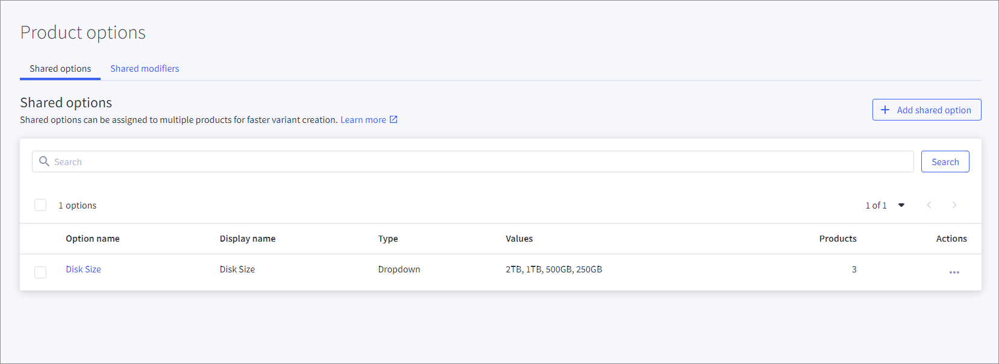

# BigCommerce particularities

There are several particularities regarding the *BigCommerce* data that are to be considered when establishing and using the *BigCommerce* connection. These particularities are described in detail below.
For detailed information on product data in *BigCommerce*, refer to the *BigCommerce* documentation.   

Note that both the *PIM* module and *BigCommerce* use the term "product". However, the *Omni-Channel* module uses the term "offer". The same object is meant in each case.

## Offer handling

You have two options for exchanging offer data between *Actindo* and *BigCommerce*:
- If you start with *BigCommerce* and have created already all offers in *Actindo*, you can export your offers to your *BigCommerce* storefront.
- If you start with *Actindo* after and have created all products in *BigCommerce*, you can import the products from *BigCommerce* to *Actindo*.   
  Note, if you choose this way, you will not be able to import product changes again from *BigCommerce* to *Actindo*. In this case, you must change the offers on the *Actindo* side and export them to *BigCommerce*.  
  For this reason, it is recommended to manage offer data at *Actindo*.

## Export of offers 

The following particularities are relevant when you export your offers from the *Omni-Channel* module to *BigCommerce*.

### Variant options

*BigCommerce* supports multiple types for the selection of variant options on the UI.  For detailed information, see [Configure BigCommerce connection](./01_ManageBigCommerceConnection.md#configure-bigcommerce-connection).

### Custom fields

*BigCommerce* supports simple string values only. For this reason, only the following *Actindo* data types are supported as possible custom field values for attributes:

- Text field
- String
- Float 
- Integer
- Date time

All data types that are no string values are converted to string. 
The length of a custom field string is limited to 255 characters. 

**To do**:   
Check your custom fields if they meet the requirements. 
If necessary, create new ones. For detailed information on changing and editing of attributes, see [Manage an attribute](../../DataHub/Integration/01_ManageAttributes.md) in the *DataHub* documentation. 

### Images

The first image in the corresponding attribute is marked as thumbnail image for the offer. The alt-text of an image will be added as description for that image. Every other field is not supported.
For detailed information, see [Check product images](./04_ManageProductData.md#check-product-images).  
 

### Videos

Offer videos are not supported by the driver. If you have a strong need to have videos available, contact your MPS consultant at *Actindo*.

### Related products

Related products in *BigCommerce* are used differently than in the *Actindo* standard. *Actindo* assigns the related products from *BigCommerce* the *Offer bundle* data type. For detailed information, see [Offer bundle](../../DataHub/UserInterface/04_DataTypeList.md#offer-bundle) in the *DataHub* documentation.   
In the *Actindo* standard, the offer bundles define offers that complete an offer. For example, a power supply unit that is required in addition to a device and part of the offer. In *BigCommerce*, the related products are used to present similar offers that may be of additional interest to the customer.  
You can select related products in the corresponding attribute. You can select only those products as related if they exist as *Omni-Channel* offers for the *BigCommerce* connection. These offers are displayed in *BigCommerce* as related if they are uploaded from *Actindo* and if they are available in the shop.

**To do**: 
1. Create offers that are applied the *BigCommerce* connection. These offers have automatically been assigned the attribute groups relevant for the *BigCommerce* connection. For detailed information on creating offers, see [Manage the offers](../../Channels/Operation/01_ManageOffers.md) in the *Omni-Channel* documentation.
2. For each offer, check the *Related product* attribute, that it only contains related products that you want to actively offer in the *BigCommerce* storefront. 
<!--- ich kann ja gar keine Produkte als related kennzeichnen, wenn sie nicht der BigCommerce connection zugeordnet sind??-->

### Variants

**Variant options**

For detailed information on *BigCommerce* product variants, refer to the following *BigCommerce* documentation: [https://developer.bigcommerce.com/docs/rest-catalog/product-variants#create-a-product-variant](https://developer.bigcommerce.com/docs/rest-catalog/product-variants#create-a-product-variant).  
Since *BigCommerce* allows multiple types for variant options, the driver needs a way to determine the intended type for a variant option. In the connection settings, you can choose default presentation types such as dropdowns, radio buttons, or rectangles. For detailed information on these types, see [Configure BigCommerce connection](./01_ManageBigCommerceConnection.md#configure-bigcommerce-connection).

For certain cases, the color-swatch type is available which requires specific configuration, see [Configure color-swatch variant option](./04_ManageProductData.md#configure-color‐swatch-variant-option).

**Omni-Channel attributes to BigCommerce attributes**

The *Omni-channel* module allows to select any attribute as changeable, but *BigCommerce* allows only certain attributes to be changeable. The following attributes are declared as changeable in *BigCommerce*:
- Cost price   
- Price   
- Sale price   
- Retail price  
- Weight   
- Width   
- Height   
- Depth   
- Is free shipping   
- Fixed cost shipping price   
- UPC   
- Inventory level   
- Inventory warning level   
- BIN   
- GTIN   
- MPN   
- Image URL (only one thumbnail per variant)   
- SKU   

**Multidimensional variants**

Multidimensional variants are variant sets containing more than one variant option as defining attribute, for example size and color for clothes. The *BigCommerce* API allows creating variants by using variant options (defining attributes) and values (changeable attributes). However, when creating an offer, the API allows the creation of more variants than those possible with *Actindo's* pre-defined options and values. As a result, your customers would be able to select and order offers in the *BigCommerce* shopfront that do not exist.   
   
For example, an offer is created by using the defining attributes *Size* and *Color*. By using these attributes, two variants are created &ndash; T-shirt-s-red (S, red) and t-shirt-m-green (M, green). The driver creates the following options and values:
- Size (S, M),
- Color (Green, Red)  

The *BigCommerce driver* of *Actindo* creates only the variants "t-shirt-s-red" and "t-shirt-m-green", but the *BigCommerce* shopfront presents all potential options and value pairings. This includes products such as t-shirt-s-green (S, green), which do not exist. These product variants are not only visible to the customers, but they can also order these non-existing products.  

**To do**:   
You must manage this issue by the shopfront itself.
In *BigCommerce*, you can access via the **/v3/catalog/products/{productId}/variants** API path all variants the driver has created.

## Import of offers 

The following particularities are relevant when you initially import *BigCommerce* products to the offers in the *Omni-Channel* module.

### Shared variant options

*BigCommerce* has shared variant options that cannot be modified in any way using the API: 
- The driver can import offers with shared variant options, but you are not able to edit them after the import.   
- The driver cannot manage any changes after the import in the *BigCommerce* UI. Changing shared variant options after an import will cause *Omni-Channel* offer updates to fail.
   

**To do:**   
Before the first import of offers, check your variant options in *BigCommerce*. It is strongly recommended not to use shared variant options. To check it, see your *BigCommerce* store under *Products > Product options > Shared options tab*. Remove any shared option that might be available there.

Instead, you can use the variants you can add to a product or an offer in the *PIM* or the *Omni-Channel* module.

## Import of orders 

The following particularities are relevant when you import your orders from *BigCommerce* to the *Omni-Channel* module.

The import of offers is supported by the *BigCommerce* driver.
- You can filter the orders that are to be imported. For detailed information, see [Configure BigCommerce connection](./01_ManageBigCommerceConnection.md#configure-bigcommerce-connection).  
- The *BigCommerce* connection enables parallel imports to handle larger loads.

The driver manages the following data:
- Contained products
- Billing address
- One shipping address      
- Sales channels    
  All sales channels that you connect via *BigCommerce* are handled as sub sales channels. This architecture enables you to run multiple stores in *BigCommerce*.

Data that is not included in the above list is not included in the order import. For example, you may be interested in the following data, which is not part of the order import: 
- Gift wraps
- More than one shipping address
- Customer IDs   
   *Actindo* does not use the customer IDs of *BigCommerce* to prevent potential inconsistencies with already existing customer IDs. Instead, *Actindo* automatically creates a new customer ID, if the imported data does not match an existing *Actindo* customer.  

If you have a strong need to have this data available, contact your *Actindo* MPS consultant.

### Multiple Shipping Addresses

Although *BigCommerce* allows multiple shipping addresses, *Actindo* supports the import of one shipping address only. Any orders that use multiple shipping addresses cannot be imported and will fail during the import.  
For detailed information, see [Manage multiple shipping addresses](./03_ManageBigCommerceSettings.md#manage-multiple-shipping-addresses).

### Discounts

*BigCommerce* supports only one single discount coupon per order.  These coupons cannot be managed in the *Omni-Channel* module and subsequent processes in *Actindo*. For this reason, used discount coupons (name and code) are displayed in *Omni-Channel* as custom attributes on each line item.
*BigCommerce* processes discounts before taxes. To manage the discounts later in the *Accounting* module, the driver splits discounts on each line item, add them, and calculates a net discount value using the line items tax rate. Because of that even “discount in percent” discounts will be output as absolute values on each line item. 

### Order status updates

**Order delivery statuses**

The driver supports updates on the order statuses, but *BigCommerce* can only manage a few *Omni-Channel* statuses. The order statuses are assigned as follows:

| Status in Omni-Channel | Status in BigCommerce   
   |-----|-------   
   |Partially shipped|Partially shipped
   |Ready for shipping|Awaiting shipment
   |Shipped| Shipped   
  

**Order payment statuses**

This feature is not supported, as *BigCommerce* does not allow an update of the payment status. This has no effects on subsequent processes in *Actindo* such as accounting. 

## Shipments

Note that *BigCommerce* allows only specific values for tracking the carrier of a shipment. You can only use one of these values, otherwise the export of the shipment will fail.  
For detailed information on the supported carriers, see the *BigCommerce* documentation in *GitHub* under https://github.com/bigcommerce/dev-docs/blob/main/assets/csv/tracking_carrier_values.csv.
