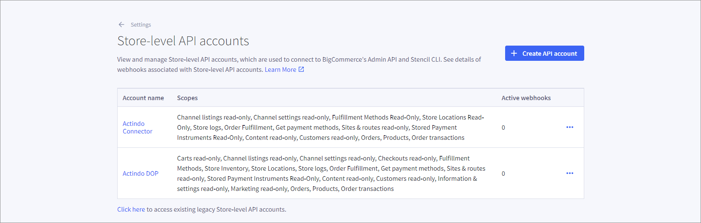

# Manage BigCommerce settings

## Manage API settings

As the driver creates automatically the necessary API settings during creating the connection, you have no need for further actions. See the *Store-level API account* in your *BigCommerce* store under *Settings > API*. 

## Manage multiple shipping addresses

Although *BigCommerce* allows multiple shipping addresses, *Actindo* supports the import of one shipping address only. Any orders that use multiple shipping addresses cannot be imported and will fail during the import.  
To avoid failures during the import, you must check a specific setting in *BigCommerce*. 

#### Prerequisites

- A *BigCommerce* connection has been created.
- You have a valid user account in *BigCommerce*.

#### Procedure

*BigCommerce store > Settings*

1. Display the *Advanced* section and click the *Checkout* entry.

   

2. Display the *Optimized one-page checkout settings > Shipping* section.

   

3. Ensure that the *Allow customers to select multiple shipping addresses for an order* setting is not selected.
